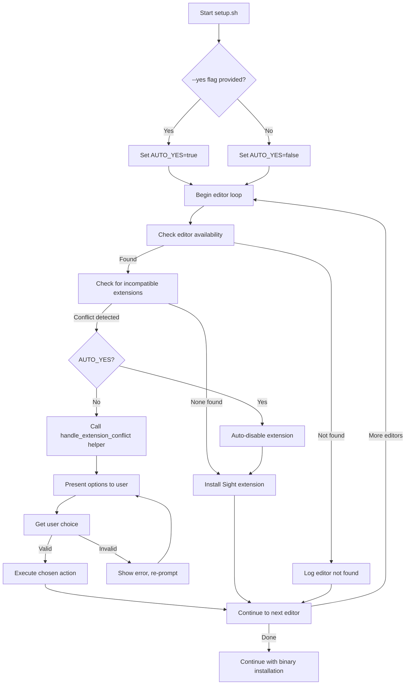

# Design Document

## Overview

This design enhances the setup.sh script to provide interactive extension conflict resolution while maintaining backward compatibility with automated usage. The solution introduces a helper function for consistent prompting and adds command-line flag support for non-interactive operation.

## Architecture

The design follows a modular approach with a dedicated helper function for extension conflict resolution. The main installation loop will detect conflicts and delegate to the helper function, which handles user interaction and executes the chosen action.



## Components and Interfaces

### Command Line Interface

The script will parse command-line arguments to detect the `--yes` or `-y` flag:

```bash
# Parse arguments
AUTO_YES=false
for arg in "$@"; do
    case $arg in
        --yes|-y)
            AUTO_YES=true
            shift
            ;;
        *)
            # Handle other arguments if needed
            ;;
    esac
done
```

### Extension Detection

The existing extension detection logic will be enhanced to return structured information:

```bash
# Enhanced detection function
detect_incompatible_extensions() {
    local editor="$1"
    local extensions=()
    
    # Check for known incompatible extensions
    if "$editor" --list-extensions 2>/dev/null | grep -q "kylebarron.stata-enhanced"; then
        extensions+=("kylebarron.stata-enhanced")
    fi
    
    # Future: Add other incompatible extensions here
    
    printf '%s\n' "${extensions[@]}"
}
```

### Conflict Resolution Helper

The core helper function will handle user interaction and action execution:

```bash
handle_extension_conflict() {
    local editor="$1"
    local extension="$2"
    local choice
    
    while true; do
        echo ""
        echo "You have a Stata syntax highlighting extension, $extension, installed in $editor."
        echo "To use Sight's syntax highlighting:"
        echo "1. Disable $extension"
        echo "2. Uninstall $extension"
        echo "3. Do nothing and continue to use $extension's syntax highlighting"
        echo ""
        read -p "Please choose (1/2/3): " choice
        
        case $choice in
            1)
                echo "Disabling $extension..."
                if "$editor" --disable-extension "$extension" &> /dev/null; then
                    echo -e "${GREEN}✓ Extension disabled${NC}"
                else
                    echo -e "${YELLOW}Warning: Failed to disable extension${NC}"
                fi
                return 0
                ;;
            2)
                echo "Uninstalling $extension..."
                if "$editor" --uninstall-extension "$extension" &> /dev/null; then
                    echo -e "${GREEN}✓ Extension uninstalled${NC}"
                else
                    echo -e "${YELLOW}Warning: Failed to uninstall extension${NC}"
                fi
                return 0
                ;;
            3)
                echo "Keeping $extension - Sight's syntax highlighting will not be used in $editor"
                return 1  # Signal to skip Sight installation for this editor
                ;;
            *)
                echo -e "${RED}Invalid choice. Please enter 1, 2, or 3.${NC}"
                ;;
        esac
    done
}
```

### Main Installation Loop

The main loop will be refactored to use the helper function:

```bash
for editor in "${EDITORS[@]}"; do
    if command -v "$editor" &> /dev/null; then
        echo -n "  $editor: "
        
        # Detect incompatible extensions
        mapfile -t incompatible_extensions < <(detect_incompatible_extensions "$editor")
        
        # Handle conflicts
        skip_installation=false
        for extension in "${incompatible_extensions[@]}"; do
            if [ "$AUTO_YES" = true ]; then
                echo -n "(auto-disabling $extension) "
                "$editor" --disable-extension "$extension" &> /dev/null || true
            else
                if ! handle_extension_conflict "$editor" "$extension"; then
                    skip_installation=true
                    break
                fi
            fi
        done
        
        # Install Sight if not skipped
        if [ "$skip_installation" = false ]; then
            if "$editor" --install-extension "$VSIX_FILE" --force &> /dev/null; then
                echo -e "${GREEN}✓${NC}"
                ((INSTALLED++))
            else
                echo -e "${YELLOW}failed${NC}"
            fi
        else
            echo -e "${YELLOW}skipped (user choice)${NC}"
        fi
    else
        echo -e "  $editor: ${YELLOW}not found${NC}"
    fi
done
```

## Data Models

### Extension Conflict Data

```bash
# Extension information structure (bash arrays)
EXTENSION_NAME="kylebarron.stata-enhanced"
EDITOR_NAME="code"
USER_CHOICE=""  # "1", "2", or "3"
```

### Configuration State

```bash
# Global configuration
AUTO_YES=false          # Whether --yes flag was provided
INSTALLED=0            # Counter for successful installations
EDITORS=("code" "code-insiders" "codium" "kiro" "antigravity" "cursor" "windsurf")
```

## Error Handling

### Input Validation

- Invalid user choices (not 1, 2, or 3) will display an error message and re-prompt
- Empty input will be treated as invalid
- Whitespace-only input will be treated as invalid

### Extension Operation Failures

- Failed disable/uninstall operations will show warnings but not halt the script
- The script will continue with Sight installation even if conflict resolution fails
- All extension operations will redirect stderr to /dev/null to avoid cluttering output

### Editor Command Failures

- If an editor command fails (e.g., --list-extensions), the script will treat it as "no extensions found"
- Installation failures will be logged but won't stop processing other editors

## Testing Strategy

### Unit Testing Approach

Since this is a bash script, testing will focus on:

1. **Manual Testing Scenarios**:
   - Test with --yes flag (automated mode)
   - Test without --yes flag (interactive mode)
   - Test with multiple editors having conflicts
   - Test with invalid user input
   - Test with no conflicts present

2. **Integration Testing**:
   - Test the complete setup flow with real VS Code installations
   - Verify extension operations work correctly
   - Test backward compatibility with existing usage

### Property-Based Testing Considerations

While property-based testing is challenging for bash scripts, we can define properties that should hold:

1. **Input Validation Property**: For any user input that is not "1", "2", or "3", the script should re-prompt
2. **State Consistency Property**: The script should never leave an editor in an inconsistent state (partially installed extensions)
3. **Idempotency Property**: Running the script multiple times should produce the same result

### Test Scenarios

1. **No Conflicts**: Script should install Sight normally
2. **Single Conflict**: User should be prompted once and choice should be respected
3. **Multiple Conflicts**: Each conflict should be handled independently
4. **Auto Mode**: --yes flag should disable all conflicts without prompting
5. **Invalid Input**: Script should handle invalid choices gracefully
6. **Edge Cases**: Empty editors list, missing VSIX file, permission errors

## Correctness Properties

*A property is a characteristic or behavior that should hold true across all valid executions of a system-essentially, a formal statement about what the system should do. Properties serve as the bridge between human-readable specifications and machine-verifiable correctness guarantees.*

### Property 1: Interactive Mode Always Prompts Before Action
*For any* detected extension conflict when --yes flag is not provided, the script should present options to the user before taking any action on the extension
**Validates: Requirements 1.1**

### Property 2: Auto Mode Disables Without Prompting
*For any* detected extension conflict when --yes or -y flag is provided, the script should automatically disable the extension without displaying any prompts
**Validates: Requirements 1.2, 5.1, 5.2**

### Property 3: Input Validation Persistence
*For any* invalid user input (not "1", "2", or "3"), the script should display an error message and re-prompt with the same options until a valid choice is made
**Validates: Requirements 1.5, 4.1, 4.2, 4.3, 4.4, 4.5**

### Property 4: Prompt Content Completeness
*For any* extension conflict prompt, the displayed options should contain the extension name, editor name, and exactly three numbered choices with disable, uninstall, and do-nothing options
**Validates: Requirements 1.4, 2.1, 2.2, 2.3, 2.4, 2.5**

### Property 5: Multiple Conflict Independence
*For any* scenario with multiple editor/extension conflicts, each conflict should be handled independently with separate prompts, and choosing "do nothing" for one should not affect processing of others
**Validates: Requirements 3.1, 3.2, 3.3**

### Property 6: Flag Recognition Flexibility
*For any* argument list containing --yes or -y, the script should recognize the flag regardless of its position in the argument list and enable auto mode
**Validates: Requirements 5.4**

### Property 7: Auto Mode Logging
*For any* extension conflict resolved automatically via --yes or -y flag, the script should log what action was taken
**Validates: Requirements 5.3**