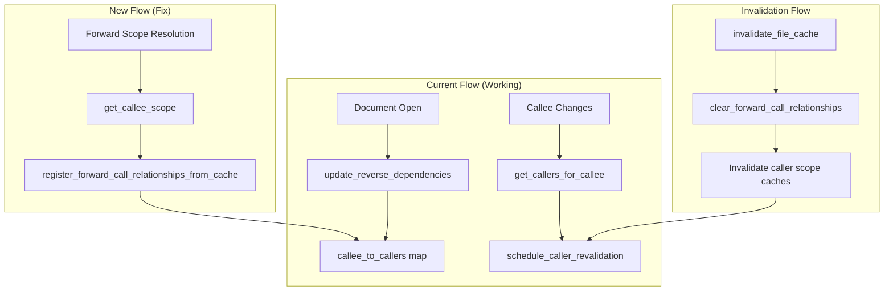

# Design Document: Callee Change Caller Revalidation

## Overview

This design addresses a cache invalidation bug where caller files are not revalidated when their callee files change via forward calls (`do`/`run`/`include` commands). The fix extends the existing reverse dependency tracking mechanism to include relationships discovered during forward scope resolution, not just from open documents.

The key insight is that the `callee_to_callers` map in `ScopeResolver` is currently only populated when documents are open in the editor (via `update_reverse_dependencies`). When a callee file is read from disk during forward scope resolution, the relationship is not registered, so changes to that callee don't trigger caller revalidation.

## Architecture

The solution builds on the existing reverse dependency infrastructure in `ScopeResolver`:



## Components and Interfaces

### ScopeResolver Extensions

The `ScopeResolver` class already has the necessary data structures. The fix adds registration of forward call relationships when files are read from disk during scope resolution.

```typescript
// Existing data structure (no changes needed)
interface ReverseDependencyIndex {
    caller_to_callees: Map<string, Map<string, CallEdge[]>>;
    callee_to_callers: Map<string, Set<string>>;
    interface_hashes: Map<string, DualInterfaceHash>;
    last_forward_calls: Map<string, ForwardCall[]>;
}

// New method to register relationships from cached files
private register_forward_call_relationships_from_cache(
    caller_uri: string,
    forward_calls: ForwardCall[]
): void;

// New method to clear relationships when cache is invalidated
private clear_forward_call_relationships(caller_uri: string): void;
```

### Integration Points

1. **get_parsed_file()**: After parsing a file and caching it, register forward call relationships
2. **invalidate_file_cache()**: Clear forward call relationships and invalidate caller scope caches
3. **invalidate_scope_cache()**: Also invalidate scope caches for callers of the changed file

## Data Models

### Forward Call Relationship Registration

When a file is parsed and cached (either from disk or in-memory), its forward calls are extracted and registered:

```typescript
// In get_parsed_file(), after caching:
this.register_forward_call_relationships_from_cache(actual_uri, parse_result.forward_calls);

// Registration logic:
private register_forward_call_relationships_from_cache(
    caller_uri: string,
    forward_calls: ForwardCall[]
): void {
    // Clear existing relationships for this caller first
    this.clear_forward_call_relationships(caller_uri);

    // Register each callee relationship
    for (const my_call of forward_calls) {
        if (!my_call.is_static || !my_call.path) continue;
        
        const callee_uri = URI.file(my_call.path).toString();
        
        // Add to callee_to_callers
        let caller_set = this.reverse_deps.callee_to_callers.get(callee_uri);
        if (!caller_set) {
            caller_set = new Set();
            this.reverse_deps.callee_to_callers.set(callee_uri, caller_set);
        }
        caller_set.add(caller_uri);
    }
}
```

### Cache Invalidation Flow

When a file's cache is invalidated, clear its relationships and cascade to callers:

```typescript
// In invalidate_file_cache():
invalidate_file_cache(uri: string): void {
    // ... existing file cache deletion ...
    
    // Clear forward call relationships for this file
    this.clear_forward_call_relationships(uri);
    
    // Invalidate scope caches for all callers
    const caller_set = this.reverse_deps.callee_to_callers.get(uri);
    if (caller_set) {
        for (const my_caller_uri of caller_set) {
            // Invalidate caller's scope cache
            for (const cache_key of this.scope_cache.keys()) {
                if (cache_key.startsWith(my_caller_uri + ':')) {
                    this.scope_cache.delete(cache_key);
                }
            }
        }
    }
    
    // ... existing cascade invalidation ...
}
```

## Correctness Properties

*A property is a characteristic or behavior that should hold true across all valid executions of a system—essentially, a formal statement about what the system should do. Properties serve as the bridge between human-readable specifications and machine-verifiable correctness guarantees.*

### Property 1: Forward Call Relationship Registration

*For any* file with static forward calls that is parsed and cached, all callee URIs from those forward calls SHALL be present in the callee_to_callers map with the caller URI in their caller set.

**Validates: Requirements 1.1, 1.2, 5.1**

### Property 2: Relationship Cleanup on Cache Removal

*For any* file that is removed from the file cache, all entries in callee_to_callers that reference this file as a caller SHALL be removed.

**Validates: Requirements 1.3, 5.2**

### Property 3: Caller Scope Cache Invalidation

*For any* file whose file cache is invalidated, all scope cache entries for files that call it via forward calls SHALL also be invalidated.

**Validates: Requirements 2.1, 2.3**

### Property 4: Transitive Caller Discovery

*For any* call graph A→B→C where A calls B and B calls C, when C changes, both B and A SHALL be identified as callers requiring revalidation.

**Validates: Requirements 3.1, 3.3**

### Property 5: Revalidation Limit and Prioritization

*For any* set of callers requiring revalidation, the number of scheduled revalidations SHALL not exceed max_callee_revalidations, and open documents SHALL be scheduled before closed documents.

**Validates: Requirements 4.1, 4.3**

### Property 6: Atomic Relationship Update

*For any* file whose forward calls change, the reverse dependency index SHALL reflect only the new forward calls (old relationships removed, new relationships added) after the update completes.

**Validates: Requirements 5.3**

## Error Handling

### Cycle Detection

The existing cycle detection in `ForwardScopeResolver` prevents infinite loops when registering relationships. If a cycle is detected (A→B→A), the relationship is still registered but resolution stops.

### Missing Files

If a callee file doesn't exist, no relationship is registered. The existing diagnostic for missing files is preserved.

### Cache Consistency

If registration fails partway through (e.g., due to an exception), the `clear_forward_call_relationships` call at the start ensures we don't have stale partial relationships.

## Testing Strategy

### Unit Tests

1. Test `register_forward_call_relationships_from_cache` with various forward call configurations
2. Test `clear_forward_call_relationships` removes all caller entries
3. Test `invalidate_file_cache` cascades to caller scope caches
4. Test transitive caller discovery with multi-level call graphs

### Property-Based Tests

Property tests should use fast-check to generate:
- Random call graphs (DAGs to avoid cycles)
- Random file URIs and forward call configurations
- Random sequences of cache operations (add, invalidate, update)

Each property test should run minimum 100 iterations.

**Tag format:** Feature: callee-change-caller-revalidation, Property {number}: {property_text}

### Integration Tests

1. End-to-end test: Edit callee.do, verify caller.do diagnostics update
2. Test with nested call chains (A→B→C)
3. Test with multiple callers of the same callee
4. Test revalidation limit behavior
