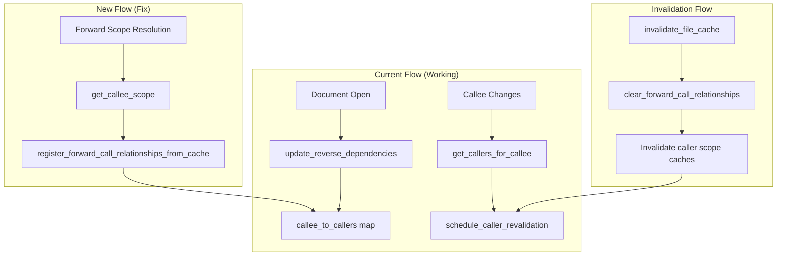

# Design Document: Callee Change Caller Revalidation

## Overview

This design addresses a cache invalidation bug where caller files are not revalidated when their callee files change via forward calls (`do`/`run`/`include` commands). The fix extends the existing reverse dependency tracking mechanism to include relationships discovered during forward scope resolution, not just from open documents.

The key insight is that the `callee_to_callers` map in `ScopeResolver` is currently only populated when documents are open in the editor (via `update_reverse_dependencies`). When a callee file is read from disk during forward scope resolution, the relationship is not registered, so changes to that callee don't trigger caller revalidation.

## Architecture

The solution builds on the existing reverse dependency infrastructure in `ScopeResolver`:



## Components and Interfaces

### ScopeResolver Extensions

The `ScopeResolver` class needs extensions to track forward call relationships efficiently. The key change is maintaining a bidirectional mapping (`caller_to_callees` for forward calls) to enable O(M) cleanup instead of O(N) scans.

```typescript
// Extended data structure for efficient bidirectional lookup
interface ReverseDependencyIndex {
    // Existing maps
    caller_to_callees: Map<string, Map<string, CallEdge[]>>;
    callee_to_callers: Map<string, Set<string>>;
    interface_hashes: Map<string, DualInterfaceHash>;
    last_forward_calls: Map<string, ForwardCall[]>;
    
    // New: Forward call specific bidirectional tracking
    // Maps caller_uri -> Set<callee_uri> for forward calls specifically
    // This enables O(M) cleanup where M = number of callees for a file
    forward_caller_to_callees: Map<string, Set<string>>;
}

// New method to register relationships from cached files
// Uses same core logic as update_reverse_dependencies for consistency
// Takes symbols to populate interface_hashes for detecting meaningful changes
private register_forward_call_relationships_from_cache(
    caller_uri: string,
    forward_calls: ForwardCall[],
    symbols: SymbolTable  // Required for interface_hashes population (Req 5.4)
): void;

// New method to clear relationships - O(M) using forward_caller_to_callees
// Also clears interface_hashes entry to prevent ghosting on file delete/recreate
private clear_forward_call_relationships(caller_uri: string): void;
```

### ScopeCache Extensions

The `ScopeCache` needs a secondary index for efficient URI-based invalidation:

```typescript
interface ScopeCacheExtensions {
    // Secondary index: uri -> Set<cache_keys>
    // Enables O(1) lookup of cache entries for a URI
    uri_to_cache_keys: Map<string, Set<string>>;
}

// When adding to scope_cache:
// 1. Add entry to scope_cache
// 2. Add cache_key to uri_to_cache_keys[uri]

// When removing from scope_cache:
// 1. Remove entry from scope_cache
// 2. Remove cache_key from uri_to_cache_keys[uri]
```

### Integration Points

1. **get_parsed_file()**: After parsing a file and caching it, register forward call relationships
2. **invalidate_file_cache()**: Clear forward call relationships using O(M) lookup and invalidate caller scope caches
3. **invalidate_scope_cache()**: Use uri_to_cache_keys for O(1) lookup
4. **resolve()**: Add forward-call callee URIs to dependent_uris for automatic cascade invalidation
5. **schedule_caller_revalidation()**: Use recursive/BFS traversal of callee_to_callers for transitive discovery

## Data Models

### Forward Call Relationship Registration

When a file is parsed and cached (either from disk or in-memory), its forward calls are extracted and registered. The registration uses the same core logic as `update_reverse_dependencies` to ensure consistency, including interface hash population:

```typescript
// In get_parsed_file(), after caching:
this.register_forward_call_relationships_from_cache(
    actual_uri, 
    parse_result.forward_calls,
    parse_result.symbols  // For interface_hashes population
);

// Registration logic - unified with update_reverse_dependencies:
private register_forward_call_relationships_from_cache(
    caller_uri: string,
    forward_calls: ForwardCall[],
    symbols: SymbolTable
): void {
    // Clear existing relationships for this caller first (O(M) operation)
    this.clear_forward_call_relationships(caller_uri);

    // Track callees for this caller (for efficient cleanup later)
    const callee_set = new Set<string>();

    // Register each callee relationship
    for (const my_call of forward_calls) {
        if (!my_call.is_static || !my_call.path) continue;
        
        const callee_uri = URI.file(my_call.path).toString();
        callee_set.add(callee_uri);
        
        // Add to callee_to_callers
        let caller_set = this.reverse_deps.callee_to_callers.get(callee_uri);
        if (!caller_set) {
            caller_set = new Set();
            this.reverse_deps.callee_to_callers.set(callee_uri, caller_set);
        }
        caller_set.add(caller_uri);
    }
    
    // Store caller->callees mapping for O(M) cleanup
    if (callee_set.size > 0) {
        this.reverse_deps.forward_caller_to_callees.set(caller_uri, callee_set);
    }
    
    // Populate interface_hashes for detecting meaningful changes (Req 2.2, 5.4)
    const interface_hash = compute_interface_hash(symbols);
    this.reverse_deps.interface_hashes.set(caller_uri, interface_hash);
}
```

### Efficient Relationship Cleanup

When clearing relationships, use the `forward_caller_to_callees` map for O(M) lookup. Also clear `interface_hashes` to prevent ghosting on file delete/recreate:

```typescript
// O(M) cleanup where M = number of callees for this caller
private clear_forward_call_relationships(caller_uri: string): void {
    const callee_set = this.reverse_deps.forward_caller_to_callees.get(caller_uri);
    if (!callee_set) return;
    
    // Remove caller from each callee's caller set
    for (const my_callee_uri of callee_set) {
        const caller_set = this.reverse_deps.callee_to_callers.get(my_callee_uri);
        if (caller_set) {
            caller_set.delete(caller_uri);
            // Clean up empty sets
            if (caller_set.size === 0) {
                this.reverse_deps.callee_to_callers.delete(my_callee_uri);
            }
        }
    }
    
    // Remove the caller->callees entry
    this.reverse_deps.forward_caller_to_callees.delete(caller_uri);
    
    // Clear interface_hashes to prevent ghosting on delete/recreate
    this.reverse_deps.interface_hashes.delete(caller_uri);
}
```

### Scope Cache with Secondary Index

The scope cache maintains a secondary index for efficient URI-based invalidation:

```typescript
// When adding to scope cache:
private add_to_scope_cache(cache_key: string, entry: ScopeCacheEntry): void {
    this.scope_cache.set(cache_key, entry);
    
    // Extract URI from cache_key (format: "uri:config_hash")
    const uri = cache_key.split(':')[0];
    let key_set = this.uri_to_cache_keys.get(uri);
    if (!key_set) {
        key_set = new Set();
        this.uri_to_cache_keys.set(uri, key_set);
    }
    key_set.add(cache_key);
}

// When invalidating by URI - O(1) lookup:
private invalidate_scope_cache_for_uri(uri: string): void {
    const key_set = this.uri_to_cache_keys.get(uri);
    if (!key_set) return;
    
    for (const my_cache_key of key_set) {
        this.scope_cache.delete(my_cache_key);
    }
    this.uri_to_cache_keys.delete(uri);
}
```

### Forward Call URIs in dependent_uris

The `resolve()` method must add forward-call callee URIs to `dependent_uris` to enable automatic cascade invalidation:

```typescript
// In resolve(), after processing forward calls:
for (const my_forward_call of forward_call_symbols) {
    // Add callee URI to dependent_uris for cascade invalidation
    if (my_forward_call.source_uri) {
        dependent_uris.add(my_forward_call.source_uri);
    }
}

// This enables cascade_invalidate_scope_cache_for_uri to handle
// transitive invalidation for both forward and backward dependencies
```

### Transitive Caller Discovery

The `schedule_caller_revalidation` function uses BFS to find all transitive callers:

```typescript
// In server-factory.ts:
function get_transitive_callers(
    callee_uri: string,
    callee_to_callers: Map<string, Set<string>>,
    max_depth: number
): Set<string> {
    const all_callers = new Set<string>();
    const queue: Array<{uri: string, depth: number}> = [{uri: callee_uri, depth: 0}];
    const visited = new Set<string>([callee_uri]);
    
    while (queue.length > 0) {
        const {uri: current_uri, depth} = queue.shift()!;
        if (depth >= max_depth) continue;
        
        const immediate_callers = callee_to_callers.get(current_uri);
        if (!immediate_callers) continue;
        
        for (const my_caller_uri of immediate_callers) {
            if (visited.has(my_caller_uri)) continue;
            visited.add(my_caller_uri);
            all_callers.add(my_caller_uri);
            queue.push({uri: my_caller_uri, depth: depth + 1});
        }
    }
    
    return all_callers;
}

// schedule_caller_revalidation uses this for transitive discovery
function schedule_caller_revalidation(callee_uri: string): void {
    const all_callers = get_transitive_callers(
        callee_uri,
        scope_resolver.reverse_deps.callee_to_callers,
        config.cross_file.max_chain_depth
    );
    
    // Prioritize open documents
    const open_callers = [...all_callers].filter(uri => document_store.has(uri));
    const closed_callers = [...all_callers].filter(uri => !document_store.has(uri));
    
    // Schedule revalidation respecting limits
    const to_revalidate = [...open_callers, ...closed_callers]
        .slice(0, config.max_callee_revalidations);
    
    for (const my_caller_uri of to_revalidate) {
        schedule_diagnostics(my_caller_uri);
    }
}
```

### Cache Invalidation Flow

When a file's cache is invalidated, clear its relationships and cascade to callers:

```typescript
// In invalidate_file_cache():
invalidate_file_cache(uri: string): void {
    // ... existing file cache deletion ...
    
    // Clear forward call relationships for this file (O(M) operation)
    // Also clears interface_hashes to prevent ghosting
    this.clear_forward_call_relationships(uri);
    
    // Invalidate scope caches for all callers using O(1) lookup
    const caller_set = this.reverse_deps.callee_to_callers.get(uri);
    if (caller_set) {
        for (const my_caller_uri of caller_set) {
            this.invalidate_scope_cache_for_uri(my_caller_uri);
        }
    }
    
    // ... existing cascade invalidation (now handles forward calls via dependent_uris) ...
}
```

### File Watcher Integration

When `DidChangeWatchedFiles` events occur, the server must trigger both cache invalidation and caller revalidation:

```typescript
// In server-factory.ts, onDidChangeWatchedFiles handler:
connection.onDidChangeWatchedFiles((params) => {
    for (const my_change of params.changes) {
        const uri = my_change.uri;
        
        // Invalidate file cache (clears relationships, scope caches)
        scope_resolver.invalidate_file_cache(uri);
        
        // Schedule revalidation for all transitive callers
        // This forces them to see fresh data from disk
        schedule_caller_revalidation(uri);
    }
});
```

## Correctness Properties

*A property is a characteristic or behavior that should hold true across all valid executions of a system—essentially, a formal statement about what the system should do. Properties serve as the bridge between human-readable specifications and machine-verifiable correctness guarantees.*

### Property 1: Forward Call Relationship Registration

*For any* file with static forward calls that is parsed and cached, all callee URIs from those forward calls SHALL be present in the callee_to_callers map with the caller URI in their caller set, AND the caller URI SHALL be present in forward_caller_to_callees with all callee URIs.

**Validates: Requirements 1.1, 1.2, 5.1**

### Property 2: Relationship Cleanup on Cache Removal

*For any* file that is removed from the file cache, all entries in callee_to_callers that reference this file as a caller SHALL be removed, AND the forward_caller_to_callees entry for this file SHALL be removed. The cleanup operation SHALL be O(M) where M is the number of callees for that file.

**Validates: Requirements 1.3, 5.2, 6.1**

### Property 3: Caller Scope Cache Invalidation

*For any* file whose file cache is invalidated, all scope cache entries for files that call it via forward calls SHALL also be invalidated. The invalidation SHALL use the uri_to_cache_keys secondary index for O(1) lookup.

**Validates: Requirements 2.1, 2.3, 6.2**

### Property 4: Transitive Caller Discovery

*For any* call graph A→B→C where A calls B and B calls C, when C changes, both B and A SHALL be identified as callers requiring revalidation via recursive/BFS traversal of callee_to_callers.

**Validates: Requirements 3.1, 3.2, 3.3**

### Property 5: Revalidation Limit and Prioritization

*For any* set of callers requiring revalidation, the number of scheduled revalidations SHALL not exceed max_callee_revalidations, and open documents SHALL be scheduled before closed documents.

**Validates: Requirements 4.1, 4.3**

### Property 6: Atomic Relationship Update

*For any* file whose forward calls change, the reverse dependency index SHALL reflect only the new forward calls (old relationships removed, new relationships added) after the update completes.

**Validates: Requirements 5.3**

### Property 7: Forward Call URIs in dependent_uris

*For any* resolved scope that includes forward-call symbols, all source URIs from those forward-call symbols SHALL be present in the dependent_uris set of the ScopeCacheEntry, enabling automatic cascade invalidation.

**Validates: Requirements 3.4**

### Property 8: Unified Dependency Tracking

*For any* file (whether open in editor or read from disk), the dependency tracking SHALL use the same core logic, ensuring consistent population of caller_to_callees, callee_to_callers, and interface_hashes.

**Validates: Requirements 5.4**

## Error Handling

### Cycle Detection

The existing cycle detection in `ForwardScopeResolver` prevents infinite loops when registering relationships. If a cycle is detected (A→B→A), the relationship is still registered but resolution stops.

### Missing Files

If a callee file doesn't exist, no relationship is registered. The existing diagnostic for missing files is preserved.

### Cache Consistency

If registration fails partway through (e.g., due to an exception), the `clear_forward_call_relationships` call at the start ensures we don't have stale partial relationships.

## Testing Strategy

### Unit Tests

1. Test `register_forward_call_relationships_from_cache` with various forward call configurations
2. Test `clear_forward_call_relationships` removes all caller entries
3. Test `invalidate_file_cache` cascades to caller scope caches
4. Test transitive caller discovery with multi-level call graphs

### Property-Based Tests

Property tests should use fast-check to generate:
- Random call graphs (DAGs to avoid cycles)
- Random file URIs and forward call configurations
- Random sequences of cache operations (add, invalidate, update)

Each property test should run minimum 100 iterations.

**Tag format:** Feature: callee-change-caller-revalidation, Property {number}: {property_text}

### Integration Tests

1. End-to-end test: Edit callee.do, verify caller.do diagnostics update
2. Test with nested call chains (A→B→C)
3. Test with multiple callers of the same callee
4. Test revalidation limit behavior
