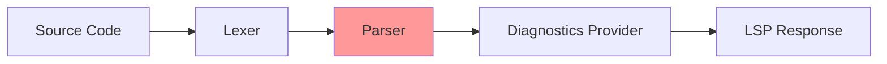

# Design Document: Orphan Closing Brace Detection

## Overview

This design addresses the detection of orphan closing braces in Stata code. An orphan closing brace is a `}` that doesn't close any block (if, else, foreach, forvalues, while, frame, or prefix command block). The LSP should detect this condition and report it as an error diagnostic.

Currently, the parser handles standalone opening braces (`{`) with an `OPEN_BRACE_ALONE` error, but orphan closing braces fall through the `parseStatement()` function without any diagnostic. This creates an inconsistency in error reporting.

## Architecture

The fix primarily affects the Parser component. The change adds explicit handling for RBRACE tokens at the top level of `parseStatement()`.



The Parser (highlighted) needs to:
1. Detect RBRACE tokens at the statement level
2. Emit an error diagnostic for orphan closing braces
3. Continue parsing after the error

## Components and Interfaces

### Parser Changes

The `parseStatement()` method in `src/parser/index.ts` needs to add explicit handling for RBRACE tokens. Currently, RBRACE tokens at the top level fall through to the `else` branch which silently advances without emitting any diagnostic.

**Current behavior (incorrect):**
```typescript
} else {
  // Skip unknown tokens but preserve any leading trivia for the next statement.
  this.advance();
  this.pending_trivia = leading_trivia;
  return null;
}
```

**New behavior (correct):**
```typescript
} else if (this.check('RBRACE')) {
  // Orphan closing brace - no matching opening brace
  const brace_token = this.advance();
  this.errors.push({
    message: 'unexpected closing brace - no matching opening brace',
    range: brace_token.range,
    code: ParseErrorCode.ORPHAN_CLOSE_BRACE,
  });
  this.pending_trivia = leading_trivia;
  return null;
} else {
  // Skip unknown tokens but preserve any leading trivia for the next statement.
  this.advance();
  this.pending_trivia = leading_trivia;
  return null;
}
```

### Error Code Addition

Add a new error code for orphan closing braces:

```typescript
// In src/types/index.ts
export enum ParseErrorCode {
  SYNTAX_ERROR = 3000,
  BRACE_ELSE_SAME_LINE = 3001,
  BRACE_NOT_ALONE = 3002,
  MISSING_PROGRAM_END = 3003,
  OPEN_BRACE_ALONE = 3004,
  UNCLOSED_BLOCK = 3005,
  CODE_AFTER_OPEN_BRACE = 3006,
  FORVALUES_SYNTAX = 3008,
  REDUNDANT_MACRO_SUFFIX = 3009,
  MISSING_EXPRESSION_AFTER_EQUALS = 3010,
  UNBALANCED_PARENTHESES = 3011,
  ORPHAN_CLOSE_BRACE = 3012,  // NEW
}
```

## Data Models

No changes to data models. The existing `ParseError` interface is sufficient:

```typescript
interface ParseError {
  message: string;
  range: Range;
  code?: ParseErrorCode;
}
```

## Correctness Properties

*A property is a characteristic or behavior that should hold true across all valid executions of a system—essentially, a formal statement about what the system should do. Properties serve as the bridge between human-readable specifications and machine-verifiable correctness guarantees.*


### Property 1: Orphan Closing Brace Detection

*For any* Stata document containing a closing brace `}` at the top level (not inside any block), the Parser SHALL emit a diagnostic with code `ORPHAN_CLOSE_BRACE` (3012), error severity, a message indicating no matching opening brace, and a range highlighting the brace token.

**Validates: Requirements 1.1, 2.1, 2.2, 2.3**

### Property 2: Valid Block Structure Acceptance

*For any* Stata document containing properly matched brace pairs in valid block structures (if, else, foreach, forvalues, while, frame, or prefix command blocks), the Parser SHALL NOT emit an `ORPHAN_CLOSE_BRACE` diagnostic for those closing braces.

**Validates: Requirements 1.2, 1.3, 1.4, 1.5, 1.6, 1.7, 1.8**

### Property 3: Multiple Orphan Brace Handling

*For any* Stata document containing N orphan closing braces on different lines, the Parser SHALL emit exactly N `ORPHAN_CLOSE_BRACE` diagnostics, each with the correct line number for its respective brace.

**Validates: Requirements 3.1, 3.2**

### Property 4: Macro Brace Exclusion

*For any* Stata document containing global macro references `${name}`, the Parser SHALL NOT emit an `ORPHAN_CLOSE_BRACE` diagnostic for the closing brace that is part of the macro reference syntax.

**Validates: Requirements 4.1, 4.2**

### Property 5: Embedded Language Exclusion

*For any* Stata document containing Mata or Python blocks (traditional or brace-style), the Parser SHALL NOT emit an `ORPHAN_CLOSE_BRACE` diagnostic for closing braces that are part of the embedded language content or that close brace-style embedded blocks.

**Validates: Requirements 5.1, 5.2, 5.3, 5.4**

### Property 6: String Literal Exclusion

*For any* Stata document containing string literals (double-quoted, compound, or single-quoted) with closing brace characters inside them, the Parser SHALL NOT emit an `ORPHAN_CLOSE_BRACE` diagnostic for those brace characters.

**Validates: Requirements 6.1, 6.2, 6.3**

## Error Handling

### Orphan Closing Brace Detection

When an orphan closing brace is detected:
1. Parser emits diagnostic with severity 'error'
2. Message: "unexpected closing brace - no matching opening brace"
3. Range: The token range of the closing brace
4. Code: `ParseErrorCode.ORPHAN_CLOSE_BRACE`

### Edge Cases

1. **Multiple orphan braces**: Each orphan `}` gets its own diagnostic
2. **Orphan brace after valid block**: Still detected as orphan
3. **Orphan brace in comments**: Comments are trivia, so `}` in comments is not tokenized as RBRACE
4. **Macro braces**: `${name}` is tokenized as MACRO_REF_GLOBAL, not separate tokens
5. **String braces**: Braces inside strings are part of STRING token content

## Testing Strategy

### Unit Tests

1. **Orphan brace detection**: Test that standalone `}` produces error diagnostic
2. **Valid if block**: Test that `if condition { ... }` produces no orphan error
3. **Valid else block**: Test that `else { ... }` produces no orphan error
4. **Valid foreach block**: Test that `foreach var in list { ... }` produces no orphan error
5. **Valid forvalues block**: Test that `forvalues i = 1/10 { ... }` produces no orphan error
6. **Valid while block**: Test that `while condition { ... }` produces no orphan error
7. **Valid frame block**: Test that `frame name { ... }` produces no orphan error
8. **Valid prefix block**: Test that `quietly { ... }` produces no orphan error
9. **Multiple orphan braces**: Test that multiple `}` produce multiple diagnostics
10. **Macro braces**: Test that `${name}` produces no orphan error
11. **Embedded blocks**: Test that Mata/Python blocks produce no orphan error
12. **String braces**: Test that `"}"` produces no orphan error

### Property-Based Tests

Property tests should use fast-check with minimum 100 iterations per property. Each property test must reference its design document property.

1. **Property 1 test**: Generate random Stata code, insert orphan `}`, verify error diagnostic
   - Tag: **Feature: closing-braces, Property 1: Orphan Closing Brace Detection**

2. **Property 2 test**: Generate valid block structures, verify no orphan-brace diagnostic
   - Tag: **Feature: closing-braces, Property 2: Valid Block Structure Acceptance**

3. **Property 3 test**: Generate documents with N orphan braces, verify N diagnostics
   - Tag: **Feature: closing-braces, Property 3: Multiple Orphan Brace Handling**

### Integration Tests

1. Test real Stata files with orphan closing braces
2. Test files with valid block structures
3. Test mixed scenarios with both valid blocks and orphan braces
