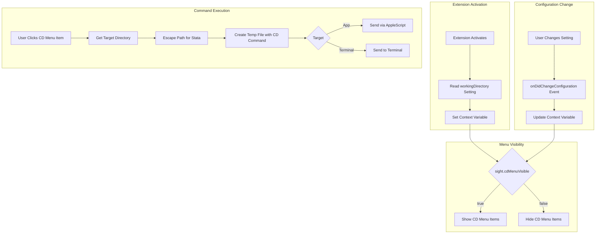

# Design Document: Conditional CD Menu Items

## Overview

This design describes the implementation of conditional "CD into Workspace Folder" and "CD into File Folder" menu items in the Sight VS Code extension. These menu items appear in the "Send to Stata" toolbar menu only when the `sight.sendToStata.workingDirectory` setting is set to `"none"`. The default setting is `"lsp"`, so the CD menu items are hidden by default.

The implementation leverages VS Code's context variable system (`setContext`) to dynamically control menu visibility through `when` clauses in `package.json`. This approach ensures the menu items respond immediately to configuration changes without requiring extension reload.

## Architecture



## Components and Interfaces

### 1. Context Variable Manager

Responsible for setting and updating the VS Code context variable that controls menu visibility.

```typescript
interface ContextManager {
    /**
     * Initialize context variable based on current configuration.
     * Called during extension activation.
     */
    initialize(): void;
    
    /**
     * Update context variable when configuration changes.
     * @param new_value - The new workingDirectory setting value
     */
    update(new_value: 'none' | 'file' | 'workspace' | 'lsp'): void;
}
```

**Implementation Location**: `client/src/send-to-stata/context-manager.ts`

The context variable `sight.cdMenuVisible` will be:
- `true` when `workingDirectory === 'none'`
- `false` when `workingDirectory` is `'lsp'`, `'file'`, or `'workspace'`

### 2. CD Commands Module

Implements the two new commands for changing directories.

```typescript
interface CDCommandOptions {
    target: 'app' | 'terminal';
    directory_type: 'workspace' | 'file';
}

/**
 * Execute a CD command to change Stata's working directory.
 * @param options - Command configuration
 * @throws Error if no workspace/file is available
 */
async function execute_cd_command(options: CDCommandOptions): Promise<void>;

/**
 * Get the target directory path based on directory type.
 * @param directory_type - 'workspace' or 'file'
 * @returns The resolved directory path
 * @throws Error if directory cannot be determined
 */
function get_target_directory(directory_type: 'workspace' | 'file'): string;

/**
 * Escape a directory path for use in Stata cd command.
 * Handles:
 * - Double quotes: Uses compound string syntax `"..."' instead of backslash escaping
 * - Windows backslashes: Doubles backslashes for Stata compatibility
 * @param path - The directory path to escape
 * @returns Object with escaped path and whether compound string is needed
 */
function escape_path_for_stata(path: string): { escaped: string; use_compound: boolean };
```

**Implementation Location**: `client/src/send-to-stata/cd-commands.ts`

### 3. Package.json Menu Contributions

New commands and menu items added to `client/package.json`.

**New Commands**:
- `sight.cdWorkspace` - CD into workspace folder (app mode)
- `sight.cdFile` - CD into file folder (app mode)
- `sight.terminal.cdWorkspace` - CD into workspace folder (terminal mode)
- `sight.terminal.cdFile` - CD into file folder (terminal mode)

**Menu Structure**:
```
Send to Stata (submenu)
├── Do Line or Selection (group: 1_do)
├── Do Upward Lines
├── Do Downward Lines
├── Do File
├── Include Line or Selection (group: 2_include)
├── Include File
├── ─────────────────────── (separator)
├── CD into Workspace Folder (group: 3_cd, when: sight.cdMenuVisible)
├── CD into File Folder (when: sight.cdMenuVisible)
├── ─────────────────────── (separator)
└── Terminal (submenu, group: 4_terminal)
    ├── Do Line or Selection
    ├── ...
    ├── CD into Workspace Folder (when: sight.cdMenuVisible)
    └── CD into File Folder (when: sight.cdMenuVisible)
```

### 4. Integration with Extension Activation

The extension activation flow is updated to:

1. Initialize the context manager
2. Register configuration change listener
3. Register new CD commands

```typescript
// In extension.ts activate()
import { initialize_cd_context, register_cd_commands } from './send-to-stata/cd-commands';

// Initialize context for menu visibility
initialize_cd_context(context);

// Register CD commands
register_cd_commands(context);
```

## Data Models

### Configuration Schema

The existing `sight.sendToStata.workingDirectory` setting is used:

```typescript
type WorkingDirectorySetting = 'none' | 'file' | 'workspace';
```

### Context Variable

```typescript
// VS Code context variable
const CONTEXT_KEY = 'sight.cdMenuVisible';

// Value is boolean: true when workingDirectory === 'none'
```

### Command Arguments

```typescript
interface CDCommandArgs {
    // No arguments needed - directory type is determined by command ID
}
```

## Correctness Properties

*A property is a characteristic or behavior that should hold true across all valid executions of a system—essentially, a formal statement about what the system should do. Properties serve as the bridge between human-readable specifications and machine-verifiable correctness guarantees.*

### Property 1: Context Variable Correctness

*For any* value of the `workingDirectory` setting (`'none'`, `'file'`, `'workspace'`, or `'lsp'`), the context variable `sight.cdMenuVisible` SHALL be `true` if and only if the setting value equals `'none'`.

**Validates: Requirements 1.1, 1.2, 1.3, 1.4, 1.5, 1.6, 1.7, 5.1, 5.3**

### Property 2: CD Command Path Correctness

*For any* valid directory path, when generating a CD command for that path, the resulting Stata command SHALL be in the format `cd "<path>"` where `<path>` is the escaped version of the input path.

**Validates: Requirements 2.1, 3.1**

### Property 3: Path Escaping Correctness

*For any* directory path containing special characters (including spaces, double quotes, and backslashes), the `escape_path_for_stata` function SHALL produce a string that, when used in a Stata `cd` command, correctly represents the original path. Specifically:
- Paths containing double quotes SHALL use Stata's compound string syntax (`` `"..."' ``)
- Windows-style backslashes SHALL be doubled (`\` → `\\`) for Stata compatibility
- The resulting command SHALL be syntactically valid Stata

**Validates: Requirements 2.3, 3.3**

**Note on Stata String Syntax:**
- Simple strings: `"path/to/dir"` - for paths without quotes
- Compound strings: `` `"path with "quotes" here"' `` - for paths containing double quotes
- Backslash handling: Stata interprets `\` as escape in some contexts, so Windows paths like `C:\Users\name` should be written as `C:\\Users\\name`

## Error Handling

### No Workspace Available (Requirement 2.2)

When the user executes "CD into Workspace Folder" but no workspace folder is open:

1. The command SHALL check if `vscode.workspace.workspaceFolders` is defined and non-empty
2. If no workspace is available, display an error message: "No workspace folder is open. Please open a folder or workspace first."
3. The command SHALL NOT attempt to send any command to Stata

### No Active File (Requirement 3.2)

When the user executes "CD into File Folder" but no file is active:

1. The command SHALL check if `vscode.window.activeTextEditor` is defined
2. If no file is active, display an error message: "No file is currently open. Please open a Stata file first."
3. The command SHALL NOT attempt to send any command to Stata

### Stata Not Available

When sending to Stata app (macOS) but Stata is not installed:

1. Reuse existing error handling from `send-to-stata/commands.ts`
2. Display appropriate error message about Stata not being found

## Testing Strategy

### Unit Tests

Unit tests should cover specific examples and edge cases:

1. **Context initialization**: Verify context is set correctly on activation with each setting value
2. **Error conditions**: Test error messages when no workspace/file is available
3. **Path edge cases**: Test paths with various special characters

### Property-Based Tests

Property-based tests should verify universal properties using fast-check:

1. **Property 1 Test**: Generate random `workingDirectory` values and verify context variable correctness
   - Tag: **Feature: conditional-cd-menu-items, Property 1: Context variable correctness**
   - Minimum 100 iterations

2. **Property 2 Test**: Generate random valid directory paths and verify CD command format
   - Tag: **Feature: conditional-cd-menu-items, Property 2: CD command path correctness**
   - Minimum 100 iterations

3. **Property 3 Test**: Generate random paths with special characters and verify escaping
   - Tag: **Feature: conditional-cd-menu-items, Property 3: Path escaping correctness**
   - Minimum 100 iterations

### Integration Tests

1. Verify menu items appear/disappear when configuration changes
2. Verify commands execute correctly with real file/workspace paths

### Test Configuration

- Use `fast-check` for property-based testing (already used in the project)
- Each property test runs minimum 100 iterations
- Tests should be placed in `tests/property/` directory following existing patterns

