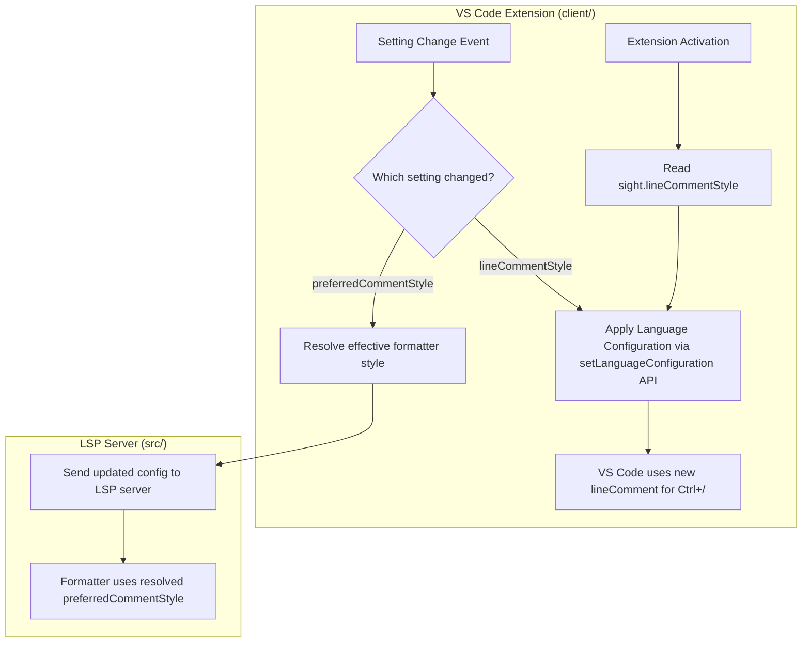
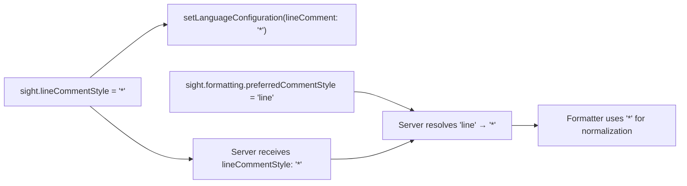

# Design Document: Configurable Comment Style

## Overview

This feature introduces a `sight.lineCommentStyle` setting that controls which line comment character (`//` or `*`) VS Code uses for the toggle comment shortcut in Stata files. It also updates the existing `sight.formatting.preferredCommentStyle` setting to add a `"line"` option (new default) that defers to `lineCommentStyle`, keeping both settings in sync by default.

The implementation is entirely client-side (VS Code extension). The LSP server is not involved in comment toggling — VS Code handles it natively via the language configuration. The extension uses `vscode.languages.setLanguageConfiguration()` to dynamically override the static `language-configuration.json` at runtime.

## Architecture



The key insight is that `language-configuration.json` is static and loaded once. To make the `lineComment` property dynamic, we call `vscode.languages.setLanguageConfiguration('stata', ...)` which returns a `Disposable`. Each time the setting changes, we dispose the previous configuration and apply a new one.

## Components and Interfaces

### 1. Language Configuration Manager (`client/src/language-config.ts`)

New module responsible for applying dynamic language configuration.

```typescript
import { Disposable, languages, workspace } from 'vscode';

/**
 * The full language configuration object matching language-configuration.json,
 * with a dynamic lineComment field.
 */
const STATA_LANGUAGE_CONFIG_BASE = {
    comments: {
        blockComment: ['/*', '*/'] as [string, string],
    },
    wordPattern: /[a-zA-Z_][a-zA-Z0-9_]*/,
    brackets: [
        ['{', '}'],
        ['[', ']'],
        ['(', ')'],
    ] as [string, string][],
    autoClosingPairs: [
        { open: '{', close: '}' },
        { open: '[', close: ']' },
        { open: '(', close: ')' },
        { open: '"', close: '"', notIn: ['string'] },
        { open: '`', close: "'", notIn: [] },
    ],
    surroundingPairs: [
        ['{', '}'],
        ['[', ']'],
        ['(', ')'],
        ['"', '"'],
    ] as [string, string][],
    indentationRules: {
        increaseIndentPattern:
            /^\s*(program\s+define|if|else|foreach|forvalues|while)\b.*$|^\s*\{\s*$/,
        decreaseIndentPattern: /^\s*(end|else|\})\s*$/,
    },
};

/**
 * Read the current line comment style from settings.
 */
function read_line_comment_style(): '//' | '*' {
    const config = workspace.getConfiguration('sight');
    const style = config.get<string>('lineCommentStyle', '//');
    return style === '*' ? '*' : '//';
}

/**
 * Apply the Stata language configuration with the given line comment style.
 * Returns a Disposable that must be disposed before re-applying.
 */
function apply_language_configuration(
    line_comment: '//' | '*'
): Disposable {
    return languages.setLanguageConfiguration('stata', {
        ...STATA_LANGUAGE_CONFIG_BASE,
        comments: {
            lineComment: line_comment,
            blockComment: ['/*', '*/'] as [string, string],
        },
    });
}
```

### 2. Extension Entry Point Changes (`client/src/extension.ts`)

The `activate` function gains:
- An initial call to apply the language configuration based on the current setting
- A `workspace.onDidChangeConfiguration` listener that re-applies when `sight.lineCommentStyle` changes

```typescript
// In activate():
import {
    apply_language_configuration,
    read_line_comment_style,
} from './language-config';

// Apply initial language configuration
let language_config_disposable = apply_language_configuration(
    read_line_comment_style()
);
context.subscriptions.push(language_config_disposable);

// Listen for setting changes
const config_change_listener = workspace.onDidChangeConfiguration(e => {
    if (e.affectsConfiguration('sight.lineCommentStyle')) {
        language_config_disposable.dispose();
        language_config_disposable = apply_language_configuration(
            read_line_comment_style()
        );
    }
});
context.subscriptions.push(config_change_listener);
```

### 3. Setting Registration (`client/package.json`)

New setting added to `contributes.configuration.properties`:

```json
"sight.lineCommentStyle": {
    "type": "string",
    "enum": ["//", "*"],
    "default": "//",
    "description": "Line comment character used by the toggle comment shortcut. In Stata, '//' can appear anywhere on a line while '*' must be at the start of a line.",
    "enumDescriptions": [
        "Use // for line comments (works anywhere on a line)",
        "Use * for line comments (must be at the start of a line)"
    ]
}
```

### 4. Formatter Setting Update (`client/package.json` + `src/`)

The existing `sight.formatting.preferredCommentStyle` setting gains a `"line"` option:

```json
"sight.formatting.preferredCommentStyle": {
    "type": "string",
    "enum": ["line", "//", "*", "/* */"],
    "default": "line",
    "description": "Preferred comment style for normalization. 'line' uses the value of sight.lineCommentStyle.",
    "enumDescriptions": [
        "Use the same style as sight.lineCommentStyle",
        "Use // for line comments",
        "Use * for line comments",
        "Use /* */ for block comments"
    ]
}
```

On the server side, the `"line"` value needs resolution. Since the LSP server receives settings via `configurationSection: 'sight'`, the server-side config validator must handle the `"line"` value. The resolution approach:

- The VS Code client already syncs the full `sight` configuration section to the server
- The server's `validate_comment_formatting_config` in `config-validator.ts` must accept `"line"` as a valid `preferredCommentStyle` value
- When the server encounters `"line"`, it reads the `lineCommentStyle` setting from the same config object to resolve the effective style
- The `StataLSPConfig` type and `CommentFormattingConfig` type must be updated to include `"line"` in the union

### 5. Type Updates (`src/types/index.ts`)

```typescript
export interface CommentFormattingConfig {
    preferredCommentStyle: 'line' | '//' | '*' | '/* */';
    normalizeCommentStyle: boolean;
    commentLineWidth: number;
    lineWidth?: number;
}

// In StataLSPConfig.formatting:
preferredCommentStyle: 'line' | '//' | '*' | '/* */';
```

### 6. Config Validator Updates (`src/utils/config-validator.ts`)

The validator must:
- Accept `"line"` as a valid `preferredCommentStyle`
- Resolve `"line"` to the effective style using the `lineCommentStyle` value from the same config

```typescript
// In validate_comment_formatting_config:
if (formatting.preferredCommentStyle !== undefined) {
    if (
        formatting.preferredCommentStyle === 'line' ||
        formatting.preferredCommentStyle === '//' ||
        formatting.preferredCommentStyle === '*' ||
        formatting.preferredCommentStyle === '/* */'
    ) {
        validated_config.formatting.preferredCommentStyle =
            formatting.preferredCommentStyle;
    }
}

// New: resolve "line" to effective style
if (validated_config.formatting.preferredCommentStyle === 'line') {
    const line_style = (config as any)?.lineCommentStyle;
    validated_config.formatting.preferredCommentStyle =
        line_style === '*' ? '*' : '//';
}
```

### 7. Server Handlers Update (`src/server-handlers.ts`)

The `DEFAULT_SETTINGS` must be updated:

```typescript
preferredCommentStyle: 'line',  // was '//'
```

And a new `lineCommentStyle` field must be added to the config shape so the server can resolve `"line"`:

```typescript
// In StataLSPConfig:
lineCommentStyle?: '//' | '*';
```

## Data Models

### Settings Schema

| Setting | Type | Default | Values | Scope |
|---------|------|---------|--------|-------|
| `sight.lineCommentStyle` | enum | `"//"` | `"//"`, `"*"` | Client-only (language config) + synced to server |
| `sight.formatting.preferredCommentStyle` | enum | `"line"` | `"line"`, `"//"`, `"*"`, `"/* */"` | Synced to server (formatter) |

### Configuration Flow




## Correctness Properties

*A property is a characteristic or behavior that should hold true across all valid executions of a system — essentially, a formal statement about what the system should do. Properties serve as the bridge between human-readable specifications and machine-verifiable correctness guarantees.*

### Property 1: Language configuration preserves structure and applies correct lineComment

*For any* valid line comment style (`"//"` or `"*"`), the language configuration object produced by `apply_language_configuration` should have its `comments.lineComment` field equal to the input style, AND should preserve all other configuration properties (brackets, autoClosingPairs, surroundingPairs, indentationRules, wordPattern, blockComment) unchanged from the base configuration.

**Validates: Requirements 1.3, 2.2, 3.1, 3.2**

### Property 2: "line" resolution defers to lineCommentStyle

*For any* `lineCommentStyle` value (`"//"` or `"*"`), when `preferredCommentStyle` is `"line"`, the config validator should resolve the effective formatter comment style to the `lineCommentStyle` value.

**Validates: Requirements 5.1, 5.3**

### Property 3: Explicit preferredCommentStyle bypasses lineCommentStyle

*For any* explicit `preferredCommentStyle` value (`"//"`, `"*"`, or `"/* */"`) and *for any* `lineCommentStyle` value, the config validator should resolve the effective formatter comment style to the explicit `preferredCommentStyle` value, ignoring `lineCommentStyle`.

**Validates: Requirements 5.4**

## Error Handling

- Invalid `lineCommentStyle` values (anything other than `"//"` or `"*"`) fall back to `"//"` with no error
- The `read_line_comment_style` function treats any unrecognized value as `"//"`
- If `setLanguageConfiguration` fails (unlikely but possible), the static `language-configuration.json` remains in effect as a fallback — no user-visible error needed
- The config validator on the server side treats unrecognized `preferredCommentStyle` values the same as before (falls back to default with a warning log)

## Testing Strategy

### Property-Based Tests (fast-check)

Property tests validate the three correctness properties above. Each test generates random valid inputs and verifies the property holds.

- **Property 1**: Generate random line comment styles from `{'//', '*'}`. Call the configuration builder function. Assert `lineComment` matches input and all other fields match the base config.
- **Property 2**: Generate random `lineCommentStyle` from `{'//', '*'}`. Call the config validator with `preferredCommentStyle: 'line'` and the generated `lineCommentStyle`. Assert the resolved style equals the `lineCommentStyle`.
- **Property 3**: Generate random `preferredCommentStyle` from `{'//', '*', '/* */'}` and random `lineCommentStyle` from `{'//', '*'}`. Call the config validator. Assert the resolved style equals the explicit `preferredCommentStyle`.

Configuration: minimum 100 iterations per property test.

Tag format: **Feature: configurable-comment-style, Property N: {property_text}**

### Unit Tests

Unit tests cover specific examples and edge cases:

- Default `lineCommentStyle` is `"//"` when not configured
- Default `preferredCommentStyle` is `"line"` in DEFAULT_SETTINGS
- Config validator handles missing `lineCommentStyle` when `preferredCommentStyle` is `"line"` (falls back to `"//"`)
- Config validator handles invalid `preferredCommentStyle` values (falls back to default with warning)

### Testing Library

- Property-based testing: `fast-check` (already used in the project)
- Unit testing: `bun test` (already used in the project)
