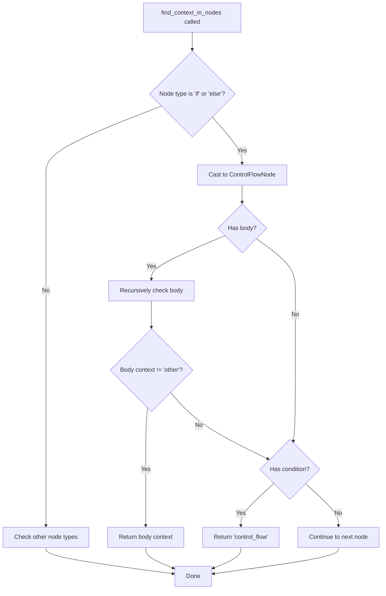

# Design Document: C-Style Logical Context Detection Bugfix

## Overview

This bugfix corrects the context detection logic in `OperatorSequenceAnalyzer.find_context_in_nodes()` for C-style logical operators (`&&`, `||`). The current implementation incorrectly returns `'control_flow'` context when an operator is inside a control flow body but within an if qualifier on a command.

The fix changes the order of checks: the method must first recursively check the body for nested contexts before checking if the node has a condition. This ensures that operators in if qualifiers inside control flow bodies are correctly classified as `'qualifier'` context.

## Architecture

The fix is localized to a single method in `src/providers/operator-sequence-diagnostics.ts`. No architectural changes are required.



**Before (buggy):**
1. Check if node has condition → return `'control_flow'` immediately
2. Check body (never reached if condition exists)

**After (fixed):**
1. Check body first → if nested context found, return it
2. Only if body returns `'other'`, check condition → return `'control_flow'`

## Components and Interfaces

### Modified Method: `find_context_in_nodes`

**File**: `src/providers/operator-sequence-diagnostics.ts`

**Current (buggy) code:**
```typescript
if (my_node.type === 'if' || my_node.type === 'else') {
    const control_flow_node = my_node as ControlFlowNode;
    
    if (control_flow_node.condition) {
        // BUG: Returns 'control_flow' immediately without checking if operator is in body
        return 'control_flow';
    }
    
    // Recursively check body - but this is never reached if condition exists!
    if (control_flow_node.body) {
        const body_context = this.find_context_in_nodes(control_flow_node.body, op_line, op_char);
        if (body_context !== 'other') {
            return body_context;
        }
    }
}
```

**Fixed code:**
```typescript
if (my_node.type === 'if' || my_node.type === 'else') {
    const control_flow_node = my_node as ControlFlowNode;
    
    // FIRST: Recursively check body to see if operator is in a nested context
    if (control_flow_node.body) {
        const body_context = this.find_context_in_nodes(control_flow_node.body, op_line, op_char);
        if (body_context !== 'other') {
            return body_context;
        }
    }
    
    // THEN: If not in body and node has a condition, operator must be in the condition
    if (control_flow_node.condition) {
        return 'control_flow';
    }
}
```

### No Interface Changes

The fix is purely internal logic reordering. No changes to:
- Public interfaces
- Type definitions
- Configuration
- Other components

## Data Models

No changes to data models. The existing `OperatorContext` type (`'control_flow' | 'qualifier' | 'other'`) remains unchanged.


## Correctness Properties

*A property is a characteristic or behavior that should hold true across all valid executions of a system — essentially, a formal statement about what the system should do. Properties serve as the bridge between human-readable specifications and machine-verifiable correctness guarantees.*

### Property 1: If qualifier context detection emits Error diagnostic

*For any* C-style logical operator (`&&`, `||`) appearing in an if qualifier on a command, regardless of nesting depth within control flow structures, the analyzer should emit exactly one diagnostic with: (a) severity Error, (b) code `INVALID_OPERATOR_SEQUENCE` (6002), and (c) a message noting that Stata uses single `|` or `&` for logical operations.

**Validates: Requirements 1.1, 2.1, 3.1**

### Property 2: Control flow context detection emits Information diagnostic

*For any* C-style logical operator (`&&`, `||`) appearing in the condition of an if/else if control flow statement, regardless of nesting depth, the analyzer should emit exactly one diagnostic with: (a) severity Information (when config is not 'off'), (b) code `CSTYLE_LOGICAL_IN_CONTROL_FLOW` (6003), and (c) a message suggesting the use of single operators for consistency.

**Validates: Requirements 1.2, 2.2, 3.2**

## Error Handling

No new error handling is required. The fix is a logic reordering within an existing method. The existing error handling in `OperatorSequenceAnalyzer` (handling missing AST, missing tokens, etc.) remains unchanged.

## Testing Strategy

### Property-Based Testing (fast-check)

Two property-based tests with minimum 100 iterations each:

**Property 1 Test**: Generate random control flow structures (if, else if, else, foreach, forvalues, while) containing commands with if qualifiers that include C-style logical operators. Verify that the analyzer emits Error diagnostics with code 6002.

**Property 2 Test**: Generate random if/else if control flow statements with C-style logical operators in their conditions. Verify that the analyzer emits Information diagnostics with code 6003.

**Test file**: `tests/property/cstyle-logical-context-bugfix.prop.test.ts`

Each test is tagged with:
```
Feature: cstyle-logical-context-detection-bugfix, Property N: <property_text>
```

### Unit Testing

Unit tests cover the specific reproduction case and edge cases:

1. **Reproduction case**: `if (1 && 1) { gen x = y if 1 && 2 }` - verify line 1 gets code 6003, line 2 gets code 6002
2. **Nested control flow**: Multiple levels of nesting with if qualifiers
3. **Nested if conditions**: `if (a) { if (b && c) { ... } }` - inner condition should get code 6003
4. **Mixed nesting**: Control flow with both nested conditions and if qualifiers

**Test file**: `tests/unit/cstyle-logical-context-bugfix.test.ts`

### Regression Testing

The existing property tests in `tests/property/operator-sequence-diagnostics.prop.test.ts` should continue to pass, ensuring the fix doesn't break existing behavior.
