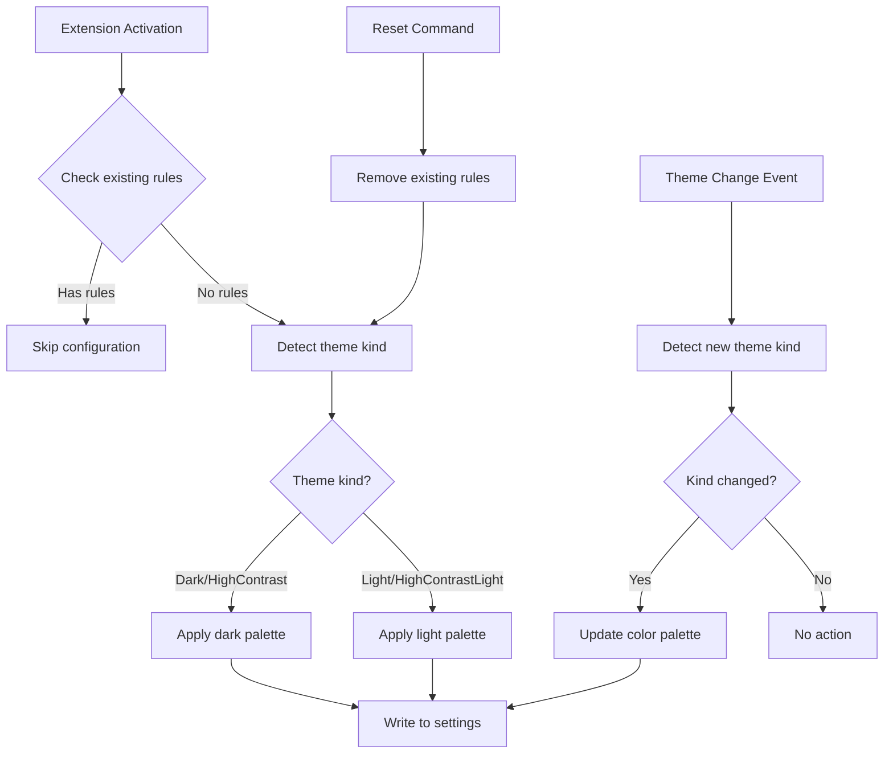

# Design Document: Depth Color Theme Compatibility

## Overview

This design addresses the issue where nested syntax coloring (depth colors) for compound strings and local macros doesn't work in VS Code themes that don't contain "Dark" or "Light" in their names. The current implementation uses `[*Dark*]` and `[*Light*]` wildcard theme selectors, which fail to match themes like "Monokai", "Dracula", "Nord", "Solarized", etc.

The solution uses VS Code's `window.activeColorTheme` API to detect the actual theme kind (dark/light/high-contrast) and applies colors using a universal selector `[*]` combined with runtime theme detection to select the appropriate color palette.

## Architecture



## Components and Interfaces

### 1. Theme Detection Module

The core module for detecting the current theme's color scheme type.

```typescript
import { window, ColorThemeKind } from 'vscode';

/**
 * Determines if the current theme is a dark theme.
 * Includes both regular dark themes and high contrast dark themes.
 */
export function isDarkTheme(): boolean {
    const theme_kind = window.activeColorTheme.kind;
    return theme_kind === ColorThemeKind.Dark || 
           theme_kind === ColorThemeKind.HighContrast;
}

/**
 * Gets the appropriate color palette based on current theme.
 */
export function getThemeColorPalette(): {
    string_colors: string[];
    macro_colors: string[];
} {
    if (isDarkTheme()) {
        return {
            string_colors: DARK_STRING_COLORS,
            macro_colors: DARK_MACRO_COLORS
        };
    }
    return {
        string_colors: LIGHT_STRING_COLORS,
        macro_colors: LIGHT_MACRO_COLORS
    };
}
```

### 2. Universal Selector Strategy

Instead of using `[*Dark*]` and `[*Light*]` selectors that only match themes with those words in their names, we use a universal approach:

**Option A: Universal Selector with Runtime Detection**
- Use `[*]` selector to match all themes
- Detect theme kind at runtime and apply appropriate colors
- Re-apply colors when theme changes

**Option B: Comprehensive Theme Selectors (Selected Approach)**
- Keep `[*Dark*]` and `[*Light*]` for themes that match
- Add `[*]` as a fallback for themes that don't match either pattern
- The fallback uses runtime detection to choose dark or light colors

The selected approach (Option B) provides:
1. Backward compatibility with existing user customizations
2. Fallback coverage for all other themes
3. Automatic color updates on theme change

### 3. Updated Configuration Logic

```typescript
/**
 * Build textMateRules for the universal fallback selector.
 * Uses runtime theme detection to select appropriate colors.
 */
export function buildUniversalDepthColorRules(): TextMateRule[] {
    const palette = getThemeColorPalette();
    return buildDepthColorRules(palette.string_colors, palette.macro_colors);
}

/**
 * Merge depth color rules with comprehensive theme coverage.
 */
export function mergeDepthColorsComprehensive(
    existing: TokenColorCustomizations | undefined
): TokenColorCustomizations {
    const result: TokenColorCustomizations = existing ? { ...existing } : {};

    // Build rules for dark and light themes (existing behavior)
    const dark_rules = buildDepthColorRules(DARK_STRING_COLORS, DARK_MACRO_COLORS);
    const light_rules = buildDepthColorRules(LIGHT_STRING_COLORS, LIGHT_MACRO_COLORS);

    // Merge dark theme rules (for themes with "Dark" in name)
    const existing_dark = result['[*Dark*]'] as ThemeTokenColorCustomizations | undefined;
    result['[*Dark*]'] = {
        ...existing_dark,
        textMateRules: [
            ...(existing_dark?.textMateRules || []),
            ...dark_rules
        ]
    };

    // Merge light theme rules (for themes with "Light" in name)
    const existing_light = result['[*Light*]'] as ThemeTokenColorCustomizations | undefined;
    result['[*Light*]'] = {
        ...existing_light,
        textMateRules: [
            ...(existing_light?.textMateRules || []),
            ...light_rules
        ]
    };

    // Add universal fallback rules based on current theme detection
    const universal_rules = buildUniversalDepthColorRules();
    const existing_universal = result['[*]'] as ThemeTokenColorCustomizations | undefined;
    result['[*]'] = {
        ...existing_universal,
        textMateRules: [
            ...(existing_universal?.textMateRules || []),
            ...universal_rules
        ]
    };

    return result;
}
```

### 4. Theme Change Handler

```typescript
/**
 * Register handler for theme changes to update depth colors.
 */
export function registerThemeChangeHandler(
    context: vscode.ExtensionContext,
    output_channel?: vscode.OutputChannel
): vscode.Disposable {
    let previous_is_dark = isDarkTheme();
    
    return vscode.window.onDidChangeActiveColorTheme(async (theme) => {
        const current_is_dark = isDarkTheme();
        
        // Only update if theme kind changed (dark <-> light)
        if (current_is_dark !== previous_is_dark) {
            log(output_channel, `Theme kind changed: ${previous_is_dark ? 'dark' : 'light'} -> ${current_is_dark ? 'dark' : 'light'}`);
            previous_is_dark = current_is_dark;
            
            // Update the universal fallback colors
            await updateUniversalFallbackColors(output_channel);
        }
    });
}

/**
 * Update only the universal fallback colors based on current theme.
 */
async function updateUniversalFallbackColors(
    output_channel?: vscode.OutputChannel
): Promise<void> {
    const config = vscode.workspace.getConfiguration('editor');
    const current = config.get<TokenColorCustomizations>('tokenColorCustomizations') || {};
    
    // Remove existing universal depth rules
    const universal_section = current['[*]'] as ThemeTokenColorCustomizations | undefined;
    if (universal_section?.textMateRules) {
        universal_section.textMateRules = universal_section.textMateRules.filter(
            rule => !isDepthColorRule(rule)
        );
    }
    
    // Add new rules based on current theme
    const new_rules = buildUniversalDepthColorRules();
    current['[*]'] = {
        ...universal_section,
        textMateRules: [
            ...(universal_section?.textMateRules || []),
            ...new_rules
        ]
    };
    
    await config.update(
        'tokenColorCustomizations',
        current,
        vscode.ConfigurationTarget.Global
    );
    
    log(output_channel, 'Updated universal fallback colors');
}
```

## Data Models

### TokenColorCustomizations (Extended)

```typescript
export interface TokenColorCustomizations {
    '[*Dark*]'?: ThemeTokenColorCustomizations;
    '[*Light*]'?: ThemeTokenColorCustomizations;
    '[*]'?: ThemeTokenColorCustomizations;  // Universal fallback
    textMateRules?: TextMateRule[];
    [key: string]: ThemeTokenColorCustomizations | TextMateRule[] | undefined;
}
```

### Theme Detection State

```typescript
interface ThemeState {
    is_dark: boolean;
    theme_name: string;
    kind: ColorThemeKind;
}
```

## Correctness Properties

*A property is a characteristic or behavior that should hold true across all valid executions of a system-essentially, a formal statement about what the system should do. Properties serve as the bridge between human-readable specifications and machine-verifiable correctness guarantees.*

### Property 1: Universal Color Application

*For any* VS Code theme (regardless of name), when the extension activates and no existing depth color rules are present, the Depth_Color_System should add depth color rules that will be applied to that theme.

**Validates: Requirements 1.1, 1.2**

### Property 2: Theme-Kind-Appropriate Palette Selection

*For any* theme with a known ColorThemeKind, the selected color palette should match the theme's kind: dark themes (Dark, HighContrast) should receive dark palette colors, and light themes (Light, HighContrastLight) should receive light palette colors.

**Validates: Requirements 1.3, 2.1, 2.2**

### Property 3: Dynamic Theme Change Handling

*For any* theme change event where the theme kind changes (dark to light or vice versa), the universal fallback colors should be updated to match the new theme kind.

**Validates: Requirements 2.3, 5.1, 5.2, 5.3**

### Property 4: Fallback Mechanism Reliability

*For any* theme configuration where neither `[*Dark*]` nor `[*Light*]` selectors match, the `[*]` universal selector should provide depth colors based on runtime theme detection.

**Validates: Requirements 3.1, 3.2**

### Property 5: User Customization Preservation

*For any* existing tokenColorCustomizations that contain depth color rules, calling the configuration function should not modify or remove those existing rules.

**Validates: Requirements 4.1, 4.2**

### Property 6: Reset Functionality

*For any* existing tokenColorCustomizations (with or without depth color rules), invoking the reset command should result in only the default depth color rules being present (removing any user customizations to depth colors).

**Validates: Requirements 4.3**

## Error Handling

### Theme Detection Failures

If `window.activeColorTheme` is unavailable or returns an unexpected value:
1. Log a warning message
2. Default to dark theme colors (most common theme type)
3. Continue with configuration

### Configuration Update Failures

If updating `tokenColorCustomizations` fails:
1. Log the error with details
2. Do not crash the extension
3. Inform user via output channel (not intrusive notification)

### Invalid Existing Configuration

If existing `tokenColorCustomizations` has unexpected structure:
1. Preserve the existing structure as-is
2. Add our rules in the appropriate sections
3. Log any anomalies for debugging

## Testing Strategy

### Unit Tests

Unit tests verify specific examples and edge cases:

1. **Theme detection accuracy**: Test `isDarkTheme()` returns correct values for each `ColorThemeKind`
2. **Color palette selection**: Test `getThemeColorPalette()` returns correct palettes
3. **Rule building**: Test `buildDepthColorRules()` produces correct TextMate rules
4. **Merge behavior**: Test `mergeDepthColorsComprehensive()` correctly merges with existing settings
5. **Rule detection**: Test `hasDepthColorRules()` correctly identifies existing rules

### Property-Based Tests

Property-based tests verify universal properties across all inputs. Each test should run minimum 100 iterations.

1. **Universal application property**: Generate random theme names and verify colors are applied
2. **Palette selection property**: Generate random ColorThemeKind values and verify correct palette
3. **Theme change property**: Generate sequences of theme changes and verify correct updates
4. **Preservation property**: Generate random existing configurations and verify preservation
5. **Reset property**: Generate random configurations and verify reset restores defaults

### Integration Tests

1. **Full activation flow**: Test extension activation applies colors correctly
2. **Theme change flow**: Test theme switching updates colors appropriately
3. **Reset command flow**: Test reset command works end-to-end
