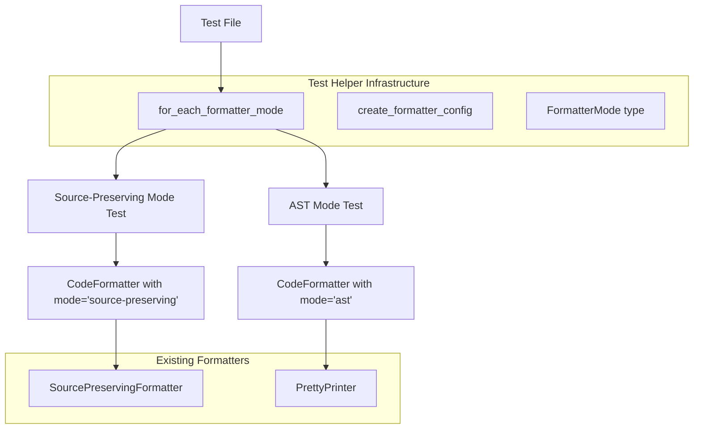

# Design Document: Dual Formatter Testing

## Overview

This design introduces a test infrastructure that ensures all formatter tests execute against both formatter implementations in the Sight LSP. The system provides a parameterized test helper that runs the same test logic against both the `SourcePreservingFormatter` (default mode) and `PrettyPrinter` (AST mode), with clear reporting of which mode failed.

The approach uses a higher-order function pattern that wraps test functions and executes them with different formatter configurations, leveraging Bun's test framework and fast-check for property-based testing.

## Architecture



## Components and Interfaces

### FormatterMode Type

```typescript
/**
 * Formatter mode type for parameterized testing.
 */
export type FormatterMode = 'source-preserving' | 'ast';

/**
 * All formatter modes for iteration.
 */
export const FORMATTER_MODES: FormatterMode[] = ['source-preserving', 'ast'];
```

### Test Helper Functions

```typescript
/**
 * Creates a StataLSPConfig with the specified formatter mode.
 * 
 * @param mode - The formatter mode to use
 * @returns StataLSPConfig configured for the specified mode
 */
export function create_formatter_config(mode: FormatterMode): StataLSPConfig;

/**
 * Runs a test function for each formatter mode.
 * Creates separate test cases with mode-specific names.
 * 
 * @param test_name - Base name for the test
 * @param test_fn - Test function that receives the formatter mode
 */
export function for_each_formatter_mode(
    test_name: string,
    test_fn: (mode: FormatterMode) => void | Promise<void>
): void;

/**
 * Runs a property test for each formatter mode.
 * Wraps fast-check property tests with mode parameterization.
 * 
 * @param test_name - Base name for the test
 * @param arbitrary - fast-check arbitrary for generating test data
 * @param property_fn - Property function that receives mode and generated data
 */
export function for_each_formatter_mode_property<T>(
    test_name: string,
    arbitrary: fc.Arbitrary<T>,
    property_fn: (mode: FormatterMode, data: T) => boolean | void
): void;
```

### Mode-Specific Assertion Helpers

```typescript
/**
 * Skips an assertion for a specific formatter mode.
 * Use when behavior legitimately differs between modes.
 * 
 * @param mode - Current formatter mode
 * @param skip_mode - Mode to skip the assertion for
 * @param assertion_fn - Assertion function to conditionally execute
 */
export function skip_for_mode(
    mode: FormatterMode,
    skip_mode: FormatterMode,
    assertion_fn: () => void
): void;

/**
 * Runs mode-specific assertions.
 * 
 * @param mode - Current formatter mode
 * @param assertions - Object mapping modes to assertion functions
 */
export function mode_specific_assertion(
    mode: FormatterMode,
    assertions: Partial<Record<FormatterMode, () => void>>
): void;
```

## Data Models

### Test Configuration

```typescript
interface FormatterTestContext {
    mode: FormatterMode;
    config: StataLSPConfig;
    formatter: CodeFormatter;
    options: FormattingOptions;
}
```

### Test Result Tracking

The test framework (Bun) handles result tracking. Each mode produces a separate test case with a descriptive name like:
- `"Property X [source-preserving]"`
- `"Property X [ast]"`

This ensures failures are clearly attributed to the specific mode.

## Correctness Properties

*A property is a characteristic or behavior that should hold true across all valid executions of a system—essentially, a formal statement about what the system should do. Properties serve as the bridge between human-readable specifications and machine-verifiable correctness guarantees.*

### Property 1: Dual Mode Execution

*For any* test function passed to `for_each_formatter_mode`, the helper SHALL execute the function exactly twice—once with `'source-preserving'` mode and once with `'ast'` mode.

**Validates: Requirements 1.1, 2.1**

### Property 2: Config Mode Correctness

*For any* formatter mode value, `create_formatter_config(mode)` SHALL return a `StataLSPConfig` where `config.formatting.mode` equals the input mode.

**Validates: Requirements 2.2**

### Property 3: Mode Skip Correctness

*For any* current mode and skip mode, `skip_for_mode(current, skip, fn)` SHALL execute `fn` if and only if `current !== skip`.

**Validates: Requirements 4.1, 4.2**

### Property 4: Test Name Mode Inclusion

*For any* base test name, the generated test names from `for_each_formatter_mode` SHALL contain the mode identifier (either `[source-preserving]` or `[ast]`).

**Validates: Requirements 5.2**

## Error Handling

### Invalid Mode Values

The `create_formatter_config` function accepts only valid `FormatterMode` values. TypeScript's type system enforces this at compile time. At runtime, invalid values would result in the default behavior of the `CodeFormatter` (source-preserving mode).

### Test Function Errors

If a test function throws an error, the error propagates normally through the test framework. The test name includes the mode, so the failure is clearly attributed.

### Formatter Errors

Both formatters have internal error handling:
- `SourcePreservingFormatter`: Falls back to original source on error
- `PrettyPrinter` (AST mode): Returns empty edits on error

Tests should account for these behaviors when asserting on formatter output.

## Testing Strategy

### Dual Testing Approach

This feature uses both unit tests and property-based tests:

- **Unit tests**: Verify specific examples like test name generation, config creation
- **Property tests**: Verify universal properties across all inputs using fast-check

### Property-Based Testing Configuration

- Library: fast-check
- Minimum iterations: 100 per property test
- Each property test references its design document property via comment tags

### Test File Organization

New test helper file:
```
tests/property/helpers/formatter-test-utils.ts
```

Property tests for the helper:
```
tests/property/dual-formatter-execution.prop.test.ts
```

### Migration Strategy

Existing formatter tests will be migrated incrementally:

1. Import the new helper functions
2. Replace direct `it()` calls with `for_each_formatter_mode()`
3. Update assertions that need mode-specific behavior using `skip_for_mode()`
4. Verify tests pass for both modes

### Known Behavioral Differences

The AST formatter (`PrettyPrinter`) may produce different output than the source-preserving formatter in these cases:

1. **Whitespace normalization**: AST formatter normalizes whitespace; source-preserving preserves original
2. **Comment placement**: AST formatter may reposition comments based on AST structure
3. **Statement terminators**: AST formatter uses consistent terminators based on delimiter mode

Tests should use `skip_for_mode()` or `mode_specific_assertion()` when these differences are expected.

## Documentation Updates

### AGENTS.md Updates

The following section will be added to AGENTS.md under the "Formatting and Analysis" section:

```markdown
**Dual Formatter Architecture**: Sight has two formatter implementations:
- `SourcePreservingFormatter` (default): Reconstructs source from tokens, preserving original structure
- `PrettyPrinter` (AST mode): Reconstructs source from AST, normalizing structure

When adding formatter tests, use the dual-mode test helpers in `tests/property/helpers/formatter-test-utils.ts`:
- `for_each_formatter_mode()` - Runs a test for both formatter modes
- `for_each_formatter_mode_property()` - Runs a property test for both modes
- `skip_for_mode()` - Skip assertions for a specific mode when behavior legitimately differs

All new formatter tests MUST use these helpers to ensure both formatters are tested.
```

