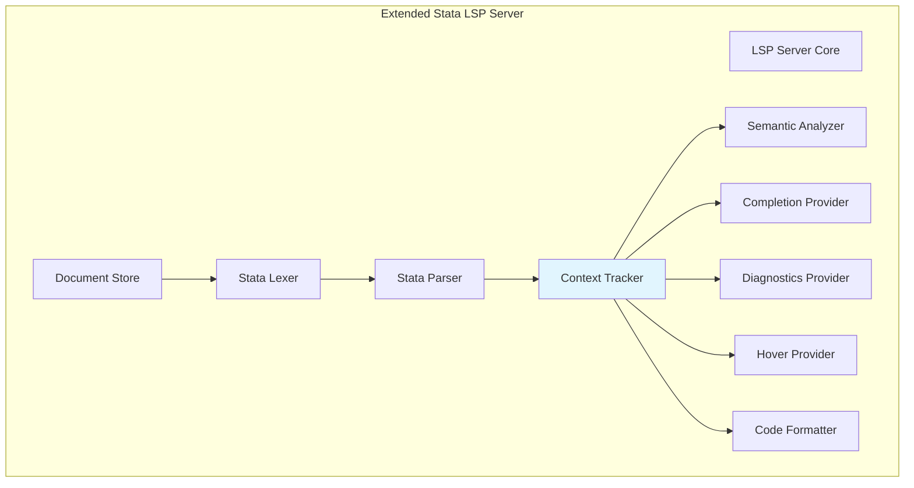

# Design Document: Embedded Language Detection for Stata LSP

## Overview

This document describes the design for extending the existing Stata Language Server Protocol (LSP) to detect and handle embedded language blocks within Stata do-files. The design focuses on adding context awareness to distinguish between Stata code and embedded Mata/Python blocks without providing full language support for the embedded languages.

The implementation will extend the existing lexer, parser, and LSP providers to maintain language context state and provide context-appropriate language features.

## Architecture

The embedded language detection extends the existing Stata LSP architecture with a new Context Tracker component:



### Key Design Principles

1. **Minimal Invasiveness**: Extend existing components rather than rewriting them
2. **Context Isolation**: Embedded language content is treated as opaque text blocks
3. **Graceful Degradation**: LSP features continue to work even with malformed embedded blocks
4. **Performance**: Context tracking adds minimal overhead to parsing

## Components and Interfaces

### 1. Language Context Types

```typescript
enum LanguageContext {
  STATA = 'stata',
  MATA = 'mata', 
  PYTHON = 'python'
}

interface ContextRange {
  context: LanguageContext;
  range: Range;
  // For nested contexts (e.g., mata within mata)
  parentContext?: LanguageContext;
  // Block delimiter information
  startDelimiter: {
    command: string;  // 'mata', 'python', 'mata:', 'python:'
    range: Range;
  };
  endDelimiter?: {
    command: string;  // 'end', 'end python'
    range: Range;
  };
  // Whether this is a single-line context (mata:, python:)
  isSingleLine: boolean;
}
```

### 2. Context Tracker (`src/context-tracker/index.ts`)

The Context Tracker maintains language context state during parsing and provides context information to other components.

```typescript
interface ContextTracker {
  // Initialize with document content
  initialize(document_content: string, existing_ast?: StataAST): void;
  
  // Get context at a specific position
  get_context_at_position(position: Position): LanguageContext;
  
  // Get all context ranges in the document
  get_all_context_ranges(): ContextRange[];
  
  // Get context range containing a position
  get_context_range_at_position(position: Position): ContextRange | undefined;
  
  // Check if a position is within an embedded language block
  is_in_embedded_language(position: Position): boolean;
  
  // Update context after document changes (for incremental parsing)
  update_context(changes: TextDocumentContentChangeEvent[], new_content: string): void;
  
  // Validate context structure and return diagnostics
  validate_context_structure(): ContextDiagnostic[];
}

interface ContextDiagnostic {
  message: string;
  range: Range;
  severity: DiagnosticSeverity;
  code: ContextErrorCode;
}

enum ContextErrorCode {
  UNCLOSED_MATA_BLOCK = 4001,
  UNCLOSED_PYTHON_BLOCK = 4002,
  UNEXPECTED_END = 4003,
  MISMATCHED_END_PYTHON = 4004,
  NESTED_BLOCK_ERROR = 4005,
  INVALID_DELIMITER_POSITION = 4006,
}
```

### 3. Extended Lexer Modifications

The existing lexer will be extended to recognize embedded language block delimiters and switch to a "pass-through" mode within embedded blocks.

```typescript
// Add new token types for embedded language delimiters
type TokenType = 
  // ... existing token types
  | 'MATA_START'        // 'mata' at statement start
  | 'MATA_INLINE'       // 'mata:' 
  | 'PYTHON_START'      // 'python' at statement start
  | 'PYTHON_INLINE'     // 'python:'
  | 'END_MATA'          // 'end' in mata context
  | 'END_PYTHON'        // 'end python'
  | 'EMBEDDED_CONTENT'; // Raw content within embedded blocks

// Extended lexer state to track context
interface ExtendedLexerState extends LexerState {
  language_context: LanguageContext;
  context_stack: LanguageContext[];  // For nested blocks
  embedded_block_start?: Position;   // Track where current embedded block started
}

// Lexer behavior in embedded contexts:
// - In MATA/PYTHON context: emit EMBEDDED_CONTENT tokens for most content
// - Still tokenize strings, comments, and braces for basic bracket matching
// - Watch for block-ending delimiters ('end', 'end python')
// - Preserve line/column information for error reporting
```

### 4. Extended Parser Modifications

The parser will be extended to recognize embedded language block delimiters and create special AST nodes for embedded content.

```typescript
// New AST node types for embedded language blocks
interface EmbeddedLanguageBlockNode {
  type: 'embedded_block';
  language: 'mata' | 'python';
  start_command: string;           // 'mata', 'python', 'mata:', 'python:'
  end_command?: string;            // 'end', 'end python' (undefined if unclosed)
  content: string;                 // Raw content between delimiters
  content_range: Range;            // Range of the content (excluding delimiters)
  is_single_line: boolean;         // true for 'mata:', 'python:'
  range: Range;                    // Full range including delimiters
  leading_trivia?: TriviaNode[];
  trailing_trivia?: TriviaNode[];
}

// Parser modifications:
// - Recognize 'mata', 'python' at statement boundaries
// - Switch to embedded content parsing mode
// - Collect all tokens until matching 'end' or 'end python'
// - Create EmbeddedLanguageBlockNode with raw content
// - Handle nesting by maintaining context stack
// - Detect malformed blocks (missing end, wrong end type)
```

### 5. Context-Aware Provider Extensions

All existing LSP providers will be extended to use context information from the Context Tracker.

#### Diagnostics Provider Extensions

```typescript
interface ContextAwareDiagnosticsProvider extends DiagnosticsProvider {
  get_diagnostics_with_context(document: DocumentState, context_ranges: ContextRange[]): Diagnostic[];
}

// Diagnostic behavior by context:
// - STATA context: Normal Stata diagnostics
// - MATA/PYTHON context: 
//   - Suppress Stata syntax diagnostics
//   - Still report structural issues (unbalanced quotes/braces)
//   - Report context structure errors (unclosed blocks, etc.)
```

#### Completion Provider Extensions

```typescript
interface ContextAwareCompletionProvider extends CompletionProvider {
  get_completions_with_context(
    document: DocumentState,
    position: Position,
    context: LanguageContext,
    context_range?: ContextRange
  ): CompletionItem[];
}

// Completion behavior by context:
// - STATA context: Normal Stata completions
// - MATA/PYTHON context: 
//   - No Stata command completions
//   - Still provide macro completions (macros can be used in embedded languages)
//   - Suggest block-ending commands when appropriate
```

#### Hover Provider Extensions

```typescript
interface ContextAwareHoverProvider extends HoverProvider {
  get_hover_with_context(
    document: DocumentState,
    position: Position,
    context: LanguageContext
  ): Hover | null;
}

// Hover behavior by context:
// - STATA context: Normal Stata hover information
// - MATA/PYTHON context:
//   - No Stata command hover for embedded language keywords
//   - Still provide hover for Stata macros
//   - Provide hover info for block delimiters
```

#### Formatter Extensions

```typescript
interface ContextAwareFormatter extends CodeFormatter {
  format_with_context(
    document: DocumentState, 
    context_ranges: ContextRange[],
    options: FormattingOptions
  ): TextEdit[];
}

// Formatting behavior:
// - Format Stata code normally
// - Preserve embedded language block content unchanged
// - Properly indent block delimiters according to Stata rules
// - Maintain spacing around block boundaries
```

## Data Models

### Context Detection Algorithm

The context detection follows this algorithm:

```typescript
function detect_context_ranges(tokens: Token[]): ContextRange[] {
  const the_ranges: ContextRange[] = [];
  const the_context_stack: LanguageContext[] = [LanguageContext.STATA];
  let my_current_range: Partial<ContextRange> | null = null;
  
  for (const my_token of tokens) {
    const my_current_context = the_context_stack[the_context_stack.length - 1];
    
    if (my_current_context === LanguageContext.STATA) {
      // Look for embedded language block starts
      if (is_mata_start_token(my_token)) {
        my_current_range = start_embedded_block('mata', my_token);
        the_context_stack.push(LanguageContext.MATA);
      } else if (is_python_start_token(my_token)) {
        my_current_range = start_embedded_block('python', my_token);
        the_context_stack.push(LanguageContext.PYTHON);
      }
    } else {
      // In embedded language context, look for block ends
      if (is_matching_end_token(my_token, my_current_context)) {
        if (my_current_range) {
          my_current_range.end_delimiter = extract_end_delimiter(my_token);
          the_ranges.push(complete_context_range(my_current_range));
          my_current_range = null;
        }
        the_context_stack.pop();
      }
    }
  }
  
  // Handle unclosed blocks
  if (my_current_range) {
    the_ranges.push(complete_context_range(my_current_range));
  }
  
  return the_ranges;
}
```

### Block Delimiter Recognition

```typescript
// Mata block delimiters
const MATA_BLOCK_PATTERNS = {
  start_multiline: /^mata$/i,           // 'mata' at statement start
  start_single_line: /^mata:$/i,        // 'mata:' for single statement
  end_block: /^end$/i,                  // 'end' to close mata block
};

// Python block delimiters  
const PYTHON_BLOCK_PATTERNS = {
  start_multiline: /^python$/i,         // 'python' at statement start
  start_single_line: /^python:$/i,      // 'python:' for single statement
  end_block: /^end\s+python$/i,         // 'end python' to close python block
};

// Context validation rules
const CONTEXT_VALIDATION_RULES = {
  // 'end' can only appear in mata context
  mata_end_in_stata: 'error',
  // 'end python' can only appear in python context  
  python_end_in_wrong_context: 'error',
  // Blocks must be properly nested
  improper_nesting: 'error',
  // Single-line contexts don't need explicit end
  single_line_auto_close: 'info',
};
```

### Edge Case Handling

```typescript
// Handle edge cases in context detection
interface EdgeCaseHandler {
  // Don't switch context if delimiter is in comment or string
  is_delimiter_in_comment_or_string(token: Token, preceding_tokens: Token[]): boolean;
  
  // Handle 'end' that might be part of embedded language syntax
  is_end_part_of_embedded_syntax(token: Token, context: LanguageContext): boolean;
  
  // Recover from malformed blocks
  recover_from_malformed_block(tokens: Token[], error_position: number): ContextRange[];
  
  // Handle single-line contexts (mata:, python:)
  handle_single_line_context(start_token: Token, statement_tokens: Token[]): ContextRange;
}
```

## Integration with Existing LSP

### Document Store Integration

```typescript
// Extend DocumentState to include context information
interface ExtendedDocumentState extends DocumentState {
  context_ranges: ContextRange[];
  context_tracker: ContextTracker;
}

// Update document store to maintain context on changes
class ExtendedDocumentStore extends DocumentStore {
  update(uri: string, changes: TextDocumentContentChangeEvent[], version: number): void {
    super.update(uri, changes, version);
    
    const my_document = this.get(uri);
    if (my_document) {
      // Update context after content changes
      my_document.context_tracker.update_context(changes, my_document.content);
      my_document.context_ranges = my_document.context_tracker.get_all_context_ranges();
    }
  }
}
```

### Server Integration

```typescript
// Extend server to provide context-aware responses
class ContextAwareStataLSPServer extends StataLSPServer {
  onCompletion(params: CompletionParams): CompletionItem[] {
    const my_document = this.document_store.get(params.textDocument.uri);
    if (!my_document) return [];
    
    const my_context = my_document.context_tracker.get_context_at_position(params.position);
    return this.completion_provider.get_completions_with_context(
      my_document, 
      params.position, 
      my_context
    );
  }
  
  // Similar extensions for hover, diagnostics, formatting, etc.
}
```

## Performance Considerations

### Incremental Context Updates

```typescript
// Efficient context updates for incremental parsing
interface IncrementalContextUpdate {
  // Only re-analyze affected ranges when document changes
  update_affected_ranges(
    changes: TextDocumentContentChangeEvent[],
    existing_ranges: ContextRange[]
  ): ContextRange[];
  
  // Cache context information to avoid re-computation
  cache_context_ranges(uri: string, ranges: ContextRange[]): void;
  
  // Invalidate cache when document structure changes significantly
  invalidate_context_cache(uri: string): void;
}
```

### Memory Optimization

- Context ranges are computed lazily and cached
- Embedded language content is stored as string references, not parsed
- Context stack is lightweight (just enum values)
- Context information is cleaned up when documents are closed

## Error Recovery

### Malformed Block Handling

```typescript
interface ErrorRecoveryStrategy {
  // Continue parsing after encountering malformed embedded blocks
  recover_from_unclosed_block(context: LanguageContext, tokens: Token[]): ParseResult;
  
  // Handle unexpected end delimiters
  recover_from_unexpected_end(token: Token, context_stack: LanguageContext[]): void;
  
  // Provide helpful error messages for common mistakes
  suggest_block_fixes(error: ContextDiagnostic): string[];
}
```

## Testing Strategy

### Unit Tests
- Context detection algorithm with various block patterns
- Edge case handling (comments, strings, malformed blocks)
- Incremental update correctness
- Error recovery scenarios

### Integration Tests  
- End-to-end LSP features with embedded language blocks
- Performance with large files containing many embedded blocks
- Real-world Stata files with complex embedded language usage

### Property-Based Tests
- Context detection consistency across document modifications
- Round-trip property: context ranges remain valid after incremental updates
- Error recovery robustness with randomly malformed input

## Correctness Properties

*A property is a characteristic or behavior that should hold true across all valid executions of a system—essentially, a formal statement about what the system should do. Properties serve as the bridge between human-readable specifications and machine-verifiable correctness guarantees.*

The following properties will be validated using property-based testing to ensure the embedded language detection implementation is correct.

### Property 1: Context Switching Correctness

*For any* Stata document containing embedded language blocks, the Context Tracker should correctly switch contexts when encountering block delimiters at statement boundaries.

This includes:
- `mata` at statement start switches to Mata context
- `python` at statement start switches to Python context  
- `end` in Mata context switches back to Stata context
- `end python` in Python context switches back to Stata context
- `mata:` and `python:` create single-statement contexts

**Validates: Requirements 1.1, 1.2, 1.3, 2.1, 2.2, 2.3**

### Property 2: Context Stack Management

*For any* document with nested embedded language blocks, the Context Tracker should maintain a correct context stack where contexts are properly pushed and popped.

```
contextStack(nestedBlocks) = 
  push(MATA) → push(PYTHON) → pop() → pop() = [STATA]
```

**Validates: Requirements 1.6, 2.6**

### Property 3: Embedded Content Isolation

*For any* content within embedded language blocks, the Parser should treat it as raw text and not attempt to parse it as Stata syntax.

This ensures:
- Mata code is not parsed as Stata AST nodes
- Python code is not parsed as Stata AST nodes
- Embedded content is preserved as opaque text blocks

**Validates: Requirements 1.4, 1.5, 2.4, 2.5**

### Property 4: Context-Aware Diagnostics Suppression

*For any* position within an embedded language block, Stata-specific syntax diagnostics should be suppressed while basic structural diagnostics are still reported.

```
diagnosticsInContext(position, MATA | PYTHON) = 
  filter(allDiagnostics, isStructuralError) ∧ 
  ¬contains(stataSyntaxErrors)
```

**Validates: Requirements 3.1, 3.2, 3.3, 3.4, 3.5**

### Property 5: Context-Aware Completion Filtering

*For any* completion request within an embedded language context, Stata command completions should be suppressed while macro completions remain available.

**Validates: Requirements 4.1, 4.2, 4.3, 4.4, 4.5**

### Property 6: Context-Aware Hover Filtering

*For any* hover request within an embedded language context, Stata command hover information should be suppressed for embedded language keywords while macro hover remains available.

**Validates: Requirements 5.1, 5.2, 5.3, 5.4, 5.5**

### Property 7: Cross-Context Symbol Navigation

*For any* Stata macro reference within an embedded language block, go-to-definition should still resolve to the macro's definition location.

```
gotoDefinition(macroRef, embeddedContext) = 
  gotoDefinition(macroRef, stataContext)
```

**Validates: Requirements 6.1, 6.2, 6.3, 6.4**

### Property 8: Formatting Preservation

*For any* document containing embedded language blocks, formatting should preserve embedded content unchanged while properly formatting block delimiters.

```
format(stataCode + embeddedBlock + stataCode) = 
  format(stataCode) + preserve(embeddedBlock) + format(stataCode)
```

**Validates: Requirements 7.1, 7.2, 7.3, 7.4**

### Property 9: Edge Case Robustness

*For any* document where embedded language delimiters appear in comments or strings, the Context Tracker should not switch contexts.

This covers:
- `mata` within `/* mata */` comment should not switch context
- `python` within `"python"` string should not switch context
- `end` within embedded language syntax should not exit blocks prematurely

**Validates: Requirements 8.1, 8.2, 8.3, 8.4, 8.5, 8.6**

### Property 10: Incremental Context Consistency

*For any* sequence of document edits, the Context Tracker should maintain consistent context information across incremental updates.

```
contextAfterEdits(doc, edits) = 
  contextFromScratch(applyEdits(doc, edits))
```

**Validates: Requirements 9.1, 9.2, 9.3, 9.4, 9.5**

### Property 11: Block Delimiter Validation

*For any* document with embedded language blocks, the Diagnostics Provider should correctly detect and report block structure errors.

This includes:
- Unclosed `mata` blocks (missing `end`)
- Unclosed `python` blocks (missing `end python`)
- Unmatched `end` commands
- Misplaced `end python` outside Python context
- Nested block delimiter mismatches
- Invalid delimiter positions

**Validates: Requirements 10.1, 10.2, 10.3, 10.4, 10.5, 10.6**

## Error Handling

### Context Recovery Strategies

The Context Tracker implements robust error recovery:

1. **Malformed Blocks**: Continue parsing with best-effort context detection
2. **Unmatched Delimiters**: Report errors but maintain parsing state
3. **Nested Block Errors**: Use context stack to recover from nesting issues
4. **EOF in Block**: Treat as unclosed block, report diagnostic

### Incremental Update Resilience

Context updates handle edge cases gracefully:

1. **Partial Delimiter Edits**: Don't switch context until delimiter is complete
2. **Multi-Edit Transactions**: Apply all edits before recomputing context
3. **Large Edits**: Fall back to full re-analysis when incremental update is complex

## Testing Strategy

### Property-Based Testing

We will use **fast-check** for property-based testing with custom generators:

- `arbitraryEmbeddedLanguageDocument`: Generate documents with nested Mata/Python blocks
- `arbitraryBlockDelimiters`: Generate various delimiter patterns and edge cases
- `arbitraryDocumentEdits`: Generate edit sequences that modify block structure
- `arbitraryContextPosition`: Generate positions within different language contexts

### Unit Tests

Unit tests will cover:
- Context detection algorithm with specific block patterns
- Edge cases (delimiters in comments/strings, malformed blocks)
- Error recovery scenarios
- Incremental update correctness

### Integration Tests

Integration tests will verify:
- End-to-end LSP features with embedded language blocks
- Performance with large files containing many embedded blocks
- Real-world Stata files with complex embedded language usage

### Test Organization

```
tests/
├── unit/
│   ├── context-tracker.test.ts
│   ├── embedded-lexer.test.ts
│   ├── embedded-parser.test.ts
│   └── context-providers.test.ts
├── property/
│   ├── context-switching.property.ts
│   ├── context-isolation.property.ts
│   ├── incremental-context.property.ts
│   └── block-validation.property.ts
└── integration/
    ├── embedded-language-lsp.test.ts
    └── real-embedded-files.test.ts
```