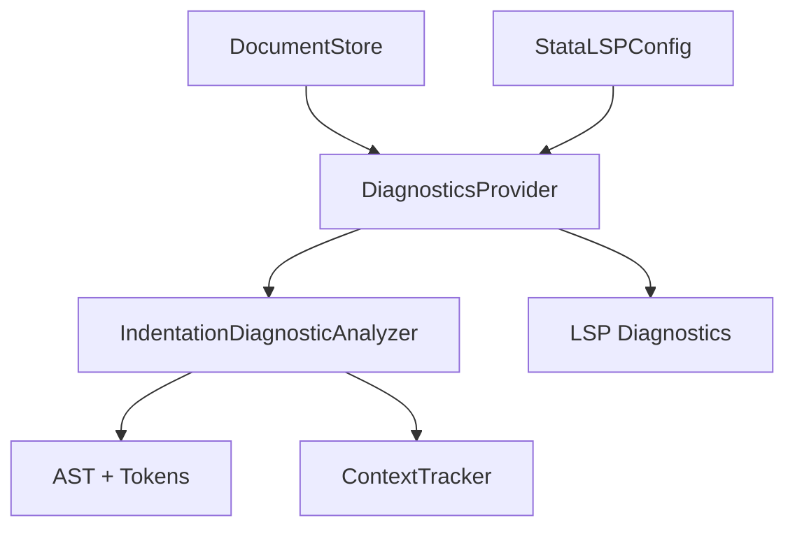

# Design Document: Indentation Diagnostics

## Overview

This feature adds information-level diagnostics to help users maintain consistent and readable indentation in their Stata code. The implementation integrates with the existing `DiagnosticsProvider` to detect two types of indentation issues:

1. **Unnecessary indentation after comments** - Code that is indented after a comment when the comment doesn't precede a control flow block
2. **Missing indentation inside control flow blocks** - Code inside braces, loops, or program definitions that isn't indented relative to its parent structure

The diagnostics are non-blocking (Information severity) and can be disabled via configuration.

## Architecture

The indentation diagnostics feature follows the existing diagnostic pipeline pattern:

```
Source Code → Lexer → Parser → IndentationDiagnosticAnalyzer → DiagnosticsProvider → LSP Response
```

### Component Integration



The `IndentationDiagnosticAnalyzer` is a new component that:
- Receives the AST, tokens, and document content from `DocumentStore`
- Uses `ContextTracker` to identify embedded language blocks (Mata/Python)
- Analyzes indentation patterns and emits diagnostics
- Respects the `diagnostics.indentation` configuration setting

## Components and Interfaces

### IndentationDiagnosticAnalyzer

A new class in `src/providers/indentation-diagnostics.ts` that analyzes indentation patterns.

```typescript
interface IndentationDiagnostic {
    type: 'unnecessary' | 'missing';
    range: Range;
    message: string;
    severity: DiagnosticSeverity.Information;
}

interface IndentationAnalysisContext {
    tokens: Token[];
    ast: StataAST;
    content: string;
    line_offsets: number[];
    context_tracker: ContextTracker;
}

class IndentationDiagnosticAnalyzer {
    /**
     * Analyze document for indentation issues.
     * Returns diagnostics for unnecessary and missing indentation.
     */
    analyze(context: IndentationAnalysisContext): IndentationDiagnostic[];
    
    /**
     * Check if a line is inside an embedded language block.
     */
    private is_in_embedded_block(line: number, context_tracker: ContextTracker): boolean;
    
    /**
     * Check if a line is a continuation of a previous statement.
     */
    private is_continuation_line(line: number, tokens: Token[]): boolean;
    
    /**
     * Get the indentation level (in spaces) of a line.
     */
    private get_line_indentation(line: number, content: string, line_offsets: number[]): number;
    
    /**
     * Check if a line starts a control flow block.
     */
    private is_control_flow_start(line: number, ast: StataAST): boolean;
    
    /**
     * Find control flow blocks and their expected indentation.
     */
    private find_block_indentation_issues(ast: StataAST, content: string, line_offsets: number[]): IndentationDiagnostic[];
    
    /**
     * Find unnecessary indentation after comments.
     */
    private find_comment_indentation_issues(tokens: Token[], ast: StataAST, content: string, line_offsets: number[]): IndentationDiagnostic[];
}
```

### Configuration Extension

Extend `StataLSPConfig` in `src/types/index.ts`:

```typescript
interface StataLSPConfig {
    diagnostics: {
        // ... existing fields ...
        indentation: boolean;  // Enable/disable indentation diagnostics (default: true)
    };
    // ... rest of config ...
}
```

### DiagnosticsProvider Integration

Modify `src/providers/diagnostics.ts` to call the indentation analyzer:

```typescript
// In get_diagnostics method
if (config.diagnostics.indentation !== false) {
    const indentation_analyzer = new IndentationDiagnosticAnalyzer();
    const indentation_diagnostics = indentation_analyzer.analyze({
        tokens: document.tokens,
        ast: document.ast,
        content: document.content,
        line_offsets: document.line_offsets,
        context_tracker: document.context_tracker,
    });
    the_diagnostics.push(...indentation_diagnostics.map(d => ({
        range: d.range,
        message: d.message,
        severity: d.severity,
        source: 'sight',
        code: d.type === 'unnecessary' 
            ? StataDiagnosticCode.UNNECESSARY_INDENTATION 
            : StataDiagnosticCode.MISSING_INDENTATION,
    })));
}
```

## Data Models

### New Diagnostic Codes

Add to `StataDiagnosticCode` enum in `src/types/index.ts`:

```typescript
enum StataDiagnosticCode {
    // ... existing codes ...
    
    // Indentation diagnostics (5xxx range)
    UNNECESSARY_INDENTATION = 5001,
    MISSING_INDENTATION = 5002,
}
```

### Block Tracking Structure

Internal structure for tracking control flow blocks during analysis:

```typescript
interface BlockInfo {
    type: 'brace' | 'foreach' | 'forvalues' | 'while' | 'program';
    start_line: number;
    end_line: number;
    parent_indentation: number;  // Indentation of the block-opening line
    body_lines: number[];        // Lines that should be indented
}
```

## Correctness Properties

*A property is a characteristic or behavior that should hold true across all valid executions of a system—essentially, a formal statement about what the system should do. Properties serve as the bridge between human-readable specifications and machine-verifiable correctness guarantees.*

### Property 1: Unnecessary indentation detection after comments

*For any* Stata code where a non-blank line follows a comment line with greater indentation, and the comment does not precede a control flow block, the analyzer SHALL emit an unnecessary indentation diagnostic for that line.

**Validates: Requirements 1.1**

### Property 2: No false positives for equal/lesser indentation after comments

*For any* Stata code where a non-blank line follows a comment line with equal or lesser indentation, the analyzer SHALL NOT emit an unnecessary indentation diagnostic.

**Validates: Requirements 1.2**

### Property 3: Control flow block exception for comment indentation

*For any* comment that precedes a control flow block opening (brace, loop keyword, program definition), the analyzer SHALL NOT emit unnecessary indentation diagnostics for the block contents.

**Validates: Requirements 1.3**

### Property 4: Missing indentation detection in control flow blocks

*For any* control flow block (brace-delimited, foreach, forvalues, while, or program), when code inside the block has equal or lesser indentation than the block-opening line, the analyzer SHALL emit a missing indentation diagnostic. This includes blocks where the opening brace appears on the same line as the control flow statement (e.g., `if condition {`).

**Validates: Requirements 2.1, 2.2, 2.3, 2.5**

### Property 5: No false positives for properly indented blocks

*For any* control flow block where the inner code has greater indentation than the block-opening line, the analyzer SHALL NOT emit a missing indentation diagnostic.

**Validates: Requirements 2.4**

### Property 6: Configuration disables diagnostics

*For any* Stata code, when `diagnostics.indentation` is set to `false`, the analyzer SHALL NOT emit any indentation diagnostics.

**Validates: Requirements 3.2, 3.3**

### Property 7: Diagnostic message content for unnecessary indentation

*For any* unnecessary indentation diagnostic emitted, the message SHALL indicate that the line appears unnecessarily indented.

**Validates: Requirements 4.1**

### Property 8: Diagnostic message content for missing indentation

*For any* missing indentation diagnostic emitted, the message SHALL indicate that the line should be indented inside the block.

**Validates: Requirements 4.2**

### Property 9: Diagnostic severity is Information

*For any* indentation diagnostic emitted (unnecessary or missing), the severity SHALL be `DiagnosticSeverity.Information`.

**Validates: Requirements 4.3**

### Property 10: Diagnostic messages suggest using formatter

*For any* indentation diagnostic emitted, the message SHALL include a suggestion to use the formatter (e.g., "Use Format Document to fix").

**Validates: Requirements 4.4**

### Property 11: Embedded language block exclusion

*For any* code inside a `mata` or `python` block, the analyzer SHALL NOT emit indentation diagnostics.

**Validates: Requirements 5.1, 5.2**

### Property 12: Continuation line exclusion

*For any* line that is a continuation of a previous line (using `///` or in `;` delimiter mode), the analyzer SHALL NOT emit an unnecessary indentation diagnostic.

**Validates: Requirements 6.1, 6.2**

## Error Handling

### Graceful Degradation

- If AST parsing fails, indentation diagnostics are skipped (no crash)
- If context tracker is unavailable, embedded block detection is skipped (may produce false positives in Mata/Python blocks)
- Malformed blocks (unclosed braces) are handled by using available range information

### Edge Cases

1. **Empty blocks**: Blocks with no body content should not trigger missing indentation diagnostics
2. **Single-line blocks**: `if x { display "y" }` should not trigger diagnostics
3. **Nested blocks**: Each nesting level should be analyzed independently
4. **Mixed indentation**: Tabs and spaces are normalized to spaces for comparison (using configured indent size)
5. **Blank lines**: Blank lines inside blocks should not trigger diagnostics

## Testing Strategy

### Unit Tests

- Test `get_line_indentation()` with various whitespace patterns
- Test `is_continuation_line()` with `///` and `;` delimiter modes
- Test `is_control_flow_start()` with all block types
- Test `is_in_embedded_block()` with Mata and Python blocks

### Property-Based Tests

Property-based tests will use `fast-check` to verify the correctness properties:

1. **Unnecessary indentation property test**: Generate random comments followed by indented code (not control flow) and verify diagnostics
2. **Missing indentation property test**: Generate random control flow blocks with unindented content and verify diagnostics
3. **Configuration property test**: Generate code with indentation issues, toggle config, verify diagnostic presence/absence
4. **Embedded block exclusion test**: Generate Mata/Python blocks with various indentation and verify no diagnostics
5. **Continuation line test**: Generate code with continuation lines and verify no false positives

Each property test should run a minimum of 100 iterations.

### Integration Tests

- End-to-end test with `DiagnosticsProvider` to verify diagnostics appear in LSP output
- Test configuration loading from `.sight.json`
- Test interaction with existing diagnostics (no interference)
