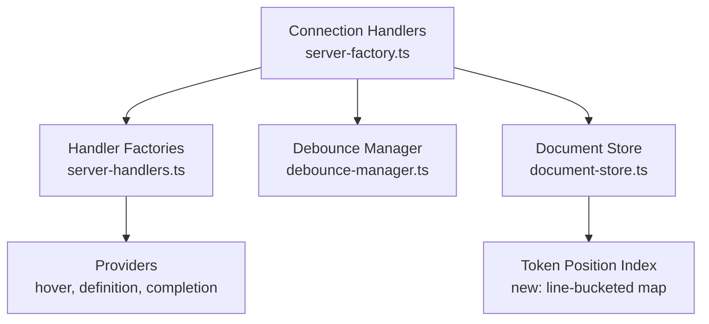

# Design Document: LSP Architectural Fixes

## Overview

This design addresses 16 architectural findings from a review of the Sight Stata LSP. The fixes span resource lifecycle management, debounce pipeline correctness, handler allocation efficiency, cancellation token compliance, token position lookup performance, map cleanup, logging overhead, completion caching, request freshness, scope resolution content sources, notification handler dependencies, shutdown cleanup for long-running services, and update safety. All changes are internal to the server — no protocol-level or client-facing API changes are required.

## Architecture

The fixes touch four layers of the server:



Changes are grouped into four categories:

1. **Lifecycle & Debounce** (Requirements 1, 2, 3, 7, 8, 15, 16): Add `dispose()` methods, move parse into debounce callback, route cross-file revalidation through debounce, clean up pending_revalidations map, cancel background indexer, gate debug logging, prevent closed-doc resurrection.
2. **Handler Efficiency** (Requirements 4, 5, 9, 10, 13, 14): Register handlers once with a mutable deps container (including notifications/custom requests), add cancellation checks in providers and resolvers, return context-aware `isIncomplete`, ensure request freshness via debounce wait.
3. **Correctness** (Requirements 10, 11, 12): Ensure request freshness with debounced parse, read scope resolution content from TextDocuments, and keep token index correct for multi-line spans.
4. **Performance** (Requirements 6, 12): Add a line-bucketed token index to DocumentState for O(1) line + small linear scan lookups, with correct multi-line token coverage.

## Components and Interfaces

### 1. Disposable Infrastructure

Add a `dispose()` method to `DocumentDebounceManager`:

```typescript
// In debounce-manager.ts
class DocumentDebounceManager implements DebounceManager {
    private disposed: boolean = false;

    dispose(): void {
        this.disposed = true;
        // Clear all pending timers
        for (const my_timer of this.pending_timers.values()) {
            clearTimeout(my_timer);
        }
        this.pending_timers.clear();
        // Clear parse queue
        this.parse_queue = [];
        // Clear version tracking
        this.current_versions.clear();
    }

    schedule_validation(uri: string, version: number, callback: () => Promise<void>): void {
        if (this.disposed) return;
        // ... existing logic
    }
}
```

Add a `dispose()` method to `DocumentStore`:

```typescript
// In document-store.ts
class DocumentStore {
    async dispose(): Promise<void> {
        // Await all active updates
        const the_promises = Array.from(this.active_updates.values());
        await Promise.allSettled(the_promises);
        this.active_updates.clear();
    }
}
```

Add a `dispose()` method to `ScopeResolver`:

```typescript
// In scope-resolver/index.ts
class ScopeResolver {
    dispose(): void {
        this.file_cache.clear();
        this.scope_cache.clear();
        this.uri_to_cache_keys.clear();
    }
}
```

Add a `dispose()` method to `ForwardScopeResolver`:

```typescript
// In forward-scope-resolver/index.ts
class ForwardScopeResolver {
    dispose(): void {
        // Clear any internal caches
    }
}
```

### 2. Enhanced Shutdown Handler

Update `create_shutdown_handler` to accept all disposable components:

```typescript
// In server-handlers.ts
export function create_shutdown_handler(
    deps?: HandlerDependencies,
    disposables?: {
        debounce_manager?: DocumentDebounceManager;
        pending_revalidations?: Map<string, { cancelled: boolean }>;
    }
): () => Promise<void> {
    return async (): Promise<void> => {
        // Cancel all pending revalidations (Req 1.1)
        if (disposables?.pending_revalidations) {
            for (const my_token of disposables.pending_revalidations.values()) {
                my_token.cancelled = true;
            }
            disposables.pending_revalidations.clear();
        }

        // Dispose debounce manager — cancels timers, clears queue (Req 1.2, 1.5)
        disposables?.debounce_manager?.dispose();

        // Await active document updates (Req 1.3)
        await deps?.document_store?.dispose();

        // Dispose scope resolvers (Req 1.4)
        deps?.scope_resolver?.dispose();
        deps?.forward_scope_resolver?.dispose();

        // Cancel background indexing (Req 15.1)
        deps?.workspace_indexer?.cancel();

        // Dispose rename handler — clears timers (Req 15.2)
        deps?.rename_handler?.dispose();
    };
}
```

### 3. Debounced Parse Pipeline

Move `document_store.update` inside the debounce callback in `validate_text_document`:

```typescript
// In server-factory.ts — validate_text_document
async function validate_text_document(text_document: TextDocument): Promise<void> {
    last_changed_uri = text_document.uri;

    // Cancel existing revalidation for this URI
    const existing_token = pending_revalidations.get(text_document.uri);
    if (existing_token) {
        existing_token.cancelled = true;
    }

    if (scope_resolver) {
        scope_resolver.invalidate_scope_cache(text_document.uri);
    }

    // Capture content snapshot for the debounce callback
    const snapshot_version = text_document.version;
    const snapshot_content = text_document.getText();
    const snapshot_uri = text_document.uri;

    debounce_manager.schedule_validation(
        snapshot_uri,
        snapshot_version,
        async () => {
            // Parse inside debounce callback — coalesced for rapid edits (Req 2.1, 2.2)
            const workspace_symbols = workspace_indexer
                ? workspace_indexer.get_all_symbols()
                : undefined;

            if (document_store.get(snapshot_uri)) {
                await document_store.update(
                    snapshot_uri,
                    [{ text: snapshot_content }],
                    snapshot_version,
                    workspace_symbols
                );
            } else {
                await document_store.open(
                    snapshot_uri,
                    snapshot_content,
                    snapshot_version,
                    workspace_symbols
                );
            }

            // Cross-file revalidation scheduling (Req 3.1)
            // ... scope_resolver reverse deps logic ...

            // Diagnostic publication (Req 2.3)
            // ... existing diagnostic logic ...
        }
    );
}
```

### 4. Request Freshness with Debounce

Add `wait_for_debounce` to ensure handlers read the latest state:

```typescript
// In debounce-manager.ts
class DocumentDebounceManager implements DebounceManager {
    private pending_promises: Map<string, Promise<void>> = new Map();
    private pending_resolvers: Map<string, () => void> = new Map();

    wait_for_debounce(uri: string): Promise<void> {
        return this.pending_promises.get(uri) ?? Promise.resolve();
    }

    schedule_validation(uri: string, version: number, callback: () => Promise<void>): void {
        if (this.disposed) return;
        // ... existing scheduling logic ...
        const promise = new Promise<void>((resolve) => {
            this.pending_resolvers.set(uri, resolve);
        });
        this.pending_promises.set(uri, promise);
        this.enqueue_parse(uri, version, async () => {
            try {
                await callback();
            } finally {
                const resolve = this.pending_resolvers.get(uri);
                resolve?.();
                this.pending_resolvers.delete(uri);
                this.pending_promises.delete(uri);
            }
        });
    }
}
```

Handlers await the debounce before reading state:

```typescript
// In server-handlers.ts (completion/hover/definition/references)
await deps.debounce_manager?.wait_for_debounce(params.textDocument.uri);
await deps.document_store.wait_for_update(params.textDocument.uri);
```

### 5. Scope Resolver Content Source

Ensure cross-file resolution uses the freshest in-memory content for open files:

```typescript
// In server-factory.ts (ScopeResolver content provider)
scope_resolver = new ScopeResolver(logger, {
    read_file: async (uri: string) => {
        // Prefer TextDocuments buffer for open files (Req 11.1)
        const open_doc = documents.get(uri);
        if (open_doc) {
            return open_doc.getText();
        }
        // Fall back to disk for closed files (Req 11.2)
        const fs_path = URI.parse(uri).fsPath;
        return fs.promises.readFile(fs_path, 'utf8');
    },
    exists: async (uri: string) => {
        if (documents.get(uri)) return true;
        const fs_path = URI.parse(uri).fsPath;
        try {
            await fs.promises.access(fs_path);
            return true;
        } catch {
            return false;
        }
    }
});
```

This ensures that even when parsing is debounced, the content provider returns the most recent TextDocuments content for open files (Req 11.3), since `TextDocuments` is updated synchronously on `didChange` before the debounce fires.

### 6. Cross-File Revalidation Through Debounce

Replace `setTimeout(() => validate_text_document(...), 0)` with routing through the debounce manager:

```typescript
// In schedule_callee_revalidation / schedule_caller_revalidation
for (const my_callee_uri of sorted_callees) {
    const callee_doc = documents.get(my_callee_uri);
    if (callee_doc) {
        if (diagnostics_provider) {
            diagnostics_provider.clear_published_version(my_callee_uri);
        }
        // Route through debounce instead of setTimeout (Req 3.1, 3.2)
        validate_text_document(callee_doc);
        count++;
    }
}
```

Since `validate_text_document` now schedules through the debounce manager internally, calling it directly is sufficient — the debounce manager will coalesce multiple calls for the same URI.

### 7. Stable Handler Registration

Replace per-request `get_handler_dependencies()` + `create_*_handler()` with a mutable container:

```typescript
// In server-factory.ts
const handler_deps: HandlerDependencies = {
    debounce_manager,
    document_store,
    diagnostics_provider: null,
    completion_provider: null,
    hover_provider: null,
    definition_provider: null,
    references_provider: null,
    symbol_provider: null,
    formatter_provider: null,
    workspace_indexer: null,
    scope_resolver: null,
    forward_scope_resolver: null,
    rename_handler: null,
    get_document_settings,
    connection: {
        sendDiagnostics: (params) => connection.sendDiagnostics(params),
        console: { log: (msg) => connection.console.log(msg) },
    },
};

// Register handlers once (Req 4.1)
const completion_handler = create_completion_handler(handler_deps);
const hover_handler = create_hover_handler(handler_deps);
const definition_handler = create_definition_handler(handler_deps);
// ... etc

connection.onCompletion(completion_handler);
connection.onHover(hover_handler);
connection.onDefinition(definition_handler);
// ... etc

// Notification and custom request handlers use the same deps (Req 14.1, 14.2)
connection.onDidChangeWatchedFiles(create_did_change_watched_files_handler(handler_deps, ...));
connection.onRequest('sight/getWorkingDirectory', create_get_working_directory_handler(handler_deps));

// Later, when providers are initialized (Req 4.3, 14.3):
handler_deps.completion_provider = completion_provider;
handler_deps.hover_provider = hover_provider;
// ... etc
```

The handler closures capture `handler_deps` by reference, so mutating the object's properties makes new providers visible to already-registered handlers.

### 8. CancellationToken Checking in Providers and Resolvers

Add periodic cancellation checks in token-scanning loops. The check interval of 500 iterations balances responsiveness against check overhead:

```typescript
// In hover.ts — token scan loop example (Req 5.1, 5.4)
for (let i = 0; i < tokens.length; i++) {
    if (i % 500 === 0 && cancellation_token?.isCancellationRequested) {
        return null;
    }
    // ... existing logic
}
```

Similar checks added in:
- `hover.ts`: `get_word_at_position`, `collect_all_symbol_matches` (Req 5.1)
- `definition.ts`: symbol resolution loops (Req 5.2)
- `references.ts`: token scanning loops and workspace-index scans (Req 5.3, 13.3)
- `scope-resolver/index.ts`: backward scope traversal loops (Req 13.1)
- `forward-scope-resolver/index.ts`: forward-call traversal loops (Req 13.2)

### 9. Token Position Index

Add a line-bucketed token map to `DocumentState`:

```typescript
// In document-store.ts
export interface DocumentState {
    // ... existing fields ...

    // Line-bucketed token index for O(1) line lookup (Req 6.1)
    token_line_index: Map<number, Token[]>;
}
```

Build the index during `create_document_state`, registering every line a token spans (Req 12.1):

```typescript
private build_token_line_index(tokens: Token[]): Map<number, Token[]> {
    const index = new Map<number, Token[]>();
    for (const my_token of tokens) {
        const start_line = my_token.range.start.line;
        const end_line = my_token.range.end.line;
        // Register token in every line it spans (Req 12.1)
        for (let my_line = start_line; my_line <= end_line; my_line++) {
            let bucket = index.get(my_line);
            if (!bucket) {
                bucket = [];
                index.set(my_line, bucket);
            }
            bucket.push(my_token);
        }
    }
    return index;
}
```

Add a lookup helper that handles multi-line token ranges correctly:

```typescript
get_token_at_position(
    state: DocumentState,
    line: number,
    character: number
): Token | undefined {
    const bucket = state.token_line_index.get(line);
    if (!bucket) return undefined;
    for (const my_token of bucket) {
        const start = my_token.range.start;
        const end = my_token.range.end;
        // Check if (line, character) falls within the token range
        const after_start = line > start.line ||
            (line === start.line && character >= start.character);
        const before_end = line < end.line ||
            (line === end.line && character <= end.character);
        if (after_start && before_end) {
            return my_token;
        }
    }
    return undefined;
}
```

The index is rebuilt on every document update as part of `create_document_state` (Req 6.3).

### 10. Pending Revalidations Cleanup

Delete entries after revalidation completes (Req 7.1), and cancel-then-replace on new scheduling (Req 7.2):

```typescript
// Inside the debounce callback for revalidation
debounce_manager.schedule_validation(
    callee_uri,
    callee_doc.version,
    async () => {
        try {
            // ... revalidation logic ...
        } finally {
            pending_revalidations.delete(callee_uri);
        }
    }
);
```

When scheduling a new revalidation for a URI that already has a pending entry:

```typescript
const existing = pending_revalidations.get(uri);
if (existing) {
    existing.cancelled = true;
}
pending_revalidations.set(uri, { cancelled: false });
```

### 11. Gated Debug Logging

Add a `debug` field to `StataLSPConfig`:

```typescript
// In types/index.ts
export interface StataLSPConfig {
    // ... existing fields ...
    debug?: boolean;
}
```

Add to `DEFAULT_SETTINGS`:

```typescript
// In server-handlers.ts
export const DEFAULT_SETTINGS: StataLSPConfig = {
    // ... existing fields ...
    debug: false,
};
```

Gate logging calls (Req 8.2, 8.3):

```typescript
// In server-factory.ts — validate_text_document
const settings = await get_document_settings(text_document.uri);
const is_debug = settings.debug === true;

if (is_debug) {
    connection.console.log(`[validate] Starting validation for ${text_document.uri}`);
}

// Gate expensive debug string building (Req 8.3)
if (is_debug && scope_resolver) {
    connection.console.log(
        `[reverse-deps] Reverse deps state:\n${scope_resolver.get_reverse_deps_debug_info()}`
    );
}
```

### 12. Context-Aware isIncomplete

The completion handler determines `isIncomplete` based on the completion context type:

```typescript
// In server-handlers.ts — create_completion_handler
const context_type = detect_completion_context_type(document_state, params.position);
const is_macro_context = context_type === 'macro';

return {
    isIncomplete: is_macro_context,  // Req 9.1, 9.2
    items
};
```

The `detect_completion_context` function already exists in the completion provider and returns a context with a `type` field. The handler uses this to determine if the context is macro-related. For the fallback path (no document state), `isIncomplete: true` is preserved (safe default, Req 9.3).

### 13. Document Close vs In-Flight Update Safety

Guard against stale async updates re-inserting closed documents using a generation counter:

```typescript
// In document-store.ts
class DocumentStore {
    private closed_generations: Map<string, number> = new Map();
    private generations: Map<string, number> = new Map();

    close(uri: string): void {
        // Increment generation and record as closed (Req 16.1)
        const current = (this.generations.get(uri) ?? 0) + 1;
        this.generations.set(uri, current);
        this.closed_generations.set(uri, current);
        this.documents.delete(uri);
        this.access_order.delete(uri);
    }

    private async commit_state(uri: string, state: DocumentState, generation: number): Promise<void> {
        // Discard stale update if document was closed after this update started (Req 16.2)
        const closed_gen = this.closed_generations.get(uri);
        if (closed_gen !== undefined && generation <= closed_gen) {
            return; // Discard stale update
        }
        this.documents.set(uri, state);
        this.touch_access(uri);
    }
}
```

### 14. Known Limitation: Parse Timeout Preemption

The current `with_parse_timeout` wrapper cannot preempt long-running synchronous
lexer/parser/analyzer work because it runs on the main event loop. The timeout
is best-effort and only reports slow operations after completion. A future
improvement (out of scope for this spec) is to move parsing to a worker thread
or add cooperative yields/cancellation inside parser stages.

## Data Models

### Modified: DocumentState

```typescript
export interface DocumentState {
    uri: string;
    version: number;
    content: string;
    tokens: Token[];
    ast: StataAST | null;
    symbols: SymbolTable;
    diagnostics: Diagnostic[];
    context_ranges: ContextRange[];
    context_tracker: ContextTracker;
    line_offsets: number[];
    forward_calls: ForwardCall[];
    working_directory?: string;
    // NEW: line-bucketed token index (Req 6.1, 12.1)
    token_line_index: Map<number, Token[]>;
}
```

### Modified: HandlerDependencies

```typescript
export interface HandlerDependencies {
    debounce_manager: DocumentDebounceManager;  // Required for wait_for_debounce (Req 10.1)
    document_store: DocumentStore;
    diagnostics_provider: DiagnosticsProvider | null;
    completion_provider: CompletionProvider | null;
    hover_provider: HoverProvider | null;
    definition_provider: DefinitionProvider | null;
    references_provider: ReferencesProvider | null;
    symbol_provider: SymbolProvider | null;
    formatter_provider: CodeFormatter | null;
    workspace_indexer: WorkspaceIndexer | null;
    scope_resolver: ScopeResolver | null;
    forward_scope_resolver: ForwardScopeResolver | null;
    rename_handler: RenameHandler | null;
    get_document_settings: (uri: string) => Promise<StataLSPConfig>;
    connection: {
        sendDiagnostics: (params: { uri: string; diagnostics: Diagnostic[] }) => void;
        console: { log: (msg: string) => void };
    };
}
```

### Modified: StataLSPConfig

```typescript
export interface StataLSPConfig {
    diagnostics: { /* unchanged */ };
    completion: { /* unchanged */ };
    formatting: { /* unchanged */ };
    lineCommentStyle?: '//' | '*';
    indexing: { maxFileSizeBytes: number };
    adoPaths: string[];
    indexWorkspace: boolean;
    cross_file: CrossFileConfig;
    // NEW: debug logging toggle (Req 8.1)
    debug?: boolean;
}
```

### Modified: DebounceManager Interface

```typescript
export interface DebounceManager {
    schedule_validation(uri: string, version: number, callback: () => Promise<void>): void;
    cancel(uri: string): void;
    on_close(uri: string): void;
    get_debounce_ms(): number;
    set_debounce_ms(ms: number): void;
    is_pending(uri: string): boolean;
    get_metrics(): DebounceMetrics;
    // NEW: wait for pending debounce to complete (Req 10.1)
    wait_for_debounce(uri: string): Promise<void>;
    // NEW: clean shutdown (Req 1.5)
    dispose(): void;
}
```

### New: DocumentStore Close Generation Tracking

```typescript
class DocumentStore {
    private generations: Map<string, number>;       // Tracks current generation per URI
    private closed_generations: Map<string, number>; // Tracks generation at close time
}
```

## Correctness Properties

*A property is a characteristic or behavior that should hold true across all valid executions of a system — essentially, a formal statement about what the system should do. Properties serve as the bridge between human-readable specifications and machine-verifiable correctness guarantees.*

### Property 1: Dispose clears debounce state

*For any* `DocumentDebounceManager` with N pending timers and M queued parse items, calling `dispose()` shall result in zero pending timers, an empty parse queue, and any subsequent `schedule_validation` call shall be a no-op (no timer created, no callback enqueued).

**Validates: Requirements 1.5**

### Property 2: Cancel pending revalidations on shutdown

*For any* `pending_revalidations` map with N entries (each with `cancelled: false`), calling the shutdown handler shall set `cancelled = true` on every entry in the map.

**Validates: Requirements 1.1**

### Property 3: Debounce coalesces rapid changes into single callback

*For any* sequence of N document change events (N ≥ 2) for the same URI arriving within the debounce window, the debounce manager shall execute exactly one callback (the one with the latest version).

**Validates: Requirements 2.2, 3.2**

### Property 4: Mutable deps container visible to all handlers

*For any* handler created via `create_*_handler(deps)` (including notification handlers and custom request handlers), mutating a property on the `deps` object after handler creation shall make the new value visible to the handler on the next invocation.

**Validates: Requirements 4.2, 4.3, 14.1, 14.2, 14.3**

### Property 5: Cancellation causes early exit in token scan loops

*For any* token list of length > 500 and a pre-cancelled `CancellationToken`, provider token-scanning loops shall examine fewer than all tokens before returning.

**Validates: Requirements 5.4, 13.3**

### Property 6: Token position index matches linear scan

*For any* list of tokens (including multi-line tokens) and any position (line, character) within a token's range, `get_token_at_position` using the line-bucketed index shall return the same token as a linear scan over all tokens.

**Validates: Requirements 6.1, 12.1, 12.2**

### Property 7: Pending revalidations cleaned up after completion

*For any* URI that completes a revalidation callback (success or cancellation), the `pending_revalidations` map shall not contain an entry for that URI after the callback returns.

**Validates: Requirements 7.1**

### Property 8: Pending revalidation replacement cancels previous

*For any* URI with an existing entry in `pending_revalidations`, scheduling a new revalidation for that URI shall set `cancelled = true` on the previous entry and replace it with a new entry where `cancelled = false`.

**Validates: Requirements 7.2**

### Property 9: Debug logging gated by config

*For any* document validation cycle where `debug` is `false` in the config, zero `connection.console.log` calls shall be made from within the `validate_text_document` function, and `scope_resolver.get_reverse_deps_debug_info()` shall not be called.

**Validates: Requirements 8.2, 8.3**

### Property 10: isIncomplete reflects macro context

*For any* completion request, the returned `isIncomplete` flag shall be `true` if and only if the detected completion context type is `'macro'`.

**Validates: Requirements 9.1, 9.2**

### Property 11: Debounce wait resolves correctly

*For any* URI with a pending debounce callback, `wait_for_debounce(uri)` shall resolve only after the callback has completed. *For any* URI with no pending callback, `wait_for_debounce(uri)` shall resolve immediately without delay.

**Validates: Requirements 10.1, 10.3**

### Property 12: Scope resolver uses in-memory content when open

*For any* URI that is open in TextDocuments, the Scope_Resolver content provider shall return the TextDocuments buffer contents (not the Document_Store snapshot or disk), regardless of whether parsing is debounced.

**Validates: Requirements 11.1, 11.3**

### Property 13: Cancellation short-circuits cross-file resolution

*For any* pre-cancelled `CancellationToken`, scope resolution (backward) and forward-call resolution shall exit before traversing the full call graph.

**Validates: Requirements 13.1, 13.2**

### Property 14: Closed documents are not reinserted

*For any* document closed while an update is in-flight, the completed update shall not reinsert document state if the close generation is newer than the update's generation.

**Validates: Requirements 16.1, 16.2**

## Error Handling

| Scenario | Handling |
|---|---|
| `dispose()` called multiple times on DebounceManager | Idempotent — second call is a no-op (already disposed) |
| `dispose()` called on DocumentStore with no active updates | Resolves immediately |
| `schedule_validation` called after `dispose()` | Silently ignored (no timer created) |
| CancellationToken is `undefined` in provider | Skip cancellation checks (existing behavior preserved) |
| `get_token_at_position` called with out-of-range line | Returns `undefined` |
| `debug` config field missing | Defaults to `false` (no verbose logging) |
| Completion context detection fails | Falls back to `isIncomplete: true` (safe default) |
| `wait_for_debounce` called for URI with no pending callback | Resolves immediately via `Promise.resolve()` |
| Shutdown called when workspace indexer is null | Skips `cancel()` call (null check) |
| In-flight update completes for closed document | Discarded via generation check — no state reinserted |

## Testing Strategy

### Property-Based Testing

Use `fast-check` (already in the project) for property-based tests. Each property test runs a minimum of 100 iterations.

Property tests go in `tests/property/` and are tagged with the design property they validate:

```typescript
// Feature: lsp-architectural-fixes, Property 1: Dispose clears debounce state
it.prop([fc.array(fc.tuple(fc.string(), fc.nat()))], (scheduled_items) => {
    // ... test body
});
```

### Unit Testing

Unit tests go in `tests/unit/` and cover specific examples and edge cases:
- Shutdown handler integration (calls dispose on all components, including indexer cancel)
- Debounced parse pipeline (parse happens inside callback, not eagerly)
- Handler registration (handlers created once, deps mutated)
- Request freshness (handlers wait for debounce before reading state)
- Scope resolver content source (TextDocuments preferred when open, disk fallback)
- CancellationToken early exit in each provider (hover, definition, references)
- Cancellation propagation in scope resolvers and workspace scans
- Token position index correctness for specific edge cases (multi-line tokens, boundary positions)
- Pending revalidations cleanup after callback
- Debug logging gating with mock connection
- isIncomplete flag for specific context types (macro vs non-macro)
- Document close vs in-flight update safety (generation counter)

### Test Organization

- `tests/property/debounce-manager-dispose.prop.test.ts` — Properties 1, 3
- `tests/property/debounce-wait.prop.test.ts` — Property 11
- `tests/property/token-position-index.prop.test.ts` — Property 6
- `tests/property/handler-deps-mutation.prop.test.ts` — Property 4
- `tests/property/scope-content-provider.prop.test.ts` — Property 12
- `tests/property/document-close-generation.prop.test.ts` — Property 14
- `tests/property/completion-is-incomplete.prop.test.ts` — Property 10
- `tests/unit/shutdown-handler.test.ts` — Properties 2, 7, 8; examples for Req 1.3, 1.4, 15.1, 15.2
- `tests/unit/cancellation-token.test.ts` — Property 5; examples for Req 5.1, 5.2, 5.3
- `tests/unit/debug-logging.test.ts` — Property 9; examples for Req 8.1, 8.4
- `tests/unit/debounced-parse-pipeline.test.ts` — Examples for Req 2.1, 2.3, 3.1
- `tests/unit/request-freshness.test.ts` — Examples for Req 10.1, 10.2, 10.3
- `tests/unit/scope-content-source.test.ts` — Examples for Req 11.1, 11.2, 11.3
- `tests/unit/document-close-safety.test.ts` — Examples for Req 16.1, 16.2
