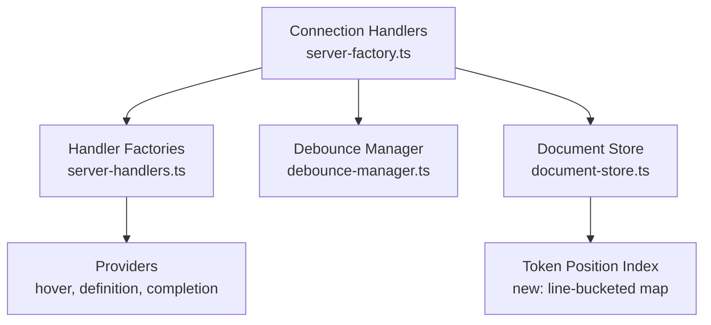

# Design Document: LSP Architectural Fixes

## Overview

This design addresses 9 architectural findings from a review of the Sight Stata LSP. The fixes span resource lifecycle management, debounce pipeline correctness, handler allocation efficiency, cancellation token compliance, token position lookup performance, map cleanup, logging overhead, and completion caching. All changes are internal to the server — no protocol-level or client-facing API changes are required.

## Architecture

The fixes touch four layers of the server:



Changes are grouped into three categories:

1. **Lifecycle & Debounce** (Findings 1, 2, 3, 8): Add `dispose()` methods, move parse into debounce callback, route cross-file revalidation through debounce, clean up pending_revalidations map.
2. **Handler Efficiency** (Findings 4, 6, 9, 10): Register handlers once with a mutable deps container, add cancellation checks in providers, gate debug logging, return context-aware `isIncomplete`.
3. **Performance** (Finding 7): Add a line-bucketed token index to DocumentState for O(1) line + small linear scan lookups.

## Components and Interfaces

### 1. Disposable Infrastructure

Add a `dispose()` method to `DocumentDebounceManager`:

```typescript
// In debounce-manager.ts
class DocumentDebounceManager implements DebounceManager {
    private disposed: boolean = false;

    dispose(): void {
        this.disposed = true;
        // Clear all pending timers
        for (const my_timer of this.pending_timers.values()) {
            clearTimeout(my_timer);
        }
        this.pending_timers.clear();
        // Clear parse queue
        this.parse_queue = [];
        // Clear version tracking
        this.current_versions.clear();
    }

    schedule_validation(uri: string, version: number, callback: () => Promise<void>): void {
        if (this.disposed) return;
        // ... existing logic
    }
}
```

Add a `dispose()` method to `DocumentStore`:

```typescript
// In document-store.ts
class DocumentStore {
    async dispose(): Promise<void> {
        // Await all active updates
        const the_promises = Array.from(this.active_updates.values());
        await Promise.allSettled(the_promises);
        this.active_updates.clear();
    }
}
```

Add a `dispose()` method to `ScopeResolver`:

```typescript
// In scope-resolver/index.ts
class ScopeResolver {
    dispose(): void {
        this.file_cache.clear();
        this.scope_cache.clear();
        this.uri_to_cache_keys.clear();
    }
}
```

Add a `dispose()` method to `ForwardScopeResolver`:

```typescript
// In forward-scope-resolver/index.ts
class ForwardScopeResolver {
    dispose(): void {
        // Clear any internal caches
    }
}
```

### 2. Enhanced Shutdown Handler

Update `create_shutdown_handler` to accept all disposable components:

```typescript
// In server-handlers.ts
export function create_shutdown_handler(
    deps?: HandlerDependencies,
    disposables?: {
        debounce_manager?: DocumentDebounceManager;
        pending_revalidations?: Map<string, { cancelled: boolean }>;
    }
): () => Promise<void> {
    return async (): Promise<void> => {
        // Cancel all pending revalidations
        if (disposables?.pending_revalidations) {
            for (const my_token of disposables.pending_revalidations.values()) {
                my_token.cancelled = true;
            }
            disposables.pending_revalidations.clear();
        }

        // Dispose debounce manager (cancels timers, clears queue)
        disposables?.debounce_manager?.dispose();

        // Await active document updates
        await deps?.document_store.dispose();

        // Dispose scope resolvers
        deps?.scope_resolver?.dispose();
        deps?.forward_scope_resolver?.dispose();

        // Dispose rename handler
        deps?.rename_handler?.dispose();
    };
}
```

### 3. Debounced Parse Pipeline

Move `document_store.update` inside the debounce callback in `validate_text_document`:

```typescript
// In server-factory.ts — validate_text_document
async function validate_text_document(text_document: TextDocument): Promise<void> {
    last_changed_uri = text_document.uri;

    // Cancel existing revalidation for this URI
    const existing_token = pending_revalidations.get(text_document.uri);
    if (existing_token) {
        existing_token.cancelled = true;
    }

    if (scope_resolver) {
        scope_resolver.invalidate_scope_cache(text_document.uri);
    }

    // Capture content snapshot for the debounce callback
    const snapshot_version = text_document.version;
    const snapshot_content = text_document.getText();
    const snapshot_uri = text_document.uri;

    debounce_manager.schedule_validation(
        snapshot_uri,
        snapshot_version,
        async () => {
            // Parse inside debounce callback — coalesced for rapid edits
            const workspace_symbols = workspace_indexer
                ? workspace_indexer.get_all_symbols()
                : undefined;

            if (document_store.get(snapshot_uri)) {
                await document_store.update(
                    snapshot_uri,
                    [{ text: snapshot_content }],
                    snapshot_version,
                    workspace_symbols
                );
            } else {
                await document_store.open(
                    snapshot_uri,
                    snapshot_content,
                    snapshot_version,
                    workspace_symbols
                );
            }

            // Cross-file revalidation scheduling (moved inside callback)
            // ... scope_resolver reverse deps logic ...

            // Diagnostic publication
            // ... existing diagnostic logic ...
        }
    );
}
```

### 4. Cross-File Revalidation Through Debounce

Replace `setTimeout(() => validate_text_document(...), 0)` with `debounce_manager.schedule_validation`:

```typescript
// In schedule_callee_revalidation / schedule_caller_revalidation
for (const my_callee_uri of sorted_callees) {
    const callee_doc = documents.get(my_callee_uri);
    if (callee_doc) {
        if (diagnostics_provider) {
            diagnostics_provider.clear_published_version(my_callee_uri);
        }
        // Route through debounce instead of setTimeout
        validate_text_document(callee_doc);
        count++;
    }
}
```

Since `validate_text_document` now schedules through the debounce manager internally, calling it directly is sufficient — the debounce manager will coalesce multiple calls for the same URI.

### 5. Stable Handler Registration

Replace per-request `get_handler_dependencies()` + `create_*_handler()` with a mutable container:

```typescript
// In server-factory.ts
const handler_deps: HandlerDependencies = {
    document_store,
    diagnostics_provider: null,
    completion_provider: null,
    hover_provider: null,
    definition_provider: null,
    references_provider: null,
    symbol_provider: null,
    formatter_provider: null,
    workspace_indexer: null,
    scope_resolver: null,
    forward_scope_resolver: null,
    rename_handler: null,
    get_document_settings,
    connection: {
        sendDiagnostics: (params) => connection.sendDiagnostics(params),
        console: { log: (msg) => connection.console.log(msg) },
    },
};

// Register handlers once
const completion_handler = create_completion_handler(handler_deps);
const hover_handler = create_hover_handler(handler_deps);
const definition_handler = create_definition_handler(handler_deps);
// ... etc

connection.onCompletion(completion_handler);
connection.onHover(hover_handler);
connection.onDefinition(definition_handler);
// ... etc

// Later, when providers are initialized:
handler_deps.completion_provider = completion_provider;
handler_deps.hover_provider = hover_provider;
// ... etc
```

The handler closures capture `handler_deps` by reference, so mutating the object's properties makes new providers visible to already-registered handlers.

### 6. CancellationToken Checking in Providers

Add periodic cancellation checks in token-scanning loops. The check interval of 500 iterations balances responsiveness against check overhead:

```typescript
// In hover.ts — get_subcommand_context_from_tokens (token scan loop)
for (let i = 0; i < tokens.length; i++) {
    if (i % 500 === 0 && cancellation_token?.isCancellationRequested) {
        return { is_subcommand: false, prefix_command: null };
    }
    // ... existing logic
}
```

Similar checks added in:
- `hover.ts`: `get_word_at_position`, `collect_all_symbol_matches`
- `definition.ts`: symbol resolution loops
- `references.ts`: token scanning loops

### 7. Token Position Index

Add a line-bucketed token map to `DocumentState`:

```typescript
// In document-store.ts
export interface DocumentState {
    // ... existing fields ...

    // Line-bucketed token index for O(1) line lookup
    token_line_index: Map<number, Token[]>;
}
```

Build the index during `create_document_state`:

```typescript
private build_token_line_index(tokens: Token[]): Map<number, Token[]> {
    const index = new Map<number, Token[]>();
    for (const my_token of tokens) {
        const line = my_token.range.start.line;
        let bucket = index.get(line);
        if (!bucket) {
            bucket = [];
            index.set(line, bucket);
        }
        bucket.push(my_token);
        // If token spans multiple lines, also index the end line
        if (my_token.range.end.line !== line) {
            let end_bucket = index.get(my_token.range.end.line);
            if (!end_bucket) {
                end_bucket = [];
                index.set(my_token.range.end.line, end_bucket);
            }
            end_bucket.push(my_token);
        }
    }
    return index;
}
```

Add a lookup helper:

```typescript
get_token_at_position(
    state: DocumentState,
    line: number,
    character: number
): Token | undefined {
    const bucket = state.token_line_index.get(line);
    if (!bucket) return undefined;
    for (const my_token of bucket) {
        if (my_token.range.start.line <= line &&
            my_token.range.end.line >= line &&
            my_token.range.start.character <= character &&
            my_token.range.end.character >= character) {
            return my_token;
        }
    }
    return undefined;
}
```

### 8. Pending Revalidations Cleanup

Delete entries after revalidation completes:

```typescript
// Inside the debounce callback for revalidation
debounce_manager.schedule_validation(
    callee_uri,
    callee_doc.version,
    async () => {
        try {
            // ... revalidation logic ...
        } finally {
            pending_revalidations.delete(callee_uri);
        }
    }
);
```

### 9. Gated Debug Logging

Add a `debug` field to `StataLSPConfig`:

```typescript
// In types/index.ts
export interface StataLSPConfig {
    // ... existing fields ...
    debug?: boolean;
}
```

Add to `DEFAULT_SETTINGS`:

```typescript
// In server-handlers.ts
export const DEFAULT_SETTINGS: StataLSPConfig = {
    // ... existing fields ...
    debug: false,
};
```

Gate logging calls:

```typescript
// In server-factory.ts — validate_text_document
const settings = await get_document_settings(text_document.uri);
const is_debug = settings.debug === true;

if (is_debug) {
    connection.console.log(`[validate] Starting validation for ${text_document.uri}`);
}

// Gate expensive debug string building
if (is_debug && scope_resolver) {
    connection.console.log(
        `[reverse-deps] Reverse deps state:\n${scope_resolver.get_reverse_deps_debug_info()}`
    );
}
```

### 10. Context-Aware isIncomplete

The completion handler determines `isIncomplete` based on the completion context type:

```typescript
// In server-handlers.ts — create_completion_handler
const context_type = detect_completion_context_type(document_state, params.position);
const is_macro_context = context_type === 'macro';

return {
    isIncomplete: is_macro_context,
    items
};
```

The `detect_completion_context` function already exists in the completion provider and returns a context with a `type` field. The handler can use this to determine if the context is macro-related. For the fallback path (no document state), `isIncomplete: true` is preserved.

## Data Models

### Modified: DocumentState

```typescript
export interface DocumentState {
    uri: string;
    version: number;
    content: string;
    tokens: Token[];
    ast: StataAST | null;
    symbols: SymbolTable;
    diagnostics: Diagnostic[];
    context_ranges: ContextRange[];
    context_tracker: ContextTracker;
    line_offsets: number[];
    forward_calls: ForwardCall[];
    working_directory?: string;
    // NEW: line-bucketed token index
    token_line_index: Map<number, Token[]>;
}
```

### Modified: StataLSPConfig

```typescript
export interface StataLSPConfig {
    diagnostics: { /* unchanged */ };
    completion: { /* unchanged */ };
    formatting: { /* unchanged */ };
    lineCommentStyle?: '//' | '*';
    indexing: { maxFileSizeBytes: number };
    adoPaths: string[];
    indexWorkspace: boolean;
    cross_file: CrossFileConfig;
    // NEW: debug logging toggle
    debug?: boolean;
}
```

### New: DebounceManager.dispose()

```typescript
export interface DebounceManager {
    // ... existing methods ...
    dispose(): void;
}
```


## Correctness Properties

*A property is a characteristic or behavior that should hold true across all valid executions of a system — essentially, a formal statement about what the system should do. Properties serve as the bridge between human-readable specifications and machine-verifiable correctness guarantees.*

### Property 1: Dispose clears debounce state

*For any* `DocumentDebounceManager` with N pending timers and M queued parse items, calling `dispose()` shall result in zero pending timers, an empty parse queue, and any subsequent `schedule_validation` call shall be a no-op (no timer created, no callback enqueued).

**Validates: Requirements 1.5**

### Property 2: Cancel pending revalidations on shutdown

*For any* `pending_revalidations` map with N entries, calling the shutdown handler shall set `cancelled = true` on every entry in the map.

**Validates: Requirements 1.1**

### Property 3: Debounce coalesces rapid changes into single parse

*For any* sequence of N document change events (N ≥ 2) for the same URI arriving within the debounce window, the debounce manager shall execute exactly one callback (the one with the latest version).

**Validates: Requirements 2.2, 3.2**

### Property 4: Mutable deps container visible to handlers

*For any* handler created via `create_*_handler(deps)`, mutating a property on the `deps` object after handler creation shall make the new value visible to the handler on the next invocation.

**Validates: Requirements 4.2, 4.3**

### Property 5: Cancellation causes early exit in token scan loops

*For any* token list of length > 500 and a pre-cancelled `CancellationToken`, provider token-scanning loops shall examine fewer than all tokens before returning.

**Validates: Requirements 5.4**

### Property 6: Token position index matches linear scan

*For any* list of tokens and any position (line, character) within the token range, `get_token_at_position` using the line-bucketed index shall return the same token as a linear scan over all tokens.

**Validates: Requirements 6.1**

### Property 7: Pending revalidations cleaned up after completion

*For any* URI that completes a revalidation callback (success or cancellation), the `pending_revalidations` map shall not contain an entry for that URI after the callback returns.

**Validates: Requirements 7.1**

### Property 8: Pending revalidation replacement cancels previous

*For any* URI with an existing entry in `pending_revalidations`, scheduling a new revalidation for that URI shall set `cancelled = true` on the previous entry and replace it with a new entry where `cancelled = false`.

**Validates: Requirements 7.2**

### Property 9: Debug logging gated by config

*For any* document validation cycle where `debug` is `false` in the config, zero `connection.console.log` calls shall be made from within the `validate_text_document` function.

**Validates: Requirements 8.2**

### Property 10: isIncomplete reflects macro context

*For any* completion request, the returned `isIncomplete` flag shall be `true` if and only if the detected completion context type is `'macro'`.

**Validates: Requirements 9.1, 9.2**

## Error Handling

| Scenario | Handling |
|---|---|
| `dispose()` called multiple times on DebounceManager | Idempotent — second call is a no-op (already disposed) |
| `dispose()` called on DocumentStore with no active updates | Resolves immediately |
| `schedule_validation` called after `dispose()` | Silently ignored (no timer created) |
| CancellationToken is `undefined` in provider | Skip cancellation checks (existing behavior preserved) |
| `get_token_at_position` called with out-of-range line | Returns `undefined` |
| `debug` config field missing | Defaults to `false` (no verbose logging) |
| Completion context detection fails | Falls back to `isIncomplete: true` (safe default) |

## Testing Strategy

### Property-Based Testing

Use `fast-check` (already in the project) for property-based tests. Each property test runs a minimum of 100 iterations.

Property tests go in `tests/property/` and are tagged with the design property they validate:

```typescript
// Feature: lsp-architectural-fixes, Property 1: Dispose clears debounce state
it.prop([fc.array(fc.tuple(fc.string(), fc.nat()))], (scheduled_items) => {
    // ... test body
});
```

### Unit Testing

Unit tests go in `tests/unit/` and cover:
- Shutdown handler integration (calls dispose on all components)
- Debounced parse pipeline (parse happens inside callback, not eagerly)
- Handler registration (handlers created once, deps mutated)
- CancellationToken early exit in each provider
- Token position index correctness for specific edge cases
- Pending revalidations cleanup after callback
- Debug logging gating with mock connection
- isIncomplete flag for specific context types

### Test Organization

- `tests/property/debounce-manager-dispose.prop.test.ts` — Properties 1, 3
- `tests/property/token-position-index.prop.test.ts` — Property 6
- `tests/property/handler-deps-mutation.prop.test.ts` — Property 4
- `tests/property/completion-is-incomplete.prop.test.ts` — Property 10
- `tests/unit/shutdown-handler.test.ts` — Properties 2, 7, 8, examples for 1.3, 1.4
- `tests/unit/cancellation-token.test.ts` — Property 5, examples for 5.1-5.3
- `tests/unit/debug-logging.test.ts` — Property 9, examples for 8.1, 8.4
- `tests/unit/debounced-parse-pipeline.test.ts` — Examples for 2.1, 2.3, 3.1
