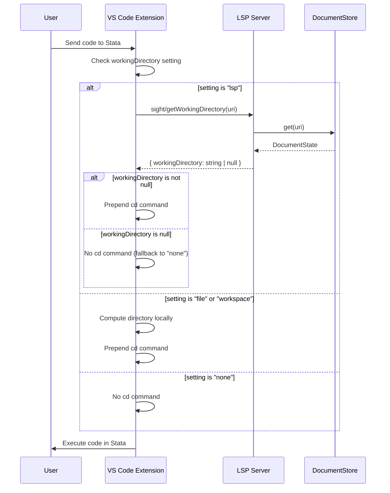

# Design Document: LSP Working Directory Option

## Overview

This design adds a fourth option "lsp" to the `sight.sendToStata.workingDirectory` setting, making it the new default. The feature enables the VS Code client extension to query the LSP server for the working directory determined from `@lsp-cd` / `@lsp-working-directory` / `@lsp-wd` directives or inherited from parent files.

The implementation requires:
1. A custom LSP request handler on the server side
2. Client-side integration to query the LSP and handle responses
3. Configuration updates to add the new option and change the default

## Architecture

The feature follows a request-response pattern between the client extension and LSP server:



## Components and Interfaces

### Server-Side Components

#### Custom Request Handler

The LSP server will implement a custom request handler for `sight/getWorkingDirectory`:

```typescript
// Request parameters
interface GetWorkingDirectoryParams {
    uri: string;  // Document URI
}

// Response
interface GetWorkingDirectoryResult {
    workingDirectory: string | null;  // Absolute path or null
}
```

The handler will be registered in `server-factory.ts` and implemented in `server-handlers.ts`.

#### Handler Implementation

```typescript
// In server-handlers.ts
export function create_get_working_directory_handler(
    deps: HandlerDependencies
): (params: GetWorkingDirectoryParams) => Promise<GetWorkingDirectoryResult> {
    return async (params: GetWorkingDirectoryParams): Promise<GetWorkingDirectoryResult> => {
        // Wait for any pending document updates
        await deps.document_store.wait_for_update(params.uri);
        
        const document_state = deps.document_store.get(params.uri);
        
        return {
            workingDirectory: document_state?.working_directory ?? null
        };
    };
}
```

### Client-Side Components

#### Type Definitions Update

Update the working directory type to include "lsp":

```typescript
// In cd-context.ts and commands.ts
type WorkingDirectoryOption = 'none' | 'file' | 'workspace' | 'lsp';
```

#### LSP Client Request Function

Add a function to query the LSP server:

```typescript
// In commands.ts or a new lsp-client.ts
async function get_lsp_working_directory(
    client: LanguageClient,
    uri: string
): Promise<string | null> {
    try {
        const result = await client.sendRequest<GetWorkingDirectoryResult>(
            'sight/getWorkingDirectory',
            { uri }
        );
        return result.workingDirectory;
    } catch (error) {
        // Log error and return null for graceful fallback
        console.error('Failed to get working directory from LSP:', error);
        return null;
    }
}
```

#### Updated Content Preparation

Modify `prepare_content_with_cd` to handle the "lsp" option:

```typescript
export async function prepare_content_with_cd(
    content: string,
    document: vscode.TextDocument,
    working_directory: WorkingDirectoryOption,
    client?: LanguageClient
): Promise<string> {
    if (working_directory === 'none') {
        return content;
    }
    
    let directory: string | null = null;
    
    if (working_directory === 'lsp') {
        if (client) {
            directory = await get_lsp_working_directory(
                client,
                document.uri.toString()
            );
        }
        // If null, fall back to "none" behavior
        if (directory === null) {
            return content;
        }
    } else if (working_directory === 'file') {
        directory = path.dirname(document.uri.fsPath);
    } else {
        // workspace
        const workspace_folder = vscode.workspace.getWorkspaceFolder(document.uri);
        directory = workspace_folder?.uri.fsPath ?? path.dirname(document.uri.fsPath);
    }
    
    const escaped_dir = directory.replace(/"/g, '\\"');
    return `cd "${escaped_dir}"\n${content}`;
}
```

### Configuration Schema

Update `client/package.json`:

```json
{
    "sight.sendToStata.workingDirectory": {
        "type": "string",
        "enum": ["lsp", "none", "file", "workspace"],
        "default": "lsp",
        "description": "Set working directory before executing code",
        "enumDescriptions": [
            "Use working directory from LSP (from @lsp-cd, @lsp-working-directory, @lsp-wd directives or inherited from parent files)",
            "Do not change working directory",
            "Change to the directory of the current file",
            "Change to the workspace root directory"
        ]
    }
}
```

## Data Models

### Request/Response Types

```typescript
// Custom LSP request types
interface GetWorkingDirectoryParams {
    uri: string;
}

interface GetWorkingDirectoryResult {
    workingDirectory: string | null;
}
```

### Existing Types Used

The implementation leverages existing types from `src/types/index.ts`:
- `DocumentState.working_directory: string | undefined` - Already stores the resolved working directory
- `WorkingDirectoryDirective` - Parsed directive information

No new data models are required on the server side as `DocumentState` already contains the `working_directory` field.


## Correctness Properties

*A property is a characteristic or behavior that should hold true across all valid executions of a system—essentially, a formal statement about what the system should do. Properties serve as the bridge between human-readable specifications and machine-verifiable correctness guarantees.*

Based on the prework analysis, the following properties can be tested:

### Property 1: Server Response Correctness

*For any* document URI, the `sight/getWorkingDirectory` request SHALL return:
- The resolved working directory if the document has an `@lsp-cd`, `@lsp-working-directory`, or `@lsp-wd` directive
- The inherited working directory if the document has backward directives (`@lsp-done-by`, `@lsp-included-by`) and a parent has a working directory
- `null` if no working directory is set or inherited

**Validates: Requirements 2.2, 2.3, 2.4, 2.5, 2.6**

### Property 2: Content Transformation Correctness

*For any* code content and LSP working directory response:
- If the response contains a valid working directory path, the transformed content SHALL have a `cd "path"` command prepended
- If the response is `null`, the content SHALL remain unchanged

**Validates: Requirements 3.2, 3.3**

### Property 3: Backward Compatibility

*For any* existing working directory option value ("none", "file", "workspace"), the content transformation behavior SHALL match the original implementation:
- "none": content unchanged
- "file": `cd` to document's directory prepended
- "workspace": `cd` to workspace root prepended

**Validates: Requirements 1.4**

## Error Handling

### LSP Request Failures

When the LSP request fails (network error, timeout, server error):
1. Log the error for debugging purposes
2. Return `null` to trigger fallback behavior
3. Do not show error messages to the user (graceful degradation)

### Document Not Found

When the requested document URI is not in the DocumentStore:
1. Return `{ workingDirectory: null }`
2. This allows the client to fall back to "none" behavior

### Invalid Working Directory

The server already validates working directories during document parsing:
- Non-existent directories result in `undefined` in DocumentState
- The handler converts `undefined` to `null` in the response

## Testing Strategy

### Unit Tests

1. **Server Handler Tests** (`tests/unit/server-handlers.test.ts`):
   - Test `create_get_working_directory_handler` returns correct working directory
   - Test handler returns null for documents without working directory
   - Test handler returns null for unknown document URIs

2. **Client Content Transformation Tests**:
   - Test `prepare_content_with_cd` with "lsp" option and valid directory
   - Test `prepare_content_with_cd` with "lsp" option and null response
   - Test backward compatibility with existing options

### Property-Based Tests

Property tests should use fast-check with minimum 100 iterations per test.

1. **Property 1: Server Response Correctness**
   - Generate random document content with/without working directory directives
   - Verify server response matches expected working directory
   - Tag: **Feature: lsp-working-directory-option, Property 1: Server Response Correctness**

2. **Property 2: Content Transformation Correctness**
   - Generate random code content and working directory paths
   - Verify transformation produces correct output
   - Tag: **Feature: lsp-working-directory-option, Property 2: Content Transformation Correctness**

3. **Property 3: Backward Compatibility**
   - Generate random code content
   - Verify each existing option produces expected output
   - Tag: **Feature: lsp-working-directory-option, Property 3: Backward Compatibility**

### Integration Tests

1. **End-to-End LSP Request**:
   - Start LSP server
   - Open document with `@lsp-cd` directive
   - Send `sight/getWorkingDirectory` request
   - Verify response contains correct path

2. **Inheritance Chain**:
   - Create parent file with `@lsp-cd` directive
   - Create child file with `@lsp-done-by` directive
   - Verify child inherits working directory
