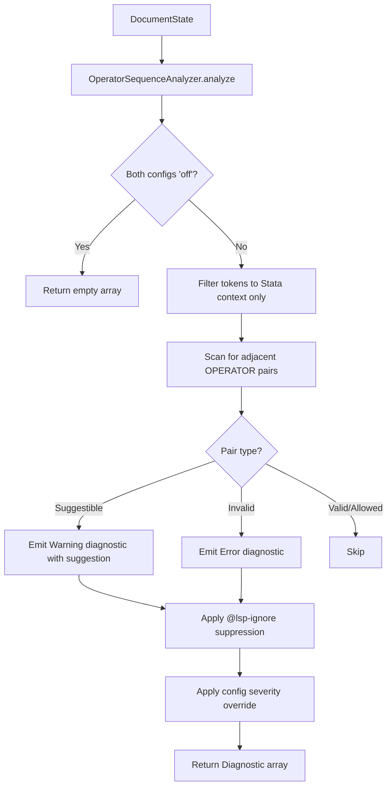
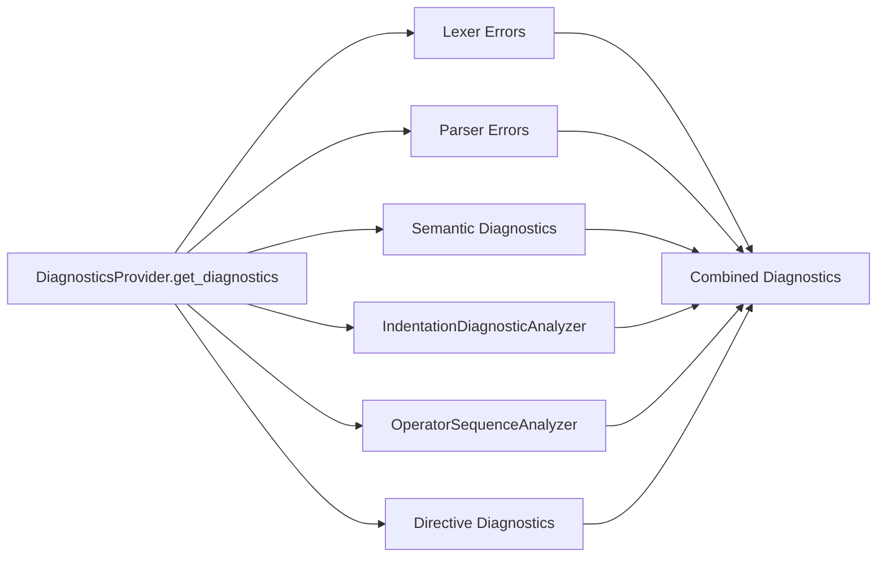

# Design Document: Malformed Operator Diagnostics

## Overview

This feature adds an `OperatorSequenceAnalyzer` that inspects adjacent OPERATOR tokens in Stata source code to detect two categories of malformed sequences:

1. **Suggestible sequences** — spaced compound operators like `< =` that likely meant `<=` (Warning severity)
2. **Invalid sequences** — operator combinations with no valid Stata meaning like `< |` or `& &` (Error severity)

The analyzer follows the established `IndentationDiagnosticAnalyzer` pattern: a standalone class instantiated by `DiagnosticsProvider`, receiving `DocumentState` and `StataLSPConfig`, and returning `Diagnostic[]`. It operates on the token stream (not the AST), scanning for adjacent OPERATOR token pairs separated only by trivia (WHITESPACE, CONTINUATION) — not by STATEMENT_TERMINATOR or non-trivia tokens.

The lexer already handles context filtering: operators inside strings produce STRING tokens, and operators inside comments produce COMMENT tokens. The analyzer only needs to additionally skip tokens in Mata/Python embedded blocks (via `ContextTracker`).

## Architecture



The analyzer is integrated into the existing diagnostics pipeline:



### Design Decisions

1. **Token-level analysis, not AST-level**: The analyzer works on the flat token array. Adjacent OPERATOR tokens separated only by trivia are suspicious by definition — no AST structure is needed. This keeps the implementation simple and decoupled from parser changes.

2. **Allowlist for valid adjacencies**: Rather than trying to enumerate all invalid pairs, the analyzer defines explicit sets for suggestible and invalid pairs, and an allowlist for valid adjacent operator combinations (e.g., comparison + arithmetic like `< +`). Any pair not in these sets is ignored (no diagnostic).

3. **Per-category severity config**: Two config fields — `diagnostics.severity.malformedOperator` (default `'warning'`) for suggestible sequences and `diagnostics.severity.invalidOperatorSequence` (default `'error'`) for invalid sequences — give users granular control. This follows the existing pattern of separate fields per diagnostic category (e.g., `undefinedMacro`, `undefinedVariable`). When either is `'off'`, that category is suppressed.

4. **Suppression reuses `ignored_lines` from `DocumentState`**: The `SemanticAnalyzer` already computes `ignored_lines` (a `Set<number>` of line numbers suppressed by `@lsp-ignore` / `@lsp-ignore-next` directives) during semantic analysis. Currently this set is internal to `AnalyzerConfig`. To avoid duplicating the token-scanning logic and re-scanning tokens, `ignored_lines` will be exposed on `DocumentState` — populated by the `SemanticAnalyzer` alongside other analysis results (tokens, AST, symbols). The `OperatorSequenceAnalyzer` simply checks `document.ignored_lines.has(line)` for each diagnostic it would emit. This is consistent with how `DocumentState` already stores all analysis outputs, and the existing scanning covers all comment styles (`//`, `*`, `/* */`) and handles `@lsp-ignore-next` by skipping over WHITESPACE, CONTINUATION, COMMENT_LINE, COMMENT_BLOCK, and STATEMENT_TERMINATOR tokens to find the target line. Note: the `@lsp-ignore-next` skip list is broader than the adjacency-detection "trivia" definition (which is WHITESPACE + CONTINUATION only).

5. **Lexer prerequisite for `~=`**: The current lexer does not produce `~=` as a compound token. Before implementing the analyzer, the lexer must be updated to recognize `~=` as a compound operator (matching `!=`, `<=`, `>=`, `==`). Without this, `~=` without spaces would be incorrectly flagged as a suggestible sequence.

## Components and Interfaces

### DocumentState Extension (`src/document-store.ts`)

Add `ignored_lines` to the `DocumentState` interface:

```typescript
export interface DocumentState {
  // ... existing fields ...

  // Lines suppressed by @lsp-ignore / @lsp-ignore-next directives
  ignored_lines: Set<number>;
}
```

The `SemanticAnalyzer` already computes this set (in `AnalyzerConfig.ignored_lines`). The change is to copy it onto `DocumentState` after analysis completes, alongside the existing `symbols` and `diagnostics` fields.

### OperatorSequenceAnalyzer

**File**: `src/providers/operator-sequence-diagnostics.ts`

```typescript
import { Diagnostic } from 'vscode-languageserver/node';
import { DocumentState } from '../document-store';
import { StataLSPConfig } from '../types';

export class OperatorSequenceAnalyzer {
    /**
     * Analyze a document's token stream for malformed operator sequences.
     * Returns diagnostics for suggestible and invalid operator pairs.
     */
    analyze(document: DocumentState, config: StataLSPConfig): Diagnostic[];
}
```

**Integration point**: `DiagnosticsProvider` instantiates `OperatorSequenceAnalyzer` as a private field (same pattern as `indentation_analyzer`) and calls `analyze()` in `get_diagnostics()`, filtering results through embedded context checks.

### Operator Pair Classification

The analyzer classifies operator pairs using lookup maps:

```typescript
/** Suggestible pairs: spaced compound operators with a known intended form */
const SUGGESTIBLE_PAIRS: Map<string, string> = new Map([
    ['< =', '<='],
    ['> =', '>='],
    ['! =', '!='],
    ['~ =', '~='],
    ['= =', '=='],
]);

/** Invalid pairs: operator combinations with no valid Stata meaning */
const INVALID_PAIRS: Set<string> = new Set([
    // Comparison + logical
    '< |', '< &', '> |', '> &',
    // Logical + comparison
    '| <', '| >', '& <', '& >',
    // Logical + assignment
    '| =',
    // Double logical
    '| &', '& |',
    // Double comparison
    '< <', '> >', '< >', '> <',
    // C-style logical (not valid in Stata)
    '| |', '& &',
]);

/** Pairs that get specialized messages */
const SPECIAL_MESSAGES: Map<string, string> = new Map([
    ['| |', "Stata uses '|' for logical OR, not '||'"],
    ['& &', "Stata uses '&' for logical AND, not '&&'"],
    ['| =', "Stata does not support compound assignment operators"],
]);

/** Arithmetic operators — adjacency with comparison is valid */
const ARITHMETIC_OPS: Set<string> = new Set(['+', '-', '*', '/', '^']);

/** Comparison operators */
const COMPARISON_OPS: Set<string> = new Set(['<', '>']);

/** Negation operators */
const NEGATION_OPS: Set<string> = new Set(['!', '~']);
```

### Adjacency Detection Algorithm

Two OPERATOR tokens are considered "adjacent" if and only if all tokens between them are trivia (WHITESPACE or CONTINUATION). A STATEMENT_TERMINATOR, COMMENT_LINE, or COMMENT_BLOCK token between them breaks adjacency.

```
for each token[i] where token[i].type === 'OPERATOR':
    find next non-trivia token token[j]
    if any token between i and j is STATEMENT_TERMINATOR, COMMENT_LINE, or COMMENT_BLOCK: skip
    if token[j].type !== 'OPERATOR': skip
    classify pair (token[i].value, token[j].value)
    if pair matched (suggestible or invalid): advance i past j (skip second token)
```

When a pair is matched, the scanner advances past the second token to avoid overlapping diagnostics. For example, `< = =` produces one diagnostic for `< =` (the `=` at position j is consumed), then the second `=` is evaluated as a new first token. Without this skip, `< = =` would produce two diagnostics (`< =` and `= =`), which would be confusing since the first diagnostic already identifies the fix.

### Valid Adjacency Allowlist

The following adjacent operator combinations are valid and produce no diagnostic:

- **Comparison + arithmetic** (either order): `< +`, `+ <`, `> *`, `^ >`, etc.
- **Negation before comparison**: `! <`, `! >`, `~ <`, `~ >`

### Diagnostic Message Templates

| Pair Type | Message Format |
|-----------|---------------|
| Suggestible | `Malformed operator '< ='. Did you mean '<='?` |
| Invalid (general) | `Invalid operator sequence '< \|'. This operator combination is not valid in Stata` |
| C-style `\| \|` | `Invalid operator sequence '\| \|'. Stata uses '\|' for logical OR, not '\|\|'` |
| C-style `& &` | `Invalid operator sequence '& &'. Stata uses '&' for logical AND, not '&&'` |
| Compound assign `\| =` | `Invalid operator sequence '\| ='. Stata does not support compound assignment operators` |

### Diagnostic Codes

Added to `StataDiagnosticCode` enum:

```typescript
// Malformed operator diagnostics (6xxx range)
MALFORMED_OPERATOR = 6001,
INVALID_OPERATOR_SEQUENCE = 6002,
```

### Configuration Extension

#### Type Definition (`src/types/index.ts`)

Added to `StataLSPConfig.diagnostics.severity`:

```typescript
severity: {
    undefinedMacro: 'error' | 'warning' | 'information' | 'hint' | 'off';
    undefinedVariable: 'error' | 'warning' | 'information' | 'hint' | 'off';
    styleWarnings: 'error' | 'warning' | 'information' | 'hint' | 'off';
    malformedOperator: 'error' | 'warning' | 'information' | 'hint' | 'off';       // NEW
    invalidOperatorSequence: 'error' | 'warning' | 'information' | 'hint' | 'off';  // NEW
};
```

Default values (in `DEFAULT_SETTINGS`):
- `malformedOperator`: `'warning'` — controls suggestible sequences (`< =` → `<=`)
- `invalidOperatorSequence`: `'error'` — controls invalid sequences (`< |`, `& &`, etc.)

When either field is set to a specific severity, it overrides the corresponding default. When `'off'`, that category is suppressed. If both are `'off'`, the analyzer returns `[]` immediately.

#### Default Settings (`src/server-handlers.ts`)

Add `malformedOperator: 'warning'` and `invalidOperatorSequence: 'error'` to `DEFAULT_SETTINGS.diagnostics.severity`.

#### Config Validator (`src/utils/config-validator.ts`)

Add validation for `diagnostics.severity.malformedOperator` and `diagnostics.severity.invalidOperatorSequence` following the same pattern as `undefinedMacro`, `undefinedVariable`, and `styleWarnings` — check against `valid_severities` and copy to `validated_config`.

Note: `src/utils/workspace-config.ts` does not need changes. Severity settings come through VS Code's `getConfiguration` path, not `.sight.json`. The existing severity fields (`undefinedMacro`, etc.) follow the same pattern.

#### VS Code Extension Settings (`client/package.json`)

Add two new entries to `contributes.configuration.properties`, following the same pattern as the existing severity settings:

```json
"sight.diagnostics.severity.malformedOperator": {
    "type": "string",
    "enum": ["error", "warning", "information", "hint", "off"],
    "default": "warning",
    "description": "Severity level for spaced compound operator diagnostics (e.g., '< =' instead of '<='). Set to 'off' to disable.",
    "enumDescriptions": [
        "Show as error",
        "Show as warning",
        "Show as information",
        "Show as hint",
        "Disable this diagnostic"
    ]
},
"sight.diagnostics.severity.invalidOperatorSequence": {
    "type": "string",
    "enum": ["error", "warning", "information", "hint", "off"],
    "default": "error",
    "description": "Severity level for invalid operator sequence diagnostics (e.g., '< |', '& &'). Set to 'off' to disable.",
    "enumDescriptions": [
        "Show as error",
        "Show as warning",
        "Show as information",
        "Show as hint",
        "Disable this diagnostic"
    ]
}
```

#### README Documentation (`README.md`)

Add rows to the diagnostics settings table:

```
| `sight.diagnostics.severity.malformedOperator` | enum | `"warning"` | Severity for spaced compound operator diagnostics (e.g., `< =` → `<=`). Options: `"error"`, `"warning"`, `"information"`, `"hint"`, `"off"` |
| `sight.diagnostics.severity.invalidOperatorSequence` | enum | `"error"` | Severity for invalid operator sequence diagnostics (e.g., `< |`, `& &`). Options: `"error"`, `"warning"`, `"information"`, `"hint"`, `"off"` |
```

Also add a brief section in the diagnostics documentation explaining what malformed operator diagnostics detect (spaced compound operators and invalid operator combinations).

## Data Models

### OperatorPairResult

Internal classification result for an operator pair:

```typescript
interface OperatorPairResult {
    kind: 'suggestible' | 'invalid';
    first_token: Token;
    second_token: Token;
    pair_key: string;        // e.g., '< ='
    message: string;         // Full diagnostic message
    default_severity: DiagnosticSeverity;  // Warning for suggestible, Error for invalid
    code: StataDiagnosticCode;
}
```

### Diagnostic Output

Each result maps to a standard LSP `Diagnostic`. The `'off'` config value is handled by an early-exit check before classification (if both categories are `'off'`, return `[]`; if only one is `'off'`, skip results of that kind). The severity mapping for non-`'off'` values uses a helper that converts config strings to `DiagnosticSeverity` enums:

```typescript
// resolve_severity converts a config string to DiagnosticSeverity,
// using the result's default_severity as fallback if config is undefined.
const my_severity = resolve_severity(
    result.kind === 'suggestible'
        ? config.diagnostics.severity.malformedOperator
        : config.diagnostics.severity.invalidOperatorSequence,
    result.default_severity,
);

{
    range: {
        start: first_token.range.start,
        end: second_token.range.end,
    },
    message: result.message,
    severity: my_severity,
    source: 'sight',
    code: result.code,
}
```


## Correctness Properties

*A property is a characteristic or behavior that should hold true across all valid executions of a system — essentially, a formal statement about what the system should do. Properties serve as the bridge between human-readable specifications and machine-verifiable correctness guarantees.*

### Property 1: Suggestible pair detection and diagnostics

*For any* suggestible operator pair (`< =`, `> =`, `! =`, `~ =`, `= =`) embedded in valid Stata code as adjacent OPERATOR tokens, the analyzer should emit exactly one diagnostic with: (a) severity Warning, (b) code `MALFORMED_OPERATOR` (6001), (c) a message matching `"Malformed operator '<op1> <op2>'. Did you mean '<compound>'?"`, and (d) a range spanning from the start of the first token to the end of the second token.

**Validates: Requirements 1.1, 1.2, 1.3, 1.4, 1.5, 1.6, 5.1, 5.3, 9.2**

### Property 2: Invalid pair detection and diagnostics

*For any* invalid operator pair (from the full set: `< |`, `< &`, `> |`, `> &`, `| <`, `| >`, `& <`, `& >`, `| =`, `| &`, `& |`, `< <`, `> >`, `< >`, `> <`, `| |`, `& &`) embedded in valid Stata code as adjacent OPERATOR tokens, the analyzer should emit exactly one diagnostic with: (a) severity Error, (b) code `INVALID_OPERATOR_SEQUENCE` (6002), (c) a message containing the specific pair string, (d) for C-style pairs (`| |`, `& &`), the message should include Stata-specific guidance about single operators, and (e) for `| =`, the message should note that Stata does not support compound assignment operators.

**Validates: Requirements 2.1, 2.2, 2.3, 2.4, 2.5, 2.6, 2.7, 5.2, 5.3, 5.9, 5.10, 5.11, 5.12, 9.3**

### Property 3: Embedded context suppression

*For any* malformed operator pair (suggestible or invalid) placed inside a Mata or Python embedded block, the analyzer should emit zero diagnostics for that pair.

**Validates: Requirements 3.1, 3.2**

### Property 4: No false positives for allowed adjacencies

*For any* pair of adjacent OPERATOR tokens where the combination is in the allowlist (comparison + arithmetic in either order, or negation before comparison), the analyzer should emit zero diagnostics.

**Validates: Requirements 4.3, 4.4**

Note: Requirement 4.1 (non-adjacent operators separated by non-operator tokens) is a structural guarantee of the adjacency detection algorithm — non-operator tokens between two operators prevent them from being considered adjacent, so they are never classified. Requirement 4.2 (compound operators without spaces) is a lexer-level guarantee — the lexer produces a single token, not a pair.

### Property 5: Continuation-spanning detection

*For any* malformed operator pair where the first operator is on one line and the second is on the next line connected by a `///` continuation, the analyzer should still detect and emit a diagnostic for the pair.

**Validates: Requirements 6.1**

### Property 6: Statement terminator boundary

*For any* two operators separated by a statement terminator (newline in CR mode or `;` in semicolon mode), the analyzer should emit zero diagnostics, even if the pair would otherwise be malformed.

**Validates: Requirements 6.2**

### Property 7: Directive suppression

*For any* malformed operator pair on a line annotated with `@lsp-ignore` (same line) or targeted by `@lsp-ignore-next` (preceding comment line), the analyzer should emit zero diagnostics for that pair.

**Validates: Requirements 7.1, 7.2**

### Property 8: Config severity override (suggestible)

*For any* suggestible operator pair and any `malformedOperator` config severity value (`'error'`, `'warning'`, `'information'`, `'hint'`), the emitted diagnostic should use the configured severity. When `malformedOperator` is `'off'`, zero suggestible diagnostics should be emitted.

**Validates: Requirements 8.1, 8.3, 8.5, 8.6**

### Property 9: Config severity override (invalid)

*For any* invalid operator pair and any `invalidOperatorSequence` config severity value (`'error'`, `'warning'`, `'information'`, `'hint'`), the emitted diagnostic should use the configured severity. When `invalidOperatorSequence` is `'off'`, zero invalid diagnostics should be emitted.

**Validates: Requirements 8.2, 8.4, 8.5, 8.7**

## Error Handling

The `OperatorSequenceAnalyzer` is a pure diagnostic analyzer with no external I/O. Error handling is minimal:

- **Missing tokens**: If `document.tokens` is empty or undefined, return `[]`.
- **Missing context tracker**: If `document.context_tracker` is unavailable, skip embedded context filtering (analyze all tokens). This is a defensive fallback — in practice, `DocumentState` always has a context tracker.
- **Missing `ignored_lines`**: If `document.ignored_lines` is undefined, treat as empty (no suppression). This handles edge cases where the semantic analyzer hasn't run yet.
- **Config missing fields**: If `malformedOperator` is absent, fall back to `'warning'`. If `invalidOperatorSequence` is absent, fall back to `'error'`. The `DEFAULT_SETTINGS` ensures both fields are always present in validated configs.
- **Malformed token ranges**: If a token has an invalid range (e.g., end before start), skip that pair. This should never happen with a correct lexer but guards against corruption.

No exceptions are thrown. The analyzer always returns a `Diagnostic[]` (possibly empty).

## Testing Strategy

### Property-Based Testing (fast-check)

Each correctness property maps to a single property-based test with minimum 100 iterations. Tests use `fast-check` generators to produce:

- Random suggestible/invalid operator pairs from the defined sets
- Random valid Stata expressions as context around the pairs
- Random whitespace/continuation trivia between operators
- Random embedded block wrappers (Mata/Python)
- Random `@lsp-ignore` / `@lsp-ignore-next` annotations
- Random config severity values

**Library**: `fast-check` (already used in the project)

**Test file**: `tests/property/operator-sequence-diagnostics.prop.test.ts`

Each test is tagged with:
```
Feature: malformed-operator-diagnostics, Property N: <property_text>
```

### Unit Testing

Unit tests cover specific examples and edge cases:

- Exact message strings for each suggestible pair (Requirements 5.4–5.8)
- Exact message strings for C-style logical pairs (Requirements 5.10–5.11)
- Exact message string for `| =` compound assignment hint (Requirement 5.12)
- Exact message strings for general invalid pairs (Requirement 5.9)
- `DEFAULT_SETTINGS.diagnostics.severity.malformedOperator` equals `'warning'` (Requirement 8.6)
- `DEFAULT_SETTINGS.diagnostics.severity.invalidOperatorSequence` equals `'error'` (Requirement 8.7)
- `StataDiagnosticCode.MALFORMED_OPERATOR === 6001` and `INVALID_OPERATOR_SEQUENCE === 6002` (Requirements 9.1–9.3)
- Compound operators without spaces produce single tokens (Requirement 4.2)
- Comments between operators break adjacency (no false positive for `x < /* */ = 1`)

**Test file**: `tests/unit/operator-sequence-diagnostics.test.ts`

### Integration Testing

Integration tests verify the analyzer works correctly within the full `DiagnosticsProvider` pipeline:

- Malformed operator diagnostics appear alongside other diagnostic types
- Config changes propagate correctly through the provider
- Cache invalidation works when config changes

**Test file**: `tests/integration/operator-sequence-diagnostics.test.ts`
