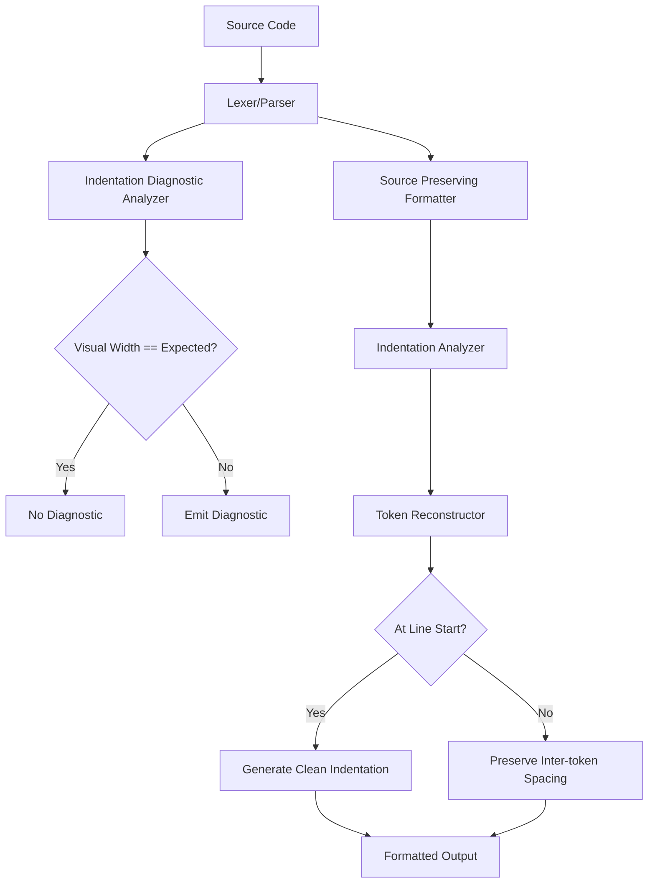

# Design Document: Mixed Whitespace Indentation Fix

## Overview

This design addresses two related bugs in the indentation diagnostic and formatter systems when handling mixed tabs and spaces. The core issue is that the diagnostic analyzer and formatter have inconsistent handling of mixed whitespace, leading to false positive diagnostics that the formatter cannot resolve.

## Architecture

The fix involves two components:

1. **Indentation Diagnostic Analyzer** (`src/providers/indentation-diagnostics.ts`): Fix the comparison logic to correctly handle mixed whitespace
2. **Token Reconstructor** (`src/formatter/token-reconstructor.ts`): Ensure leading whitespace is normalized when applying indentation



## Components and Interfaces

### Component 1: Root Cause Analysis

The bug is in `get_line_indentation`:

```typescript
// CURRENT (BUGGY) CODE:
private get_line_indentation(line: string, indent_size: number): number {
    let level = 0;
    for (const char of line) {
      if (char === ' ') {
        level += 1;
      } else if (char === '\t') {
        level += indent_size;  // BUG: Treats tab as fixed width!
      } else {
        break;
      }
    }
    return level;
}
```

The bug: Tabs are treated as adding a fixed `indent_size` spaces, but tabs actually advance to the **next tab stop** (next multiple of tab_width).

Example with `indent_size=4`:
- `" \t"` (space + tab): Space puts us at column 1, tab advances to column 4. **Visual width = 4**
- But current code calculates: 1 (space) + 4 (tab) = **5** ← WRONG!

This causes false positives when a line uses space+tab that produces correct visual width.

### Component 2: Visual Width Calculator Fix

Fix `get_line_indentation` to properly compute visual width with tab stops:

```typescript
/**
 * Calculate the visual width of leading whitespace, accounting for tab stops.
 * Tabs expand to the next multiple of indent_size (tab stop).
 * 
 * @param line - The full line of text
 * @param indent_size - Tab stop interval (typically 4, validated by config system)
 * @returns Visual column width of leading whitespace
 */
private get_line_indentation(line: string, indent_size: number): number {
    let visual_column = 0;
    
    for (const char of line) {
        if (char === ' ') {
            visual_column += 1;
        } else if (char === '\t') {
            // Tab advances to next tab stop (next multiple of indent_size)
            visual_column = Math.ceil((visual_column + 1) / indent_size) * indent_size;
        } else {
            break;
        }
    }
    return visual_column;
}
```

Note: The config system validates `indent_size` before it reaches this code, so we don't need defensive checks here.

### Component 3: Indentation Diagnostic Analyzer

With the fixed `get_line_indentation`, the diagnostic comparisons will work correctly:
- `find_comment_indentation_issues`: `nextIndent > commentIndent` will be accurate
- `find_unnecessary_indentation_issues`: `actual_indent > expected_indent` will be accurate
- `find_block_indentation_issues`: `innerIndent <= braceIndent` will be accurate

### Component 4: Token Reconstructor (Already Correct)

The `TokenReconstructor.reconstruct` method already handles indentation correctly:
- When `at_line_start` is true and not preserving whitespace, it calls `make_indent` which generates clean spaces/tabs
- The `make_indent` method produces consistent indentation based on `indent_style` config

The formatter should work correctly once the diagnostic is fixed. However, we should verify that the formatter is being invoked correctly for lines with mixed whitespace.

## Data Models

No new data models required. The existing `IndentationInfo` and `FormatterConfig` types are sufficient.

## Correctness Properties

*A property is a characteristic or behavior that should hold true across all valid executions of a system—essentially, a formal statement about what the system should do. Properties serve as the bridge between human-readable specifications and machine-verifiable correctness guarantees.*

### Property 1: Visual Width Calculation Correctness

*For any* string of whitespace characters (spaces and tabs) and any positive tab width, the `calculate_visual_width` function SHALL return the correct visual column position where:
- Each space adds 1 to the visual column
- Each tab advances to the next multiple of tab_width

**Validates: Requirements 1.1**

### Property 2: No False Positive When Visual Width Equals Expected

*For any* line of Stata code where the visual width of leading whitespace equals the expected indentation (depth × indent_size), the Indentation_Diagnostic_Analyzer SHALL NOT emit an unnecessary indentation diagnostic.

**Validates: Requirements 1.2, 1.4**

### Property 3: Diagnostic Emitted When Visual Width Exceeds Expected

*For any* line of Stata code where the visual width of leading whitespace exceeds the expected indentation (depth × indent_size), the Indentation_Diagnostic_Analyzer SHALL emit an unnecessary indentation diagnostic.

**Validates: Requirements 1.3**

### Property 4: Formatter Normalizes Mixed Whitespace

*For any* line with mixed tabs and spaces at the start, after formatting:
- If indent_style is "spaces", the leading whitespace SHALL contain only spaces
- If indent_style is "tabs", the leading whitespace SHALL contain only tabs (for full indent levels)

**Validates: Requirements 2.1, 2.2, 2.3**

### Property 5: Formatter Preserves Visual Indentation Level

*For any* line with correct visual indentation (visual width equals expected), after formatting, the visual indentation level SHALL remain the same.

**Validates: Requirements 2.4**

### Property 6: Formatter Resolves All Indentation Diagnostics

*For any* code that triggers indentation diagnostics (unnecessary or missing), after formatting, the same diagnostics SHALL NOT be present.

**Validates: Requirements 3.1, 3.2, 3.3**

## Error Handling

- Preserve original source if formatting fails (existing behavior)
- Config validation ensures `indent_size` is always a positive integer

## Testing Strategy

### Unit Tests

1. Test `calculate_visual_width` with various whitespace combinations:
   - All spaces
   - All tabs
   - Mixed space+tab
   - Tab+space
   - Multiple tabs

2. Test diagnostic analyzer with mixed whitespace:
   - Space+tab producing correct visual width → no diagnostic
   - Space+tab producing excess visual width → diagnostic

3. Test formatter with mixed whitespace:
   - Input with mixed whitespace → output with consistent whitespace

### Property-Based Tests

Use fast-check to generate:
- Random whitespace strings (spaces and tabs)
- Random Stata code with various indentation patterns
- Random indent_size values (1-8)

Property tests should verify:
1. Visual width calculation is consistent with tab-stop semantics
2. No false positives when visual width equals expected
3. Formatter output has consistent whitespace style
4. Formatter resolves diagnostics

### Test Configuration

- Minimum 100 iterations per property test
- Tag format: **Feature: mixed-whitespace-indentation-fix, Property N: {property_text}**
