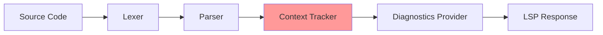

# Design Document: Orphan End Diagnostic

## Overview

This design addresses the detection of orphan `end` statements in Stata code. An orphan `end` is one that doesn't close any block (program, mata, or python). In Stata, such statements result in:

```
command end is unrecognized
r(199);
```

The LSP should detect this condition and report it as an error diagnostic.

## Architecture

The fix primarily affects the Context Tracker component, which already tracks program, mata, and python blocks. The change reverses the previous behavior (from `diagnostic-false-positives` spec) that suppressed orphan end diagnostics.



The Context Tracker (highlighted) needs to:
1. Track all block types (program, mata, python)
2. Match `end` statements to their corresponding blocks
3. Flag `end` statements that don't match any block

## Components and Interfaces

### Context Tracker Changes

The `validate_end_delimiters()` method in `src/context-tracker/index.ts` currently suppresses orphan end diagnostics. This needs to be changed to emit an error.

**Current behavior (incorrect):**
```typescript
if (!my_is_valid_end) {
    // Per diagnostic-false-positives spec Requirement 1.4:
    // Don't flag standalone 'end' commands as errors since they could be
    // valid program block terminators that we can't detect without full context
    // For plain 'end', we err on the side of caution and don't report an error
}
```

**New behavior (correct):**
```typescript
if (!my_is_valid_end) {
    // Orphan 'end' command - doesn't close any block
    this.diagnostics.push({
        message: 'Unexpected "end" command - not closing any program, mata, or python block',
        range: {
            start: { line: my_line_number, character: 0 },
            end: { line: my_line_number, character: my_code_trimmed.length },
        },
        severity: 'error',
        code: ContextErrorCode.UNEXPECTED_END_COMMAND,
    });
}
```

### Program Block Tracking Enhancement

The existing `find_program_block_end_lines()` method needs to be more robust. It should handle:

1. `program define name` - explicit define
2. `program name` - implicit define (two words)
3. Nested program blocks (rare but possible)

**Enhanced implementation:**
```typescript
private find_program_block_end_lines(the_lines: string[]): Set<number> {
    const my_program_end_lines = new Set<number>();
    const my_program_stack: number[] = []; // Stack of program start lines
    
    for (let my_line_number = 0; my_line_number < the_lines.length; my_line_number++) {
        const my_line = the_lines[my_line_number];
        const my_code_part = this.extract_code_before_comment(my_line);
        const my_code_trimmed = my_code_part.trim().toLowerCase();
        
        // Check for program block start
        if (this.is_program_block_start(my_code_trimmed)) {
            my_program_stack.push(my_line_number);
        }
        
        // Check for 'end' that closes a program block
        if (my_code_trimmed === 'end' && my_program_stack.length > 0) {
            my_program_stack.pop();
            my_program_end_lines.add(my_line_number);
        }
    }
    
    return my_program_end_lines;
}

private is_program_block_start(code_trimmed: string): boolean {
    // Match: program define name, program def name, program name
    // But NOT: program drop name, program dir, program list
    const my_words = code_trimmed.split(/\s+/);
    if (my_words[0] !== 'program') return false;
    if (my_words.length < 2) return false;
    
    const my_second_word = my_words[1];
    // Explicit define
    if (my_second_word === 'define' || my_second_word === 'def') {
        return my_words.length >= 3; // Need program name
    }
    // Commands that don't start blocks
    const my_non_block_commands = ['drop', 'dir', 'list', 'query'];
    if (my_non_block_commands.includes(my_second_word)) {
        return false;
    }
    // Implicit define: program name
    return true;
}
```

### Error Code Addition

Add a new error code for orphan end commands:

```typescript
// In src/context-tracker/types.ts
export enum ContextErrorCode {
    UNCLOSED_MATA_BLOCK = 4001,
    UNCLOSED_PYTHON_BLOCK = 4002,
    INVALID_DELIMITER_POSITION = 4003,
    UNEXPECTED_END_COMMAND = 4004,  // NEW
}
```

## Data Models

No changes to data models. The existing `ContextDiagnostic` interface is sufficient:

```typescript
interface ContextDiagnostic {
    message: string;
    range: Range;
    severity: 'error' | 'warning' | 'information';
    code: ContextErrorCode;
}
```

## Correctness Properties

*A property is a characteristic or behavior that should hold true across all valid executions of a system—essentially, a formal statement about what the system should do. Properties serve as the bridge between human-readable specifications and machine-verifiable correctness guarantees.*

### Property 1: Orphan End Detection

*For any* Stata source code containing an `end` statement that is not inside a program, mata, or python block, the Context Tracker SHALL emit an error diagnostic with severity 'error' and a message indicating the `end` has nothing to close.

**Validates: Requirements 1.1, 2.1, 2.2**

### Property 2: Valid Block Terminator Acceptance

*For any* valid program block (started with `program define` or `program name`), mata block (started with `mata`), or python block (started with `python`) that is properly closed with `end`, the Context Tracker SHALL NOT emit an orphan-end diagnostic for that `end` statement.

**Validates: Requirements 1.2, 1.3, 1.4, 3.1, 3.2, 4.1, 4.2, 5.1, 5.2**

### Property 3: Nested Block Handling

*For any* Stata source code with nested program blocks, each `end` statement SHALL be matched to its corresponding innermost unclosed program block, and no orphan-end diagnostics SHALL be emitted for correctly matched `end` statements.

**Validates: Requirements 3.3**

## Error Handling

### Orphan End Detection

When an orphan `end` is detected:
1. Context Tracker emits diagnostic with severity 'error'
2. Message: "Unexpected \"end\" command - not closing any program, mata, or python block"
3. Range: The line containing the `end` statement
4. Code: `ContextErrorCode.UNEXPECTED_END_COMMAND`

### Edge Cases

1. **Multiple orphan ends**: Each orphan `end` gets its own diagnostic
2. **End after unclosed block**: If a block is unclosed, subsequent `end` statements are still evaluated
3. **End in comments**: `end` in comments should not trigger diagnostics (already handled)

## Testing Strategy

### Unit Tests

1. **Orphan end detection**: Test that standalone `end` produces error diagnostic
2. **Program block end**: Test that `end` after `program define` produces no error
3. **Mata block end**: Test that `end` after `mata` produces no error
4. **Python block end**: Test that `end` after `python` produces no error
5. **Nested blocks**: Test nested program blocks with multiple `end` statements

### Property-Based Tests

Property tests should use fast-check with minimum 100 iterations per property. Each property test must reference its design document property.

1. **Property 1 test**: Generate random Stata code without blocks, insert `end`, verify error diagnostic
   - Tag: **Feature: orphan-end-diagnostic, Property 1: Orphan End Detection**

2. **Property 2 test**: Generate valid program/mata/python blocks with `end`, verify no orphan-end diagnostic
   - Tag: **Feature: orphan-end-diagnostic, Property 2: Valid Block Terminator Acceptance**

3. **Property 3 test**: Generate nested program blocks, verify correct `end` matching
   - Tag: **Feature: orphan-end-diagnostic, Property 3: Nested Block Handling**

### Integration Tests

1. Test real Stata files with orphan `end` statements
2. Test files with valid program, mata, and python blocks
3. Test mixed scenarios with both valid and orphan `end` statements
