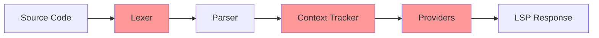

# Design Document: Python Block End Fix

## Overview

This design addresses the incorrect handling of embedded language block endings in the Stata LSP. The current implementation expects `end python` to close Python blocks, but Stata actually requires just `end` for both `mata` and `python` blocks. This fix unifies the end delimiter handling across both embedded language types.

## Architecture

The fix touches several components in the LSP pipeline:



Components requiring changes (highlighted):
- **Lexer**: Remove `end python` look-ahead logic, treat `end` as delimiter for Python blocks
- **Context Tracker**: Update validation and error messages
- **Providers**: Update completion and hover providers

## Components and Interfaces

### Lexer Changes

The lexer currently has special handling for Python blocks that looks ahead for `end python`. This needs to be simplified to match Mata handling.

**Current behavior (incorrect):**
```typescript
// In Python context, check for end python delimiter
if (this.is_end_delimiter(lower_value)) {
    // Check if next word is "python"
    // ... look-ahead logic ...
    if (next_word.toLowerCase() === 'python') {
        // This is "end python"
        this.pop_context();
        return { type: 'END_PYTHON', value: combined_value, ... };
    }
}
```

**New behavior (correct):**
```typescript
// In Python context, check for end delimiter (same as Mata)
if (this.is_end_delimiter(lower_value)) {
    this.pop_context();
    return {
        type: 'END_PYTHON',
        value,  // Just 'end', not 'end python'
        range: this.makeRange(startLine, startColumn, this.line, this.column),
    };
}
```

**Remove deprecated methods:**
- `is_end_python_delimiter()` - no longer needed

### Context Tracker Changes

The context tracker needs updates in several areas:

1. **Block validation**: Accept `end` as valid closer for Python blocks
2. **Error messages**: Update to suggest `end` instead of `end python`
3. **Malformed end detection**: Flag `end python` and `end mata` as invalid

**Updated error messages:**
```typescript
// Unclosed block message
my_range.context === LanguageContext.PYTHON
    ? 'Unclosed python block - missing "end" command'
    : 'Unclosed mata block - missing "end" command'

// Invalid end command detection
if (my_code_trimmed.toLowerCase() === 'end python' ||
    my_code_trimmed.toLowerCase() === 'end mata') {
    this.diagnostics.push({
        message: `Invalid syntax: use "end" to close ${language} blocks, not "${my_code_trimmed}"`,
        ...
    });
}
```

### Completion Provider Changes

Update block boundary completions to suggest `end` for both Mata and Python:

```typescript
// For both Mata and Python contexts
the_completions.push({
    label: 'end',
    kind: CompletionItemKind.Keyword,
    detail: `End ${my_context_range.context === LanguageContext.MATA ? 'mata' : 'python'} block`,
    documentation: `Closes the current ${language} block`,
    sortText: '0end',
});
```

### Hover Provider Changes

Update hover documentation for `end` command:

```typescript
// When hovering over 'end' in Python context
return {
    kind: MarkupKind.Markdown,
    value: `**End Python Block**\n\nCloses a Python block started with \`python\`.\n\n**Syntax:** \`end\`\n\nMust be used to close multi-line Python blocks. Single-line \`python:\` statements do not require \`end\`.`,
};
```

## Data Models

No changes to data models. The `EmbeddedLanguageBlockNode` interface remains the same:

```typescript
interface EmbeddedLanguageBlockNode {
    type: 'embedded_block';
    language: 'mata' | 'python';
    start_command: string;  // 'mata', 'python', 'mata:', 'python:'
    end_command?: string;   // Now always 'end' for both (or undefined if unclosed)
    content: string;
    content_range: Range;
    is_single_line: boolean;
    range: Range;
}
```

## Correctness Properties

*A property is a characteristic or behavior that should hold true across all valid executions of a system—essentially, a formal statement about what the system should do. Properties serve as the bridge between human-readable specifications and machine-verifiable correctness guarantees.*

### Property 1: Unified End Delimiter Tokenization

*For any* embedded language block (Mata or Python) with `end` as the closing command, the lexer SHALL emit the appropriate END_MATA or END_PYTHON token with value `end`.

**Validates: Requirements 1.1, 1.2**

### Property 2: Invalid End Syntax Tokenization

*For any* occurrence of `end python` or `end mata` in an embedded block, the lexer SHALL emit an END token for `end` followed by a separate WORD token for `python`/`mata`.

**Validates: Requirements 1.3, 1.4**

### Property 3: Parser End Delimiter Handling

*For any* embedded language block (Mata or Python) closed with `end`, the parser SHALL produce an EmbeddedLanguageBlockNode with `end_command` set to `end`.

**Validates: Requirements 2.1, 2.2, 2.3**

### Property 4: Context Tracker Valid Block Acceptance

*For any* embedded language block (Mata or Python) closed with `end`, the context tracker SHALL NOT report an unclosed block error or invalid delimiter error.

**Validates: Requirements 3.1, 3.2, 3.3**

### Property 5: Invalid Syntax Diagnostic Detection

*For any* occurrence of `end python` or `end mata` in source code, the diagnostics system SHALL emit a warning diagnostic suggesting to use `end` instead.

**Validates: Requirements 3.4, 6.1, 6.2**

### Property 6: Completion Provider Correctness

*For any* position inside an embedded language block where block-ending completions are appropriate, the completion provider SHALL include `end` in suggestions and SHALL NOT include `end python` or `end mata`.

**Validates: Requirements 4.1, 4.2, 4.3**

## Error Handling

### Invalid End Syntax

When `end python` or `end mata` is encountered:
1. The lexer emits `END_PYTHON` or `END_MATA` for just `end`
2. The remaining `python` or `mata` word becomes a separate token
3. The context tracker detects this pattern and emits a diagnostic
4. Diagnostic severity: Warning (code still parses, but will fail in Stata)

### Unclosed Blocks

When a block is not closed:
1. Parser reaches end of file without finding `end`
2. Context tracker reports unclosed block error
3. Error message suggests adding `end` (not `end python`)

## Testing Strategy

### Unit Tests

1. **Lexer tests**: Verify `end` produces correct token types in both contexts
2. **Parser tests**: Verify embedded blocks parse correctly with `end`
3. **Context tracker tests**: Verify diagnostics for `end python`/`end mata`
4. **Completion tests**: Verify `end` is suggested, not `end python`
5. **Hover tests**: Verify correct documentation for `end`

### Property-Based Tests

Property tests should use fast-check with minimum 100 iterations per property. Each property test must reference its design document property.

1. **Property 1 test**: Generate random embedded blocks (Mata/Python), verify `end` produces correct END_MATA/END_PYTHON tokens
   - Tag: **Feature: python-block-end-fix, Property 1: Unified End Delimiter Tokenization**

2. **Property 2 test**: Generate `end python`/`end mata` patterns, verify tokenization produces separate tokens
   - Tag: **Feature: python-block-end-fix, Property 2: Invalid End Syntax Tokenization**

3. **Property 3 test**: Generate embedded blocks with `end`, verify parser produces correct AST nodes
   - Tag: **Feature: python-block-end-fix, Property 3: Parser End Delimiter Handling**

4. **Property 4 test**: Generate valid embedded blocks, verify context tracker reports no errors
   - Tag: **Feature: python-block-end-fix, Property 4: Context Tracker Valid Block Acceptance**

5. **Property 5 test**: Generate code with `end python`/`end mata`, verify diagnostic warnings are emitted
   - Tag: **Feature: python-block-end-fix, Property 5: Invalid Syntax Diagnostic Detection**

6. **Property 6 test**: Generate positions inside embedded blocks, verify completion suggestions
   - Tag: **Feature: python-block-end-fix, Property 6: Completion Provider Correctness**

### Integration Tests

1. Test real Stata files with Python blocks ending in `end`
2. Test diagnostic reporting for files with `end python`
3. Test completion suggestions at block boundaries
