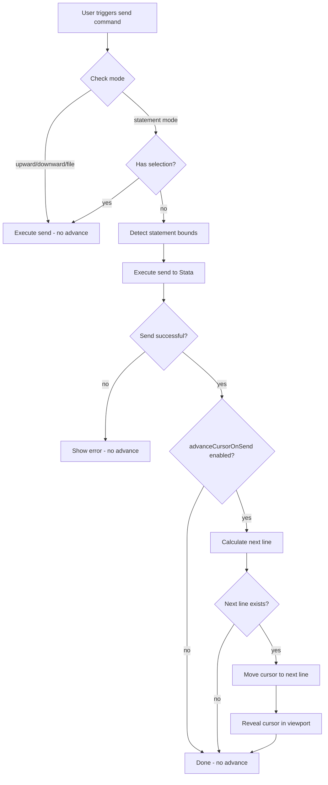

# Design Document: Send-to-Stata Cursor Advance

## Overview

This feature enhances the send-to-stata functionality by automatically advancing the cursor to the next line after sending a single line to Stata. The implementation modifies the existing `handle_send_command` function in `client/src/send-to-stata/commands.ts` to optionally move the cursor after successful execution, controlled by a new configuration setting.

The design follows the existing patterns in the codebase:
- Configuration settings are defined in `client/package.json` under `contributes.configuration.properties`
- Settings are read using `vscode.workspace.getConfiguration('sight.sendToStata')`
- Cursor manipulation uses VS Code's `TextEditor` API

## Architecture



## Components and Interfaces

### Modified Component: `handle_send_command` (commands.ts)

The existing `handle_send_command` function will be extended to:
1. Track whether this is a single-line send (statement mode without selection)
2. Track the statement bounds for multi-line statements with continuations
3. After successful send, optionally advance the cursor based on settings

```typescript
interface CursorAdvanceContext {
    should_advance: boolean;      // Whether cursor should advance after send
    next_line: number;            // The line to advance to (0-indexed)
}
```

### New Function: `advance_cursor_if_enabled`

A helper function to handle cursor advancement logic:

```typescript
/**
 * Advances the cursor to the next line if conditions are met.
 * @param editor - The active text editor
 * @param statement_end_line - The last line of the sent statement (0-indexed)
 * @returns void
 */
function advance_cursor_if_enabled(
    editor: vscode.TextEditor,
    statement_end_line: number
): void
```

### Configuration Setting

New setting in `client/package.json`:

```json
{
    "sight.sendToStata.advanceCursorOnSend": {
        "type": "boolean",
        "default": true,
        "description": "Automatically advance cursor to the next line after sending a single line to Stata"
    }
}
```

## Data Models

### CursorAdvanceContext

Tracks the context needed to determine if and where to advance the cursor:

| Field | Type | Description |
|-------|------|-------------|
| `should_advance` | `boolean` | True if this is a single-line send (statement mode, no selection) |
| `next_line` | `number` | The 0-indexed line number to advance to |

### StatementBounds (existing)

Already defined in `statement-detector.ts`:

| Field | Type | Description |
|-------|------|-------------|
| `start_line` | `number` | 0-indexed start line of statement |
| `end_line` | `number` | 0-indexed end line of statement |


## Correctness Properties

*A property is a characteristic or behavior that should hold true across all valid executions of a system—essentially, a formal statement about what the system should do. Properties serve as the bridge between human-readable specifications and machine-verifiable correctness guarantees.*

### Property 1: Next Line Calculation

*For any* statement bounds (single-line or multi-line with continuations), the calculated next line for cursor advancement SHALL equal `statement.end_line + 1`.

**Validates: Requirements 1.1, 1.2**

### Property 2: Selection Mode Prevents Advancement

*For any* send operation where the editor has an active selection (non-empty), the `should_advance` flag SHALL be `false`, regardless of the cursor advance setting value.

**Validates: Requirements 1.3**

### Property 3: Disabled Setting Prevents Advancement

*For any* send operation where `advanceCursorOnSend` setting is `false`, the cursor position SHALL remain unchanged after the send operation completes.

**Validates: Requirements 2.3**

### Property 4: Cursor State After Advancement

*For any* cursor advancement operation, the resulting cursor position SHALL have column 0 (beginning of line) AND the selection SHALL be empty (no text selected).

**Validates: Requirements 3.1, 3.2**

## Error Handling

| Scenario | Handling |
|----------|----------|
| Cursor on last line of document | Do not advance; cursor stays on current line |
| Send operation fails | Do not advance; show error message as usual |
| No active editor | Early return; no cursor manipulation attempted |
| Document changed during send | Use statement bounds captured before send |

## Testing Strategy

### Unit Tests

Unit tests will verify specific examples and edge cases:

1. **Configuration default value**: Verify `advanceCursorOnSend` defaults to `true` in package.json
2. **Last line edge case**: Verify cursor stays on last line when no next line exists
3. **File mode no-advance**: Verify file mode never triggers advancement
4. **Upward/downward mode no-advance**: Verify these modes never trigger advancement

### Property-Based Tests

Property-based tests will use `fast-check` to verify universal properties across generated inputs:

1. **Property 1**: Generate random statement bounds, verify next_line = end_line + 1
2. **Property 2**: Generate random editor states with selections, verify should_advance = false
3. **Property 3**: Generate random send contexts with setting=false, verify no cursor movement
4. **Property 4**: Generate random advancement operations, verify cursor at (line, 0) with empty selection

Each property test will run minimum 100 iterations.

**Tag format**: `Feature: send-to-stata-cursor-advance, Property N: <property_text>`

### Test Configuration

- Property-based testing library: `fast-check`
- Minimum iterations per property: 100
- Test location: `tests/unit/send-to-stata/cursor-advance.test.ts`
