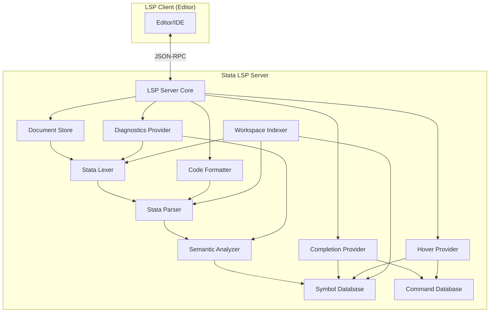

# Design Document: Stata LSP

## Overview

This document describes the architecture and implementation design for a Stata Language Server Protocol (LSP) implementation. The server will provide IDE features for Stata `.do` and `.ado` files, including syntax parsing, auto-completion, diagnostics, hover information, go-to-definition, and code formatting.

The implementation will use TypeScript with the `vscode-languageserver` library, which provides a robust foundation for LSP servers and integrates seamlessly with VS Code, Kiro, and other LSP-compatible editors.

## Architecture

The Stata LSP follows a modular architecture with clear separation of concerns:



### Communication Flow

1. Editor sends LSP requests/notifications via JSON-RPC over stdio
2. Server Core routes requests to appropriate providers
3. Lexer tokenizes source, handling delimiter modes and continuations
4. Parser builds AST from token stream
5. Semantic Analyzer builds symbol tables and detects semantic issues
6. Workspace Indexer maintains symbol index across workspace/ado-path files
7. Providers use shared Lexer, Parser, Analyzer, and Symbol Database
8. Responses flow back through Server Core to Editor

### Diagnostics Model

The LSP uses the **push diagnostics model** via `textDocument/publishDiagnostics`. Diagnostics are pushed to the client whenever a document is opened or changed. This is the standard LSP approach and does not require a special capability flag.

## Components and Interfaces

### 1. LSP Server Core (`server.ts`)

The main entry point that handles LSP lifecycle and request routing.

```typescript
interface ServerCapabilities {
  textDocumentSync: TextDocumentSyncKind;
  completionProvider: {
    // Trigger on macro/option contexts
    // Note: backtick (`) and double-quote (") trigger quote snippet completions
    triggerCharacters: ['.', ':', ',', '$', '`', '"'];
    resolveProvider: boolean;
  };
  hoverProvider: boolean;
  definitionProvider: boolean;
  documentSymbolProvider: boolean;
  workspaceSymbolProvider: boolean;
  documentFormattingProvider: boolean;
  documentRangeFormattingProvider: boolean;
}

interface StataLSPServer {
  initialize(params: InitializeParams): InitializeResult;
  shutdown(): void;
  exit(): void;  // Exit with code 0 after shutdown, code 1 if no prior shutdown
  onDidOpenTextDocument(params: DidOpenTextDocumentParams): void;
  onDidChangeTextDocument(params: DidChangeTextDocumentParams): void;
  onDidCloseTextDocument(params: DidCloseTextDocumentParams): void;
  onCompletion(params: CompletionParams): CompletionItem[];
  onHover(params: HoverParams): Hover | null;
  onDefinition(params: DefinitionParams): Location | Location[] | null;  // Multiple locations for ambiguous cases
  onDocumentSymbol(params: DocumentSymbolParams): DocumentSymbol[];
  onWorkspaceSymbol(params: WorkspaceSymbolParams): SymbolInformation[];
  onDocumentFormatting(params: DocumentFormattingParams): TextEdit[];
}
```

### 2. Document Store (`document-store.ts`)

Manages open document state and triggers parsing on changes.

```typescript
interface DocumentState {
  uri: string;
  version: number;
  content: string;
  ast: StataAST | null;
  symbols: SymbolTable;
  diagnostics: Diagnostic[];
}

interface DocumentStore {
  open(uri: string, content: string, version: number): void;
  update(uri: string, changes: TextDocumentContentChangeEvent[], version: number): void;
  close(uri: string): void;
  get(uri: string): DocumentState | undefined;
  getAll(): DocumentState[];
}

// v1 Parsing Strategy:
// - Apply incremental text edits to document content
// - Re-lex and re-parse the entire document (not incremental parsing)
// - Debounce re-parsing to avoid excessive work during rapid typing
// - Incremental/partial parsing deferred to future versions
//
// Document Version Gate:
// Only publish diagnostics/results if analyzed version matches current DocumentState.version.
// This prevents publishing stale results after rapid edits during debounce window.
```

### 3. Stata Lexer (`lexer/`)

Tokenizes Stata source code, handling delimiter modes, line continuations, and comment/string boundaries.

```typescript
// Token Types
// Lexer produces structural tokens; parser determines semantic role (command/prefix/option)
type TokenType =
  | 'WORD'             // identifier-like token (parser determines if command/prefix/option/keyword)
  | 'NUMBER'
  | 'STRING'           // includes quote style info
  | 'MACRO_REF_LOCAL'  // `name' (complete token including delimiters)
  | 'MACRO_REF_GLOBAL' // $name or ${name} (braces are part of token, NOT block braces)
  | 'OPERATOR'         // = == != < > <= >= + - * / ^ & | ~
  | 'LBRACE'           // { (block brace only - lexer distinguishes from ${...})
  | 'RBRACE'           // } (block brace only)
  | 'LPAREN'           // (
  | 'RPAREN'           // )
  | 'LBRACKET'         // [
  | 'RBRACKET'         // ]
  | 'COMMA'            // ,
  | 'COLON'            // : (for by: prefix)
  | 'COMMENT_LINE'     // * at start or // anywhere
  | 'COMMENT_BLOCK'    // /* ... */
  | 'CONTINUATION'     // ///
  | 'DELIMIT_DIRECTIVE'// #delimit (always newline-terminated, even in #delimit ; mode)
  | 'STATEMENT_TERMINATOR' // Unified: NEWLINE in cr mode, ; in semicolon mode
  | 'WHITESPACE'       // Spaces, tabs, and NEWLINE in semicolon mode (trivia)
  | 'EOF';

// Key lexer behavior: ${name} is tokenized as a single MACRO_REF_GLOBAL token,
// NOT as LBRACE + WORD + RBRACE. This prevents false-positive brace diagnostics.

// Design Decision: Unified STATEMENT_TERMINATOR token
// The lexer abstracts delimiter mode by emitting a unified STATEMENT_TERMINATOR:
// - In #delimit cr mode: NEWLINE → STATEMENT_TERMINATOR
// - In #delimit ; mode: ; → STATEMENT_TERMINATOR, NEWLINE → WHITESPACE (trivia)
//
// Benefits:
// 1. Avoids "dual state" - only lexer tracks delimiter mode, parser is stateless
// 2. Simplifies parser loop - just consume(STATEMENT_TERMINATOR)
// 3. Handles #delimit edge case cleanly - directive is newline-terminated,
//    lexer updates state after, emits STATEMENT_TERMINATOR for that newline
//
// Round-trip safety: PrettyPrinter tracks #delimit nodes to decide whether
// to print \n or ; at statement end. No ambiguity since valid Stata requires
// terminator to match current mode.

// /// Continuation + Delimiter Mode Interaction:
// - In #delimit cr mode: /// suppresses the following newline (no STATEMENT_TERMINATOR)
//   The /// is emitted as CONTINUATION token, next line is joined to current statement
// - In #delimit ; mode: /// is still recognized as a comment (CONTINUATION token)
//   but has no structural effect since newlines are already trivia
// The CONTINUATION token is preserved for round-tripping and trivia attachment.

interface Token {
  type: TokenType;
  value: string;
  range: Range;
  // For strings, track quote style
  quoteStyle?: 'simple' | 'compound';
}

// Lexer State (tracks delimiter mode across statements)
interface LexerState {
  delimiterMode: 'cr' | 'semicolon';
  // Position tracking for error recovery
  line: number;
  column: number;
}

interface LexerResult {
  tokens: Token[];
  errors: LexerError[];
  finalState: LexerState;
}

interface LexerError {
  message: string;
  range: Range;
  code: LexerErrorCode;
}

enum LexerErrorCode {
  UNBALANCED_QUOTES = 1001,        // Maps to StataDiagnosticCode.UNBALANCED_QUOTES
  UNBALANCED_BLOCK_COMMENT = 1002, // Maps to StataDiagnosticCode.UNBALANCED_BLOCK_COMMENT
  UNTERMINATED_STATEMENT = 1003,   // Maps to StataDiagnosticCode.UNTERMINATED_STATEMENT
  CONTINUATION_NO_SPACE = 1004,    // Maps to StataDiagnosticCode.CONTINUATION_NO_SPACE
}

interface StataLexer {
  tokenize(source: string, initialState?: LexerState): LexerResult;
}
```

### 4. Stata Parser (`parser/`)

Parses token stream into an Abstract Syntax Tree (AST).

```typescript
// AST Node Types
type StataNode =
  | CommandNode
  | ProgramNode
  | MacroDefNode
  | MacroRefNode
  | ControlFlowNode
  | StringLiteralNode
  | DirectiveNode;

// Directive node for #delimit (must be preserved for round-trip)
interface DirectiveNode {
  type: 'directive';
  directive: 'delimit';
  mode: 'cr' | 'semicolon';
  range: Range;
  leadingTrivia?: TriviaNode[];
  trailingTrivia?: TriviaNode[];
}

// Prefix commands (by, quietly, capture, etc.)
interface PrefixNode {
  type: 'prefix';
  name: string;               // prefix name as written (possibly abbreviated)
  fullName: string;           // expanded prefix name (derived from command DB)
  varlist?: string[];         // for by: prefix, the grouping variables
  range: Range;
}

// Command options (after comma)
interface OptionNode {
  type: 'option';
  name: string;               // option name as written (possibly abbreviated)
  fullName: string;           // expanded option name (derived from command DB)
  argument?: string;          // option argument if present (e.g., level(95))
  range: Range;
}

// Identifier with range (for hover/definition on specific tokens in varlists)
interface IdentifierNode {
  name: string;
  range: Range;
}

interface CommandNode {
  type: 'command';
  prefix?: PrefixNode[];      // by, quietly, capture, etc.
  name: string;               // command name as written (possibly abbreviated)
  fullName: string;           // expanded command name (derived from command DB lookup)
  varlist?: IdentifierNode[]; // Variables with ranges for hover/definition
  options?: OptionNode[];
  range: Range;
  leadingTrivia?: TriviaNode[];  // comments before this node
  trailingTrivia?: TriviaNode[]; // comments after this node
}

interface ProgramNode {
  type: 'program';
  name: string;
  body: StataNode[];
  range: Range;
  leadingTrivia?: TriviaNode[];
  trailingTrivia?: TriviaNode[];
}

interface MacroDefNode {
  type: 'macro_def';
  scope: 'local' | 'global';
  name: string;
  value: string;
  range: Range;
  leadingTrivia?: TriviaNode[];
  trailingTrivia?: TriviaNode[];
}

interface MacroRefNode {
  type: 'macro_ref';
  scope: 'local' | 'global';
  name: string;
  range: Range;
}

interface ControlFlowNode {
  type: 'if' | 'else' | 'foreach' | 'forvalues' | 'while';
  condition?: string;
  loopVar?: string;
  loopSpec?: string;
  body: StataNode[];
  range: Range;
  leadingTrivia?: TriviaNode[];
  trailingTrivia?: TriviaNode[];
}

interface StringLiteralNode {
  type: 'string';
  quoteStyle: 'simple' | 'compound';
  value: string;
  range: Range;
}

// Trivia (comments, whitespace) attached to AST nodes
interface TriviaNode {
  type: 'comment';
  style: 'star' | 'slash' | 'block' | 'continuation';
  content: string;
  range: Range;
}

// Parser Interface
interface StataParser {
  parse(tokens: Token[]): ParseResult;
}

interface ParseResult {
  ast: StataAST;
  errors: ParseError[];
}

interface StataAST {
  nodes: StataNode[];
}
```

### 5. Pretty Printer (`pretty-printer.ts`)

Converts AST nodes back to valid Stata source code.

```typescript
interface PrettyPrinter {
  print(ast: StataAST, options?: PrintOptions): string;
  printNode(node: StataNode, options?: PrintOptions): string;
}

interface PrintOptions {
  indentSize: number;
  indentStyle: 'spaces' | 'tabs';
  lineWidth: number;
}
```

### 6. Semantic Analyzer (`analyzer.ts`)

Performs semantic analysis on the AST to build symbol tables and detect semantic issues.

**Responsibility Separation:**
- **Lexer**: Syntax-level issues (unbalanced quotes, unbalanced block comments, delimiter issues, continuation whitespace)
- **Parser**: Structural issues (brace placement, missing `end`, unclosed blocks, `forvalues` syntax)
- **Semantic Analyzer**: Semantic issues (undefined macros, undefined variables, scope analysis)

```typescript
interface SemanticAnalyzer {
  analyze(ast: StataAST, uri: string, workspaceSymbols?: SymbolTable): AnalysisResult;
}

interface AnalysisResult {
  symbols: SymbolTable;
  diagnostics: Diagnostic[];
  scopes: ScopeInfo[];
}

interface SymbolTable {
  programs: Map<string, ProgramSymbol>;
  localMacros: Map<string, MacroSymbol>;
  globalMacros: Map<string, MacroSymbol>;
  variables: Map<string, VariableSymbol>;
}

interface ProgramSymbol {
  name: string;
  location: Location;
  sourceUri: string;
  parameters?: string[];
}

interface MacroSymbol {
  name: string;
  scope: 'local' | 'global';
  location: Location;
  sourceUri: string;
  value?: string;
  // Scope context for local macros
  containingScope?: ScopeType;
}

interface VariableSymbol {
  name: string;
  location: Location;
  sourceUri: string;
  // Best-effort type info from static analysis only
  type?: string;
  label?: string;
  // How we determined this variable exists (v1: static analysis only)
  // Note: tempvar is NOT a variable source - it creates a macro, not a variable
  source: 'gen' | 'egen' | 'input' | 'inferred' | 'directive';  // 'directive' = @lsp-variables
}

// v1 Variable Detection:
// - Static analysis of gen, egen, input commands in analyzed files
// - No runtime Stata integration or .dta file parsing
// - Undefined-variable diagnostics are heuristic and off by default
//
// Note: tempvar creates a LOCAL MACRO containing a generated name, not a dataset variable.
// Track tempvar as a macro definition (kind='tempvar'), not as a variable.
// Only treat as variable if we see actual creation: gen `tempname' = ...
//
// Dataset Context Workaround:
// Users can declare "incoming" variables from loaded datasets via comment directive:
//   // @lsp-variables age income status
// This seeds the symbol table with variables not created in the script.

// Identifier Normalization Rules:
// - Commands/options/keywords: case-INSENSITIVE (normalize to lowercase for lookup)
// - Variable names: case-SENSITIVE (Stata preserves case)
// - Macro names: case-SENSITIVE (Stata preserves case)
// - Program names: case-INSENSITIVE (normalize to lowercase for lookup)
// All lookups in CommandDB, SymbolDB, completion, hover, go-to-definition must follow these rules.

// Stata macro scoping rules
type ScopeType = 'dofile' | 'program' | 'ado';

interface ScopeInfo {
  type: ScopeType;
  range: Range;
  // Local macros are scoped to do-file or program, NOT to { } blocks
  // Loop variables are locals introduced by foreach/forvalues, lifetime = enclosing scope
  localMacros: Map<string, MacroSymbol>;
}
```

**Stata Scoping Rules:**
- Global macros (`$name` or `${name}`) are visible everywhere
- Local macros (`` `name' ``) are scoped to the containing do-file or program definition, NOT to `{ }` blocks
- `foreach`/`forvalues` loop variables are locals introduced by the loop, with lifetime matching the enclosing do-file/program scope (they remain defined after the loop, typically holding the last iteration's value)
- Redefinition of a local macro shadows the previous definition within the same scope

**Loop Variable Post-Loop Access:**
While Stata allows accessing loop variables after the loop (they hold the last iteration's value), this is often unintentional. The Semantic Analyzer allows this access (to be correct) but may optionally emit a "hint" diagnostic suggesting it might be unintentional reliance on implementation details.

### 7. Command Database (`commands/`)

Static database of built-in Stata commands with metadata.

**Abbreviation Handling:**
- Stata allows commands to be abbreviated to their shortest unique prefix
- The `minAbbreviation` field stores the documented minimum abbreviation for built-in commands
- For user-installed ado commands, abbreviation uniqueness cannot be guaranteed statically
- The LSP treats abbreviations as "best effort" - we support documented abbreviations for built-in commands but may not catch all edge cases with user ado commands

```typescript
interface CommandInfo {
  name: string;
  minAbbreviation: string;     // documented minimum abbreviation (e.g., "gen" for "generate")
  syntax: string;
  description: string;
  options: OptionInfo[];
  category: string;
  isBuiltin: boolean;          // true for Stata built-ins, false for indexed ado commands
}

interface OptionInfo {
  name: string;
  minAbbreviation: string;     // minimum abbreviation for this option within this command's option set
  description: string;
  hasArgument: boolean;
}

interface CommandDatabase {
  lookup(name: string): CommandInfo | undefined;
  // Returns all commands where name starts with prefix (for completion)
  search(prefix: string): CommandInfo[];
  getAll(): CommandInfo[];
  // Check if a string is a valid abbreviation - returns 0/1/many matches
  // (abbreviation validity = unique prefix within built-in DB; user ado is best-effort)
  expandAbbreviation(abbrev: string): CommandInfo[];
  // Register user ado commands from workspace indexer
  registerAdoCommand(info: CommandInfo): void;
}
```

### 8. Completion Provider (`completion.ts`)

Generates context-aware completion suggestions.

```typescript
interface CompletionProvider {
  getCompletions(
    document: DocumentState,
    position: Position,
    context: CompletionContext
  ): CompletionItem[];
}

// Completion contexts
type CompletionContext =
  | { type: 'command' }
  | { type: 'option'; command: string }
  | { type: 'macro'; scope: 'local' | 'global' }
  | { type: 'variable' }
  | { type: 'program' }
  | { type: 'fallback' };  // When AST unavailable, provide command DB completions

// Symbol Precedence in Completion and Hover:
// User-defined symbols (SymbolDB) take precedence over built-in commands (CmdDB).
// This mirrors Stata's execution behavior where user programs shadow built-ins.
// If a user defines `program reg`, it shadows the built-in `regress` command.

// Snippet completions for quote pairing
// Note: Only send snippet-format items if client advertises snippetSupport;
// otherwise send plain-text fallbacks
//
// Example snippet content (actual insertText values):
// - Local macro: `${1:name}'$0  → inserts `name' with cursor after
// - Compound quote: `"${1:text}"'$0 → inserts `"text"' with cursor after
const QUOTE_SNIPPETS: CompletionItem[] = [
  {
    label: "Local macro reference",
    insertText: "`${1:name}'$0",  // backtick + placeholder + apostrophe
    insertTextFormat: InsertTextFormat.Snippet,
    filterText: "`",
    detail: "Insert `name' with closing quote"
  },
  {
    label: "Compound quote string",
    insertText: "`\"${1:text}\"'$0",  // backtick + dquote + placeholder + dquote + apostrophe
    insertTextFormat: InsertTextFormat.Snippet,
    filterText: "`\"",
    detail: "Insert `\"text\"' compound quote"
  }
];
```

### 9. Diagnostics Provider (`diagnostics.ts`)

Aggregates diagnostics from lexer, parser, and semantic analyzer, then publishes via `textDocument/publishDiagnostics`.

```typescript
interface DiagnosticsProvider {
  getDiagnostics(document: DocumentState): Diagnostic[];
  publishDiagnostics(uri: string, diagnostics: Diagnostic[]): void;
}

// Diagnostic codes for Stata-specific issues
// 1xxx = Lexer errors (tokenization)
// 2xxx = Semantic errors (analyzer)
// 3xxx = Parser errors (structure)
enum StataDiagnosticCode {
  // Lexer errors
  UNBALANCED_QUOTES = 1001,
  UNBALANCED_BLOCK_COMMENT = 1002,
  UNTERMINATED_STATEMENT = 1003,  // EOF in #delimit ; mode without terminating ;
  CONTINUATION_NO_SPACE = 1004,
  
  // Semantic errors (heuristic, may have false positives)
  UNDEFINED_MACRO = 2001,
  UNDEFINED_VARIABLE = 2002,
  
  // Parser errors
  SYNTAX_ERROR = 3000,
  BRACE_ELSE_SAME_LINE = 3001,
  BRACE_NOT_ALONE = 3002,
  MISSING_PROGRAM_END = 3003,
  UNCLOSED_BLOCK = 3005,
  FORVALUES_SYNTAX = 3008,
}
```

### 10. Hover Provider (`hover.ts`)

Provides hover information for symbols and commands.

```typescript
interface HoverProvider {
  getHover(
    document: DocumentState,
    position: Position,
    workspaceSymbols?: SymbolTable
  ): Hover | null;
}

// Variable type/label info is best-effort (v1: static analysis only)
interface VariableHoverInfo {
  name: string;
  type?: string;      // Only if determinable from static analysis
  label?: string;     // Only if determinable from static analysis
  source: 'static_analysis' | 'unknown';
  definitionLocation?: Location;
}

// Included file navigation
// Supported commands: do, run, include
// Path resolution: relative to current file's directory (cd commands ignored in v1)
//
// IMPORTANT SEMANTIC DIFFERENCE (v1 limitation):
// - `include "file.do"` acts as textual substitution (macros visible across boundary)
// - `do "file.do"` creates a new scope (macros NOT visible across boundary)
// v1 parses files in isolation and does NOT resolve `include` for merged symbol tables.
// This may cause false-positive "Undefined Macro" warnings for projects using header files.
// Workaround: use `// @lsp-ignore-next` comment directive to suppress specific warnings.
interface IncludedFileRef {
  command: 'do' | 'run' | 'include';
  path: string;
  range: Range;
}

// Client capability checking
interface ClientCapabilities {
  snippetSupport: boolean;  // Check before sending snippet-format completions
}
```

### 11. Formatter (`formatter.ts`)

Formats Stata code according to style rules. The CodeFormatter is a thin wrapper around PrettyPrinter that computes TextEdits for LSP.

**Formatting Constraints:**
- Only whitespace and indentation are modified
- No token normalization (abbreviations are NOT expanded, quote styles are NOT changed)
- Comments are preserved in their original form (PrettyPrinter handles trivia)
- Semantic meaning is preserved (formatted code parses to equivalent AST)
- PrettyPrinter tracks #delimit nodes to emit correct statement terminators

**Future Extension:**
The architecture allows for optional abbreviation expansion in future versions.
The PrettyPrinter could accept a canonicalization map to expand `gen` → `generate`, etc.
This would be opt-in via configuration to preserve backward compatibility.

```typescript
// CodeFormatter wraps PrettyPrinter to produce LSP TextEdits
interface CodeFormatter {
  format(document: DocumentState, options: FormattingOptions): TextEdit[];
  formatRange(
    document: DocumentState,
    range: Range,
    options: FormattingOptions
  ): TextEdit[];
}

interface FormattingOptions {
  tabSize: number;
  insertSpaces: boolean;
  trimTrailingWhitespace: boolean;
  insertFinalNewline: boolean;
}

### 12. Workspace Indexer (`indexer.ts`)

Scans workspace and ado-path directories to build a cross-file symbol index.

```typescript
// Workspace Indexer: indexes PROGRAMS, ADO COMMANDS, and TOP-LEVEL GLOBAL MACROS (cross-file)
// Local macros and variables are NOT indexed cross-file (they are per-execution-scope)
interface WorkspaceIndexer {
  // Initialize indexer with configured paths
  initialize(workspaceFolders: string[], adoPaths: string[]): Promise<void>;
  
  // Get programs from indexed files (NOT local macros or variables)
  getWorkspacePrograms(): Map<string, ProgramSymbol[]>;
  
  // Get top-level global macros from indexed files
  getWorkspaceGlobalMacros(): Map<string, MacroSymbol[]>;
  
  // Search for programs matching a query
  searchPrograms(query: string): SymbolInformation[];
  
  // Resolve a program name to its definition location
  // Follows Stata resolution order: current dir → PERSONAL → PLUS → SITE
  // (BASE commands handled via built-in command DB, not indexed)
  // "Current dir" = directory of the referring file (cd commands ignored in v1)
  resolveProgram(name: string, currentUri: string): Location | undefined;
  
  // Handle file system changes
  onFileCreated(uri: string): Promise<void>;
  onFileChanged(uri: string): Promise<void>;
  onFileDeleted(uri: string): void;
}

interface IndexedFile {
  uri: string;
  lastModified: number;
  // Programs and top-level global macros are indexed cross-file
  programs: Map<string, ProgramSymbol>;
  globalMacros: Map<string, MacroSymbol>;  // Only top-level global macro definitions
  parseErrors: boolean;
}

// Scope of symbol lookups:
// - Programs: cross-file (via WorkspaceIndexer)
// - Global macros: cross-file (via WorkspaceIndexer, if defined at file top-level)
// - Local macros: current-file-only (per-execution-scope, cross-file would be misleading)
// - Variables: current-file-only (dataset/runtime concept, cross-file would be misleading)

// Stata ado-path resolution order
// - 'current' = directory of the referring file (cd commands ignored in v1)
// - BASE commands handled via built-in command DB, not indexed
const ADO_PATH_PRECEDENCE = ['current', 'PERSONAL', 'PLUS', 'SITE'];
```

## Data Models

### Configuration Schema

```typescript
interface StataLSPConfig {
  diagnostics: {
    enabled: boolean;
    severity: {
      undefinedMacro: 'error' | 'warning' | 'information' | 'hint' | 'off';
      undefinedVariable: 'error' | 'warning' | 'information' | 'hint' | 'off';
      styleWarnings: 'error' | 'warning' | 'information' | 'hint' | 'off';
    };
    // Heuristic diagnostics are off by default due to potential false positives
    undefinedVariableEnabled: boolean;  // default: false
  };
  completion: {
    includeAbbreviations: boolean;
    includeSnippets: boolean;
  };
  formatting: {
    indentSize: number;
    indentStyle: 'spaces' | 'tabs';
  };
  // Paths to search for ado files (in addition to workspace)
  adoPaths: string[];
  // Enable workspace indexing for cross-file features
  indexWorkspace: boolean;  // default: true
}

// Configuration mechanism:
// - Server registers for workspace/didChangeConfiguration notifications
// - Server requests config via workspace/configuration when needed
// - Config changes trigger re-analysis of open documents
interface ConfigurationProvider {
  getConfiguration(section: string): Promise<StataLSPConfig>;
  onConfigurationChanged(callback: (config: StataLSPConfig) => void): void;
}
```

### Quote Pairing Rules

Quote auto-pairing is handled client-side via VS Code/Kiro language configuration, NOT by the LSP server.

```typescript
// Client-side language configuration (package.json or language-configuration.json)
// In language-configuration.json (actual characters, JSON-escaped where needed):
// {
//   "autoClosingPairs": [
//     { "open": "`", "close": "'" },
//     { "open": "`\"", "close": "\"'" },
//     { "open": "\"", "close": "\"" },
//     { "open": "{", "close": "}" },
//     { "open": "(", "close": ")" },
//     { "open": "[", "close": "]" }
//   ]
// }
//
// TypeScript representation (for documentation):
const STATA_AUTO_CLOSING_PAIRS = [
  { open: '`', close: "'" },              // Local macro: ` closes with '
  { open: '`"', close: "\"'" },           // Compound quote: `" closes with "'
  { open: '"', close: '"' },              // Simple string quote
  { open: '{', close: '}' },
  { open: '(', close: ')' },
  { open: '[', close: ']' },
];

// LSP server provides snippet completions as a fallback/enhancement
// See Completion Provider section for snippet definitions
```

### Supported Stata Syntax Subset (v1)

The initial implementation supports the following Stata constructs:

**Fully Supported:**
- Commands with prefix commands (`by`, `quietly`, `capture`, `noisily`)
- Variable lists
- Options (after comma)
- Local and global macro definitions and references
- Program definitions (`program define ... end`)
- Control flow: `if`, `else`, `foreach`, `forvalues`, `while`
- All comment styles: `*`, `//`, `/* */`, `///`
- String literals: simple quotes, compound quotes, escape sequences
- `#delimit` directive (both `cr` and `;` modes)
- Line continuations with `///`

**Partially Supported (recognized but limited analysis):**
- `if`/`in` qualifiers on commands
- Weights (`[weight=...]`)
- `using` clauses
- Factor variables (`i.varname`)
- Time-series operators (`L.`, `F.`, `D.`, `S.`)

**Not Supported in v1:**
- Mata code blocks
- `ado` file internal structure beyond program definitions
- Dynamic do-file generation patterns
- Extended macro functions (`local name : ...` colon syntax) - recognized but not fully analyzed
  - The macro name is still extracted and indexed
  - The colon expression is stored as raw text, not parsed
  - Users may see false positives for macros defined via extended syntax


## Correctness Properties

*A property is a characteristic or behavior that should hold true across all valid executions of a system—essentially, a formal statement about what the system should do. Properties serve as the bridge between human-readable specifications and machine-verifiable correctness guarantees.*

The following properties will be validated using property-based testing to ensure the Stata LSP implementation is correct.

### Property 1: Parser Round-Trip Consistency

*For any* valid Stata AST, printing the AST to source code and then parsing it back should produce an equivalent AST.

This is the most critical property for the parser/pretty-printer pair. It ensures that:
- The parser correctly interprets all Stata syntax
- The pretty printer produces valid Stata code
- No information is lost in the transformation

```
roundTrip(ast) = parse(tokenize(print(ast))) ≡ ast
```

**AST Equivalence Definition:**
Two ASTs are equivalent if they have:
- Identical node structure (same node types in same tree shape)
- Identical token content (command names, identifiers, literals, operators)
- Identical trivia content (comments preserved and associated with the same nodes)

Equivalence explicitly IGNORES:
- Source ranges (line/column positions) - these will differ after formatting

**Validates: Requirements 4.6, 4.7**

### Property 2: Lexer Tokenization Correctness

*For any* valid Stata source code within the v1 supported subset, the lexer should produce a token stream that:
- Correctly segments statements via unified STATEMENT_TERMINATOR (abstracts delimiter mode)
- Handles `///` continuations by joining lines while preserving continuation tokens
- Correctly identifies string boundaries (simple and compound quotes)
- Correctly distinguishes `${name}` macro refs (single token) from block braces (separate tokens)
- Produces tokens with accurate source spans

**Validates: Requirements 3.1, 3.2, 3.3, 3.4, 3.5, 3.6, 3.7**

### Property 3: Parser Syntax Recognition

*For any* valid token stream representing Stata code within the v1 supported subset, the parser should produce AST nodes that accurately represent the syntactic structure.

This property covers:
- Command structures with prefixes, options, and variable lists
- Local and global macro definitions and references (including `${name}` form)
- Program definitions with correct boundaries
- Control flow structures (if, else, foreach, forvalues, while)
- `#delimit` directives preserved as DirectiveNode
- Comments attached as trivia to appropriate nodes

**Validates: Requirements 4.1, 4.2, 4.3, 4.4, 4.5**

### Property 4: Document Store Consistency

*For any* sequence of document operations (open, update, close), the Document Store should maintain consistent state where:
- Opened documents are retrievable with correct content
- Updates are applied correctly (both full and incremental)
- Closed documents are no longer retrievable

```
open(uri, content) → get(uri).content == content
update(uri, changes) → get(uri).content == applyChanges(oldContent, changes)
close(uri) → get(uri) == undefined
```

**Validates: Requirements 2.1, 2.2, 2.3**

### Property 5: Completion Relevance

*For any* document position and completion context, the returned completion items should be relevant to that context:
- Command completions include matching built-in commands (full and abbreviated forms)
- Option completions are valid for the current command
- Symbol completions include in-scope variables, macros, and programs
- Macro reference completions include defined macros

**Validates: Requirements 5.1, 5.2, 5.3, 5.4, 5.5, 5.6**

### Property 6: Diagnostic Accuracy

*For any* Stata source code within the v1 supported subset with errors or warnings, the diagnostics should:
- Report syntax errors at accurate line/column positions
- Detect undefined macro references (heuristic, via Semantic Analyzer)
- Detect Stata-specific issues (brace placement, missing `end`, unbalanced quotes, etc.)
- Not accumulate across document updates (previous diagnostics are cleared)

**Diagnostic Source Mapping:**
- Lexer detects: unbalanced quotes, unbalanced block comments, delimiter issues, continuation whitespace
- Parser detects: brace placement, missing `end`, unclosed blocks, `forvalues` syntax
- Semantic Analyzer detects: undefined macros, undefined variables (heuristic)

Specific patterns that must be detected:
- `} else {` on same line → error (Parser)
- Closing brace not alone on line → error (Parser)
- `program define` without `end` → error (Parser)
- Unclosed block structures → error (Parser)
- Unbalanced string quotes → error (Lexer)
- Unterminated statement in `#delimit ;` mode → error (Lexer)
- `///` without preceding whitespace → warning (Lexer)
- `forvalues` with `in` instead of `=` → error (Parser)
- Undefined local macro reference → warning (Semantic Analyzer, heuristic)

**Validates: Requirements 6.1, 6.2, 6.3, 6.5, 6.6, 6.7, 6.8, 6.9, 6.10, 6.11, 6.12, 6.14**

### Property 7: Hover Information Completeness

*For any* hoverable element (command, macro, program, variable), the hover response should include appropriate information:
- Built-in commands: syntax and description
- User-defined macros: definition location and value
- User-defined programs: signature and location
- Variables: type and label information (when available)

**Validates: Requirements 7.1, 7.2, 7.3, 7.4**

### Property 8: Go-to-Definition Correctness

*For any* symbol reference (macro, program, included file), go-to-definition should:
- Return the correct definition location when the definition exists
- Return an empty result (not an error) when the definition is not found

```
gotoDefinition(ref) = 
  if isDefined(ref) then definitionLocation(ref)
  else emptyResult
```

**Validates: Requirements 8.1, 8.2, 8.3, 8.4**

### Property 9: Symbol Information Completeness

*For any* document or workspace symbol request, the response should include:
- All programs, macros, and major sections in the document(s)
- Correct symbol kind, name, and location for each symbol
- Hierarchical structure where appropriate

**Validates: Requirements 9.1, 9.2, 9.3**

### Property 10: Formatting Semantic Preservation

*For any* Stata document within the v1 supported subset (when AST is available), formatting should preserve semantic meaning:
- The formatted code should parse to an equivalent AST (using the equivalence definition from Property 1)
- Only whitespace and indentation should change
- No token normalization (abbreviations NOT expanded, quote styles NOT changed)
- Comments should be preserved and associated with the same nodes

```
semanticEquivalent(format(doc)) = semanticEquivalent(doc)
```

**Validates: Requirements 10.1, 10.2, 10.3**

### Property 11: Workspace Indexer Consistency

*For any* sequence of file system events (create, modify, delete) in the workspace or ado-paths, the Workspace Indexer should maintain a consistent symbol index where:
- Created files are indexed and their symbols are searchable
- Modified files have their symbol index updated
- Deleted files have their symbols removed from the index
- Program resolution follows Stata's precedence order

**Validates: Requirements 12.1, 12.2, 12.3, 12.4, 12.5**

## Error Handling

### Lexer Errors

The lexer handles tokenization errors gracefully:

1. **Unbalanced Strings**: On unclosed string, emit error token and continue from next line
2. **Unbalanced Block Comments**: On unclosed `/* */`, emit error and treat rest of file as comment
3. **Delimiter Mode Tracking**: Track `#delimit` state even when errors occur
4. **Continuation Handling**: `///` without preceding space emits warning but still joins lines

### Parse Errors

The parser uses error recovery to continue parsing after encountering errors:

1. **Synchronization Points**: On error, skip to next statement boundary (newline in `#delimit cr`, semicolon in `#delimit ;`)
2. **Partial AST**: Return partial AST with error nodes marking problematic regions
3. **Error Accumulation**: Collect all errors rather than stopping at first error

### LSP Protocol Errors

- Request before initialization → Error code -32002 (ServerNotInitialized)
- Unknown method → Error code -32601 (MethodNotFound)
- Invalid params → Error code -32602 (InvalidParams)
- Internal error → Error code -32603 (InternalError)

### Graceful Degradation

When analysis fails for a document:
- Clear diagnostics (don't show stale errors)
- **Completion**: Fall back to command database completions (no AST required)
- **Hover**: Fall back to command database lookups for command names
- **Go-to-definition**: Disabled for symbols, but file navigation may still work
- **Formatting**: Disabled (requires valid AST)
- Log error for debugging
- Continue serving other documents

## Testing Strategy

### Property-Based Testing

We will use **fast-check** for property-based testing in TypeScript. Each correctness property will be implemented as a property test with minimum 100 iterations.

**Generator Strategy**:
- `arbitraryStataAST`: Generate random valid AST nodes
- `arbitraryStataSource`: Generate random valid Stata source code
- `arbitraryDocumentChanges`: Generate random document edit sequences
- `arbitraryPosition`: Generate random positions within documents

### Unit Tests

Unit tests will cover:
- Specific command parsing examples
- Edge cases (empty files, very long lines, deeply nested structures)
- Error conditions and recovery
- LSP protocol compliance

### Integration Tests

Integration tests will verify:
- End-to-end LSP communication
- Multi-document scenarios
- Configuration changes
- Real-world Stata file samples

### Test Organization

```
tests/
├── unit/
│   ├── lexer.test.ts
│   ├── parser.test.ts
│   ├── pretty-printer.test.ts
│   ├── analyzer.test.ts
│   ├── completion.test.ts
│   ├── diagnostics.test.ts
│   ├── formatter.test.ts
│   └── indexer.test.ts
├── property/
│   ├── lexer-tokenization.property.ts
│   ├── parser-roundtrip.property.ts
│   ├── document-store.property.ts
│   ├── completion.property.ts
│   ├── diagnostics.property.ts
│   ├── formatting.property.ts
│   └── indexer.property.ts
└── integration/
    ├── lsp-lifecycle.test.ts
    ├── cross-file-navigation.test.ts
    └── real-files.test.ts
```

## Client Extension (VS Code / Kiro)

The LSP server is accompanied by a client extension that provides editor integration. This section describes the client-side deliverables.

### Extension Structure

```
vscode-stata/
├── package.json              # Extension manifest
├── language-configuration.json  # Bracket/quote pairing rules
├── syntaxes/
│   └── stata.tmLanguage.json # TextMate grammar for syntax highlighting
└── src/
    └── extension.ts          # Extension entry point (LSP client setup)
```

### TextMate Grammar (Syntax Highlighting)

The TextMate grammar provides basic syntax highlighting independent of the LSP server. It covers:

- **Keywords**: `if`, `else`, `foreach`, `forvalues`, `while`, `program`, `end`, `local`, `global`, etc.
- **Commands**: Common Stata commands (best-effort, not exhaustive)
- **Comments**: All four comment styles (`*`, `//`, `/* */`, `///`)
- **Strings**: Simple quotes, compound quotes
- **Macros**: Local (`` `name' ``) and global (`$name`, `${name}`) macro references
- **Numbers**: Integer and floating-point literals

The grammar is intentionally conservative to avoid false positives; semantic highlighting (if desired) would be provided by the LSP server in a future version.

### Language Configuration

The `language-configuration.json` file configures:

- Auto-closing pairs (see Quote Pairing Rules section)
- Bracket matching
- Comment toggling (`*` for line, `/* */` for block)
- Indentation rules (increase after `{`, decrease before `}`)

### Extension Activation

The extension activates when:
- A `.do` or `.ado` file is opened
- The Stata language ID is selected

On activation, the extension:
1. Starts the LSP server as a child process
2. Establishes JSON-RPC communication over stdio
3. Registers for configuration changes
