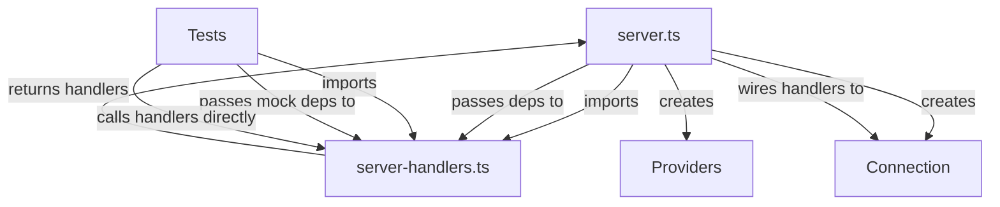

# Design Document: Testable Server Refactor

## Overview

This design refactors the LSP server to separate handler logic from connection wiring. The goal is to enable unit testing of server handlers without requiring a real LSP connection, while maintaining identical runtime behavior.

## Architecture

The refactoring splits `server.ts` into two modules:

```
src/
├── server.ts              # Entry point - creates connection, wires handlers
├── server-handlers.ts     # Handler logic - factory functions for each handler
```



## Components and Interfaces

### Handler Dependencies Interface

```typescript
// src/server-handlers.ts

export interface HandlerDependencies {
    document_store: DocumentStore;
    diagnostics_provider: DiagnosticsProvider | null;
    completion_provider: CompletionProvider | null;
    hover_provider: HoverProvider | null;
    definition_provider: DefinitionProvider | null;
    symbol_provider: SymbolProvider | null;
    formatter_provider: CodeFormatter | null;
    workspace_indexer: WorkspaceIndexer | null;
    get_document_settings: (uri: string) => Promise<StataLSPConfig>;
    connection: {
        sendDiagnostics: (params: { uri: string; diagnostics: any[] }) => void;
        console: { log: (msg: string) => void };
    };
}

export interface ServerCapabilities {
    has_snippet_support: boolean;
    has_configuration_capability: boolean;
    has_workspace_folder_capability: boolean;
    has_diagnostic_related_information_capability: boolean;
}
```

### Handler Factory Functions

```typescript
// src/server-handlers.ts

export function create_initialize_handler(): (params: InitializeParams) => InitializeResult {
    return (params: InitializeParams) => {
        // Extract capabilities from params
        // Return server capabilities
    };
}

export function create_initialized_handler(
    deps: HandlerDependencies,
    caps: ServerCapabilities,
    on_initialized: () => void
): () => void {
    return () => {
        // Initialize providers
        // Call on_initialized callback
    };
}

export function create_completion_handler(
    deps: HandlerDependencies
): (params: CompletionParams) => CompletionItem[] {
    return (params) => {
        // Get document state
        // Return completions
    };
}

// Similar factories for: hover, definition, document_symbol, 
// workspace_symbol, formatting, shutdown, exit
```

### Server Entry Point

```typescript
// src/server.ts

import { createConnection, ... } from 'vscode-languageserver/node';
import {
    create_initialize_handler,
    create_completion_handler,
    // ... other factories
} from './server-handlers';

// Create connection (only happens in entry point)
const connection = createConnection(ProposedFeatures.all);

// Create dependencies
const deps: HandlerDependencies = { ... };

// Wire handlers
connection.onInitialize(create_initialize_handler());
connection.onCompletion(create_completion_handler(deps));
// ... wire other handlers

connection.listen();
```

## Data Models

No new data models. The existing types are reused:
- `StataLSPConfig` - configuration
- `DocumentState` - parsed document state
- `SymbolTable` - workspace symbols

## Correctness Properties

*A property is a characteristic or behavior that should hold true across all valid executions of a system—essentially, a formal statement about what the system should do.*

### Property 1: Handler Factory Returns Callable Function

*For any* handler factory function and valid dependencies, calling the factory SHALL return a function that can be invoked without throwing.

**Validates: Requirements 1.2**

This ensures all handler factories produce valid, callable handlers regardless of the specific dependencies provided.

## Error Handling

- Handler factories should validate dependencies and throw descriptive errors if required deps are missing
- Handlers should gracefully handle null/undefined document states
- The server entry point should catch and log initialization errors

## Testing Strategy

### Unit Tests

The refactored handlers enable direct unit testing:

```typescript
// tests/unit/server-handlers.test.ts

describe('Server Handlers', () => {
    it('should return correct capabilities on initialize', () => {
        const handler = create_initialize_handler();
        const result = handler({
            processId: null,
            rootUri: null,
            capabilities: { ... },
            workspaceFolders: null
        });
        
        expect(result.capabilities.textDocumentSync).toBe(2);
        expect(result.capabilities.completionProvider).toBeDefined();
    });
    
    it('should handle shutdown', () => {
        const handler = create_shutdown_handler();
        const result = handler();
        expect(result).toBeUndefined();
    });
});
```

### Property-Based Tests

Property tests verify handler factories work with various inputs:

```typescript
describe('Handler Factory Properties', () => {
    it('should return callable function for all factories', () => {
        const factories = [
            create_initialize_handler,
            create_shutdown_handler,
            // ...
        ];
        
        for (const factory of factories) {
            const handler = factory(mock_deps);
            expect(typeof handler).toBe('function');
        }
    });
});
```

### Integration Tests

The existing integration tests continue to work, verifying end-to-end behavior through the providers.
