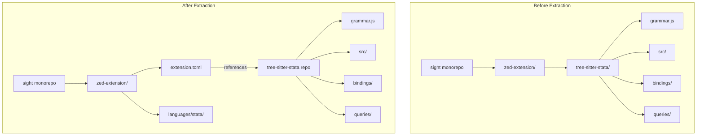

# Design Document: Tree-Sitter Grammar Extraction

## Overview

This design describes the extraction of the tree-sitter-stata grammar from the sight monorepo into a standalone repository named "tree-sitter-stata". The extraction enables Zed editor compatibility by allowing dynamic grammar fetching during extension installation.

The extraction involves:
1. Creating a new GitHub repository (tree-sitter-stata) with the grammar implementation
2. Updating the Zed extension to reference the external repository
3. Removing the bundled grammar from the monorepo
4. Adding documentation to both repositories

## Architecture



### Repository Structure

**New tree-sitter-stata repository:**
```
tree-sitter-stata/
├── grammar.js              # Grammar definition
├── package.json            # npm package config
├── Cargo.toml              # Rust package config
├── tree-sitter.json        # Tree-sitter metadata
├── LICENSE                 # GPL-3.0 license
├── README.md               # Documentation
├── bindings/
│   └── rust/
│       ├── lib.rs          # Rust bindings
│       └── build.rs        # Build script
├── queries/
│   └── highlights.scm      # Syntax highlighting
├── src/
│   ├── grammar.json        # Generated
│   ├── node-types.json     # Generated
│   ├── parser.c            # Generated
│   ├── scanner.c           # External scanner
│   └── tree_sitter/
│       ├── alloc.h
│       ├── array.h
│       └── parser.h
└── test/
    ├── test.do
    ├── test2.do
    └── test3.do
```

**Updated zed-extension structure:**
```
zed-extension/
├── extension.toml          # Updated grammar reference
├── Cargo.toml
├── Cargo.lock
├── src/
│   └── lib.rs
├── languages/
│   └── stata/
│       ├── config.toml
│       ├── highlights.scm
│       ├── brackets.scm
│       ├── indents.scm
│       └── outline.scm
└── server/
    └── sight-server        # LSP binary
```

## Components and Interfaces

### Component 1: Grammar Repository

The standalone tree-sitter-stata repository contains all grammar implementation files.

**Files to extract:**
| Source Path | Destination Path |
|-------------|------------------|
| `zed-extension/tree-sitter-stata/grammar.js` | `grammar.js` |
| `zed-extension/tree-sitter-stata/package.json` | `package.json` |
| `zed-extension/tree-sitter-stata/Cargo.toml` | `Cargo.toml` |
| `zed-extension/tree-sitter-stata/tree-sitter.json` | `tree-sitter.json` |
| `zed-extension/tree-sitter-stata/src/*` | `src/*` |
| `zed-extension/tree-sitter-stata/bindings/*` | `bindings/*` |
| `zed-extension/tree-sitter-stata/queries/*` | `queries/*` |
| `zed-extension/tree-sitter-stata/test*.do` | `test/*` |

**Configuration updates required:**

1. **package.json** - Update repository URL and name:
```json
{
  "name": "tree-sitter-stata",
  "repository": {
    "type": "git",
    "url": "https://github.com/jbearak/tree-sitter-stata.git"
  }
}
```

2. **Cargo.toml** - Update repository URL and name:
```toml
[package]
name = "tree-sitter-stata"
repository = "https://github.com/jbearak/tree-sitter-stata"
```

### Component 2: Extension Configuration

The Zed extension's `extension.toml` must be updated to reference the external grammar repository.

**Current configuration:**
```toml
[grammars.stata]
repository = "file:///Users/jmb/hobby/sight/zed-extension/tree-sitter-stata"
rev = "HEAD"
```

**Updated configuration:**
```toml
[grammars.stata]
repository = "https://github.com/jbearak/tree-sitter-stata"
rev = "v0.1.8"
```

### Component 3: Documentation

**tree-sitter-stata README.md structure:**
```markdown
# tree-sitter-stata

Tree-sitter grammar for Stata programming language, part of the Sight project.

## Overview
[Description of the grammar and its purpose]

## Installation

### npm
npm install tree-sitter-stata

### Cargo
[dependencies]
tree-sitter-stata = "0.1.8"

## Usage
[Code examples for Node.js and Rust]

## Development
[Instructions for building and testing]

## Related Projects
- [sight](https://github.com/jbearak/sight) - Stata Language Server

## License
GPL-3.0
```

**sight repository documentation update:**
Add a section to the existing README or DEVELOPMENT.md explaining:
- The tree-sitter grammar lives in a separate repository (tree-sitter-stata)
- How to update the grammar version in the Zed extension
- Link to the tree-sitter-stata repository

## Data Models

### Git Tag Model

The grammar repository uses semantic versioning tags for releases:

```
Tag format: v{major}.{minor}.{patch}
Example: v0.1.8
```

### Extension Configuration Model

The extension.toml grammar reference:

```toml
[grammars.{language_name}]
repository = "{github_url}"  # HTTPS URL to grammar repository
rev = "{git_ref}"            # Tag, branch, or commit hash
```

### Package Version Synchronization

Both package.json and Cargo.toml must maintain synchronized versions:

| File | Version Field |
|------|---------------|
| package.json | `"version": "0.1.8"` |
| Cargo.toml | `version = "0.1.8"` |
| extension.toml | `rev = "v0.1.8"` |


## Correctness Properties

*A property is a characteristic or behavior that should hold true across all valid executions of a system—essentially, a formal statement about what the system should do. Properties serve as the bridge between human-readable specifications and machine-verifiable correctness guarantees.*

Based on the prework analysis, most acceptance criteria for this extraction task are file existence or content validation checks (examples), not properties that apply across a range of inputs. However, two key functional properties can be verified:

### Property 1: Grammar Compilation Produces Working Language

*For any* valid build environment with the required dependencies (tree-sitter, Rust toolchain), compiling the Rust bindings SHALL produce a tree-sitter Language that can be loaded by a Parser.

**Validates: Requirements 2.4**

### Property 2: Grammar Tests Pass

*For any* valid test execution environment with tree-sitter-cli installed, running `tree-sitter test` SHALL pass all corpus tests without failures.

**Validates: Requirements 5.3**

## Error Handling

### Repository Creation Errors

| Error Condition | Handling Strategy |
|-----------------|-------------------|
| GitHub repository already exists | Check existence before creation; if exists, verify it's empty or prompt for confirmation |
| Insufficient GitHub permissions | Provide clear error message with required permissions |
| Network failure during push | Retry with exponential backoff; provide manual push instructions |

### Build Errors

| Error Condition | Handling Strategy |
|-----------------|-------------------|
| Missing tree-sitter-cli | Provide installation instructions in README |
| Rust compilation failure | Ensure build.rs handles missing files gracefully; document dependencies |
| Grammar generation failure | Validate grammar.js syntax before committing |

### Extension Configuration Errors

| Error Condition | Handling Strategy |
|-----------------|-------------------|
| Invalid repository URL in extension.toml | Validate URL format before committing |
| Invalid Git revision | Use tagged version instead of commit hash for stability |
| Grammar fetch failure in Zed | Document troubleshooting steps in README |

## Testing Strategy

### Unit Tests (Examples)

The majority of acceptance criteria are verified through example-based tests:

1. **File Existence Tests**: Verify all required files exist in the grammar repository
   - grammar.js, package.json, Cargo.toml, tree-sitter.json
   - src/scanner.c, src/parser.c, src/grammar.json, src/node-types.json
   - bindings/rust/lib.rs, bindings/rust/build.rs
   - queries/highlights.scm
   - LICENSE, README.md

2. **Content Validation Tests**: Verify configuration files contain correct values
   - package.json repository URL points to new repository
   - Cargo.toml repository URL points to new repository
   - extension.toml references external GitHub URL (not file://)
   - extension.toml specifies valid Git revision

3. **Directory State Tests**: Verify directory structure after extraction
   - tree-sitter-stata directory removed from zed-extension
   - languages/stata directory preserved in zed-extension
   - No duplicate grammar files in sight repository

4. **Documentation Tests**: Verify documentation contains required content
   - README.md exists in grammar repository
   - Installation instructions present
   - Link to sight repository present

### Property-Based Tests

Property-based testing validates universal properties across all inputs:

1. **Property 1: Grammar Compilation**
   - **Test**: Compile Rust bindings and verify Language loads
   - **Library**: Standard Rust test with `cargo test`
   - **Iterations**: Single execution (deterministic)
   - **Tag**: Feature: tree-sitter-extraction, Property 1: Grammar compilation produces working language

2. **Property 2: Grammar Tests Pass**
   - **Test**: Run `tree-sitter test` and verify exit code 0
   - **Library**: Shell command execution
   - **Iterations**: Single execution (deterministic)
   - **Tag**: Feature: tree-sitter-extraction, Property 2: Grammar tests pass

### Integration Tests

1. **Zed Extension Build**: Verify the Zed extension builds successfully with the external grammar reference
2. **Grammar Fetch**: Verify Zed can fetch the grammar from the external repository (manual test)

### Test Execution

```bash
# In tree-sitter-stata repository
tree-sitter generate    # Regenerate parser from grammar
tree-sitter test        # Run corpus tests
cargo test              # Run Rust binding tests

# In sight/zed-extension
cargo build             # Verify extension builds
```
