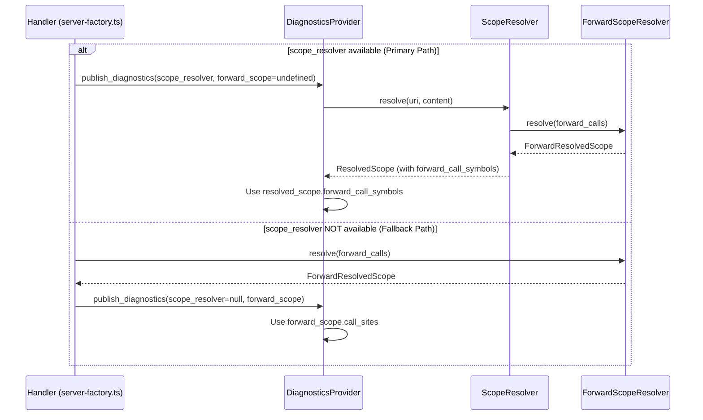

# Design Document: Unify Forward-Call Feeds

## Overview

This design describes the refactoring to unify the two forward-call symbol feeds used in diagnostics. The goal is to eliminate redundant computation by using `resolved_scope.forward_call_symbols` as the primary source when `scope_resolver` is available, while keeping the handler-computed `forward_scope` as a fallback for edge cases.

### Current State

```
┌─────────────────────────────────────────────────────────────────────────┐
│                         Current Architecture                             │
├─────────────────────────────────────────────────────────────────────────┤
│                                                                          │
│  server-factory.ts / server-handlers.ts                                  │
│  ┌─────────────────────────────────────────────────────────────────┐    │
│  │  forward_scope = forward_scope_resolver.resolve(...)  ◄─────────┼────┤ Call #1
│  └─────────────────────────────────────────────────────────────────┘    │
│                              │                                           │
│                              ▼                                           │
│  ┌─────────────────────────────────────────────────────────────────┐    │
│  │  diagnostics_provider.publish_diagnostics(                       │    │
│  │      ...,                                                        │    │
│  │      scope_resolver,                                             │    │
│  │      forward_scope  ◄─── Handler-computed                        │    │
│  │  )                                                               │    │
│  └─────────────────────────────────────────────────────────────────┘    │
│                              │                                           │
│                              ▼                                           │
│  DiagnosticsProvider.get_diagnostics()                                   │
│  ┌─────────────────────────────────────────────────────────────────┐    │
│  │  resolved_scope = scope_resolver.resolve(...)                    │    │
│  │      └── internally calls forward_scope_resolver.resolve() ◄────┼────┤ Call #2
│  │                                                                  │    │
│  │  // Check BOTH sources (redundant!)                              │    │
│  │  if (forward_scope) { ... }                                      │    │
│  │  if (resolved_scope.forward_call_symbols) { ... }                │    │
│  └─────────────────────────────────────────────────────────────────┘    │
│                                                                          │
└─────────────────────────────────────────────────────────────────────────┘
```

### Target State

```
┌─────────────────────────────────────────────────────────────────────────┐
│                         Target Architecture                              │
├─────────────────────────────────────────────────────────────────────────┤
│                                                                          │
│  server-factory.ts / server-handlers.ts                                  │
│  ┌─────────────────────────────────────────────────────────────────┐    │
│  │  if (!scope_resolver) {                                          │    │
│  │      // Fallback: compute forward_scope only when needed         │    │
│  │      forward_scope = forward_scope_resolver.resolve(...)         │    │
│  │  }                                                               │    │
│  └─────────────────────────────────────────────────────────────────┘    │
│                              │                                           │
│                              ▼                                           │
│  ┌─────────────────────────────────────────────────────────────────┐    │
│  │  diagnostics_provider.publish_diagnostics(                       │    │
│  │      ...,                                                        │    │
│  │      scope_resolver,                                             │    │
│  │      forward_scope  ◄─── Only set when scope_resolver is null    │    │
│  │  )                                                               │    │
│  └─────────────────────────────────────────────────────────────────┘    │
│                              │                                           │
│                              ▼                                           │
│  DiagnosticsProvider.get_diagnostics()                                   │
│  ┌─────────────────────────────────────────────────────────────────┐    │
│  │  if (scope_resolver) {                                           │    │
│  │      resolved_scope = scope_resolver.resolve(...)                │    │
│  │      // Use resolved_scope.forward_call_symbols (single source)  │    │
│  │  } else if (forward_scope) {                                     │    │
│  │      // Fallback: use handler-computed forward_scope             │    │
│  │  }                                                               │    │
│  └─────────────────────────────────────────────────────────────────┘    │
│                                                                          │
└─────────────────────────────────────────────────────────────────────────┘
```

## Architecture

### Component Interactions



## Components and Interfaces

### Handler Changes (server-factory.ts, server-handlers.ts)

The handlers will be modified to skip `forward_scope` computation when `scope_resolver` is available:

```typescript
// BEFORE (current)
let forward_scope = undefined;
if (forward_scope_resolver && document_state.forward_calls.length > 0) {
    forward_scope = await forward_scope_resolver.resolve(...);
}
await diagnostics_provider.publish_diagnostics(..., forward_scope);

// AFTER (target)
let forward_scope = undefined;
// Only compute forward_scope when scope_resolver is NOT available
if (!scope_resolver && forward_scope_resolver && document_state.forward_calls.length > 0) {
    forward_scope = await forward_scope_resolver.resolve(...);
}
await diagnostics_provider.publish_diagnostics(..., forward_scope);
```

### DiagnosticsProvider Changes

The diagnostics provider will be modified to use a single source based on availability:

```typescript
// BEFORE (current) - checks BOTH sources
if (forward_scope && ...) {
    // Check forward_scope
}
if (resolved_scope?.forward_call_symbols && ...) {
    // Check resolved_scope.forward_call_symbols
}

// AFTER (target) - single source based on availability
const forward_call_sites = resolved_scope?.forward_call_symbols ?? forward_scope?.call_sites;
if (forward_call_sites && ...) {
    // Check single source
}
```

**Implementation Note:** The fallback path previously used `is_symbol_defined_in_scope` which incorrectly filtered by sourceUri. The unified code uses `is_symbol_in_forward_call` which correctly filters by `effective_type`. This is a bug fix - forward-call symbols should suppress warnings regardless of source file, with local macros only suppressed for 'include' calls.

### Data Flow

```
Primary Path (scope_resolver available):
  Document → ScopeResolver.resolve() → ResolvedScope.forward_call_symbols → DiagnosticsProvider

Fallback Path (scope_resolver NOT available):
  Document → Handler → ForwardScopeResolver.resolve() → forward_scope → DiagnosticsProvider
```

## Data Models

### ForwardCallSite (existing, unchanged)

```typescript
interface ForwardCallSite {
    callee_uri: string;           // URI of the called file
    call_line: number;            // 0-indexed line where call occurs
    symbols: SymbolTable;         // Symbols from the called file
    effective_type: 'do' | 'include';  // Determines local macro visibility
}
```

### ResolvedScope (existing, unchanged)

```typescript
interface ResolvedScope {
    chain: ScopeChainEntry[];
    symbols: SymbolTable;
    out_of_scope_symbols: OutOfScopeSymbol[];
    diagnostics: DirectiveDiagnostic[];
    has_directives: boolean;
    inherited_working_directory?: string;
    forward_call_symbols?: ForwardCallSite[];  // Used by diagnostics
}
```

### ForwardResolvedScope (existing, unchanged)

```typescript
interface ForwardResolvedScope {
    symbols: SymbolTable;
    call_sites: ForwardCallSite[];  // Same shape as forward_call_symbols
    diagnostics: DirectiveDiagnostic[];
}
```

## Correctness Properties

*A property is a characteristic or behavior that should hold true across all valid executions of a system—essentially, a formal statement about what the system should do. Properties serve as the bridge between human-readable specifications and machine-verifiable correctness guarantees.*

### Property 1: Handler Skips Forward-Scope Computation When Scope-Resolver Available

*For any* document with forward calls, when `scope_resolver` is available, the handler SHALL NOT call `ForwardScopeResolver.resolve()` directly (the call happens inside `ScopeResolver.resolve()` instead).

**Validates: Requirements 1.1, 1.4**

### Property 2: Fallback Path Equivalence

*For any* document with forward calls, when `scope_resolver` is NOT available, the handler-computed `forward_scope.call_sites` SHALL produce the same symbol suppression behavior as `resolved_scope.forward_call_symbols` would.

**Validates: Requirements 1.3, 2.1, 2.3**

### Property 3: Position-Aware Symbol Visibility

*For any* forward call at line N and any symbol reference at line M, the symbol SHALL suppress the undefined-symbol warning if and only if M > N (reference is after the call site).

**Validates: Requirements 3.4, 5.1, 5.2, 5.3**

### Property 4: Effective Type Filtering

*For any* forward call with `effective_type`:
- If `effective_type` is 'do': local macros SHALL NOT suppress warnings, but global macros/variables/scalars/matrices SHALL
- If `effective_type` is 'include': ALL symbols (including local macros) SHALL suppress warnings

**Validates: Requirements 6.1, 6.2, 6.3**

### Property 5: Working Directory Consistency

*For any* document with a working directory setting, both the primary path (via `ScopeResolver`) and the fallback path (via handler) SHALL resolve relative paths to the same absolute paths.

**Validates: Requirements 4.1, 4.2, 4.3**

### Property 6: Duplicate Call Handling

*For any* file referenced multiple times:
- Same effective type → skip redundant resolution (action: 'skip')
- `do`/`run` first then `include` → add only local macros (action: 'add_locals_only')

**Validates: Requirements 3.5, 3.6**

### Property 7: Data Shape Consistency

*For any* forward call result (from either path), the ForwardCallSite SHALL contain: `callee_uri` (string), `call_line` (number, 0-indexed), `symbols` (SymbolTable), and `effective_type` ('do' | 'include').

**Validates: Requirements 3.7**

## Error Handling

### Missing Scope Resolver

When `scope_resolver` is null (edge case):
1. Handler computes `forward_scope` via `ForwardScopeResolver.resolve()`
2. DiagnosticsProvider uses `forward_scope.call_sites` for symbol suppression
3. Behavior is equivalent to the primary path

### Missing Forward Scope Resolver

When `forward_scope_resolver` is null (should not happen in normal operation):
1. No forward-call symbols are available
2. Undefined-symbol warnings are not suppressed by forward calls
3. This is acceptable as it's a defensive edge case

### Resolution Errors

Forward call resolution errors (missing file, cycle, max depth) are handled by:
1. Adding diagnostics to the result
2. Continuing with available symbols
3. Not blocking other forward calls

## Testing Strategy

### Unit Tests

Unit tests verify specific examples and edge cases:

1. **Handler behavior tests**:
   - Verify handler skips `forward_scope` computation when `scope_resolver` is available
   - Verify handler computes `forward_scope` when `scope_resolver` is null

2. **DiagnosticsProvider tests**:
   - Verify single source is used (not both)
   - Verify fallback path works correctly

3. **Edge case tests**:
   - `scope_resolver` is null
   - `forward_scope_resolver` is null
   - Empty forward calls
   - Working directory variations

### Property-Based Tests

Property-based tests verify universal properties across many generated inputs. Each test should run minimum 100 iterations.

1. **Property 1 test**: Generate documents with forward calls, verify handler behavior based on scope_resolver availability
2. **Property 2 test**: Generate documents, compare suppression behavior between primary and fallback paths
3. **Property 3 test**: Generate forward calls and symbol references at various lines, verify position-aware suppression
4. **Property 4 test**: Generate forward calls with different effective types, verify local macro filtering
5. **Property 5 test**: Generate documents with working directories, verify path resolution consistency
6. **Property 6 test**: Generate duplicate forward calls, verify skip/add_locals_only behavior
7. **Property 7 test**: Generate forward call results, verify data shape

### Test Configuration

- Use `fast-check` for property-based testing (already used in the codebase)
- Minimum 100 iterations per property test
- Tag format: `Feature: unify-forward-call-feeds, Property N: <property_text>`
