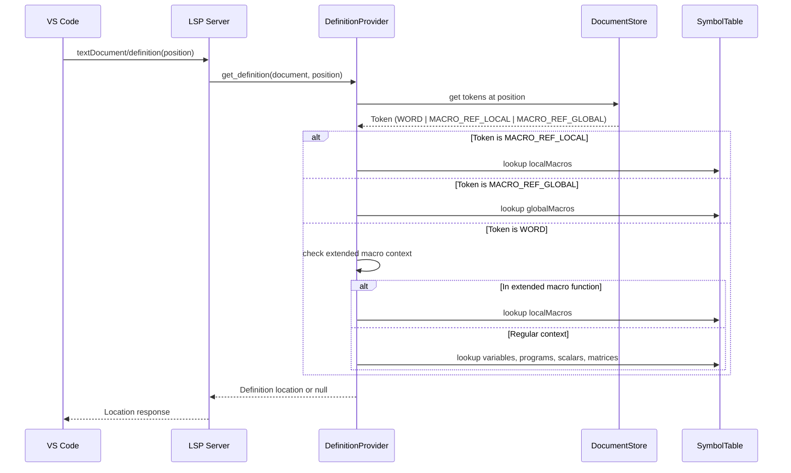

# Design Document: Variable-Macro Definition Disambiguation

## Overview

This design addresses a bug in the Stata LSP's go-to-definition feature where clicking on a variable name incorrectly navigates to a macro definition when both a variable and macro share the same name. The fix modifies the `DefinitionProvider` to use token type information from the lexer to disambiguate between variable references (WORD tokens) and macro references (MACRO_REF_LOCAL/MACRO_REF_GLOBAL tokens).

## Architecture

The solution follows the existing LSP architecture pattern:

```
User Click → Position → Token Lookup → Symbol Type Detection → Symbol Resolution → Definition Location
```

The key change is inserting a **Token Lookup** step that determines the symbol type based on the lexer's token classification rather than searching all symbol tables indiscriminately.

### Component Interaction



## Components and Interfaces

### Modified Component: DefinitionProvider

**File:** `src/providers/definition.ts`

#### New Method: `get_token_at_position`

```typescript
/**
 * Get the token at the given position from the document's token list.
 * 
 * @param document - The document state containing tokens
 * @param position - The cursor position
 * @returns The token at the position, or null if no token found
 */
private get_token_at_position(
    document: DocumentState,
    position: Position
): Token | null {
    if (!document.tokens) {
        return null;
    }
    
    for (const token of document.tokens) {
        if (this.position_in_range(position, token.range)) {
            return token;
        }
    }
    
    return null;
}
```

#### New Method: `position_in_range`

```typescript
/**
 * Check if a position falls within a range.
 */
private position_in_range(position: Position, range: Range): boolean {
    if (position.line < range.start.line || position.line > range.end.line) {
        return false;
    }
    if (position.line === range.start.line && position.character < range.start.character) {
        return false;
    }
    if (position.line === range.end.line && position.character >= range.end.character) {
        return false;
    }
    return true;
}
```

#### New Method: `is_in_extended_macro_context`

```typescript
/**
 * Check if the position is within an extended macro function context
 * where bare identifiers should be treated as macro references.
 * 
 * @param document - The document state
 * @param position - The cursor position
 * @returns true if in extended macro function context
 */
private is_in_extended_macro_context(
    document: DocumentState,
    position: Position
): boolean {
    const line_text = get_line_text(document, position.line);
    const text_before_cursor = line_text.substring(0, position.character + 1);
    
    // Pattern: local/global macname : list_function ...
    const extended_macro_pattern = /^\s*(local|global)\s+\w+\s*:\s*(list|word|piece)\s+/;
    return extended_macro_pattern.test(text_before_cursor);
}
```

#### Modified Method: `get_definition`

The main `get_definition` method will be modified to:

1. First retrieve the token at the cursor position
2. Based on token type, determine which symbol tables to search:
   - `MACRO_REF_LOCAL` → search only `localMacros`
   - `MACRO_REF_GLOBAL` → search only `globalMacros`
   - `WORD` → check extended macro context first, then search `variables`, `programs`, `scalars`, `matrices`
3. Fall back to existing heuristics only when token lookup fails

### Existing Components (Unchanged)

- **Lexer** (`src/lexer/index.ts`): Already correctly classifies tokens as WORD, MACRO_REF_LOCAL, or MACRO_REF_GLOBAL
- **DocumentStore** (`src/document-store.ts`): Already stores tokens in `DocumentState.tokens`
- **SymbolTable** (`src/types/index.ts`): Already separates variables from macros

## Data Models

### Token Type Classification (Existing)

```typescript
type TokenType =
    | 'WORD'              // Plain identifier (variable, program, etc.)
    | 'MACRO_REF_LOCAL'   // `name' syntax
    | 'MACRO_REF_GLOBAL'  // $name or ${name} syntax
    // ... other types
```

### Symbol Resolution Priority

For WORD tokens in regular context:
1. Variables (`symbols.variables`)
2. Programs (`symbols.programs`)
3. Scalars (`symbols.scalars`)
4. Matrices (`symbols.matrices`)

For WORD tokens in extended macro context:
1. Local macros (`symbols.localMacros`)

For MACRO_REF_LOCAL tokens:
1. Local macros (`symbols.localMacros`)

For MACRO_REF_GLOBAL tokens:
1. Global macros (`symbols.globalMacros`)

## Correctness Properties

*A property is a characteristic or behavior that should hold true across all valid executions of a system—essentially, a formal statement about what the system should do. Properties serve as the bridge between human-readable specifications and machine-verifiable correctness guarantees.*


### Property 1: WORD Token Variable Priority

*For any* WORD token at a cursor position where both a variable and a local/global macro with the same name exist in the symbol table, go-to-definition SHALL return the variable definition location, not the macro definition.

**Validates: Requirements 1.1, 2.1, 2.2**

### Property 2: MACRO_REF_LOCAL Token Resolution

*For any* MACRO_REF_LOCAL token (`` `name' `` syntax) at a cursor position where a local macro with that name exists, go-to-definition SHALL return the local macro definition location.

**Validates: Requirements 1.2, 3.1**

### Property 3: MACRO_REF_GLOBAL Token Resolution

*For any* MACRO_REF_GLOBAL token (`$name` or `${name}` syntax) at a cursor position where a global macro with that name exists, go-to-definition SHALL return the global macro definition location.

**Validates: Requirements 1.3, 3.2**

### Property 4: WORD Token Does Not Resolve to Macro

*For any* WORD token at a cursor position where only a macro (local or global) with that name exists (no variable, program, scalar, or matrix), go-to-definition SHALL return null, not the macro definition.

**Validates: Requirements 2.3**

### Property 5: Extended Macro Context Resolution

*For any* WORD token at a cursor position within an extended macro function context (e.g., after `local x : list `), go-to-definition SHALL resolve to the local macro definition if one exists, regardless of whether a variable with the same name exists.

**Validates: Requirements 5.1, 5.2, 5.3**

### Property 6: Token Position Lookup Accuracy

*For any* cursor position that falls within a token's range (start ≤ position < end), the token lookup function SHALL return that token.

**Validates: Requirements 4.1, 4.2**

### Property 7: Missing Macro Returns Null

*For any* MACRO_REF_LOCAL or MACRO_REF_GLOBAL token where no corresponding macro definition exists in the symbol table, go-to-definition SHALL return null.

**Validates: Requirements 3.3**

## Error Handling

### Token Lookup Failures

When `document.tokens` is null or empty:
- Fall back to `get_word_at_position` for word extraction
- Use `reference_looks_like_macro` heuristic to detect macro syntax from preceding characters
- This maintains backward compatibility with documents that haven't been fully tokenized

### Position Out of Range

When cursor position is outside all token ranges:
- Return null from `get_token_at_position`
- Fall back to word extraction and heuristics
- This handles clicks on whitespace or between tokens

### Symbol Not Found

When the identified symbol type has no matching definition:
- Return null (not an error)
- This is expected behavior for undefined symbols

## Testing Strategy

### Dual Testing Approach

Both unit tests and property-based tests are required for comprehensive coverage:

- **Unit tests**: Verify specific examples, edge cases, and error conditions
- **Property tests**: Verify universal properties across all valid inputs

### Property-Based Testing Configuration

- **Library**: fast-check (already used in the project)
- **Minimum iterations**: 100 per property test
- **Tag format**: `Feature: variable-macro-definition-disambiguation, Property N: {property_text}`

### Test Categories

1. **Token Type Disambiguation Tests**
   - WORD token with variable and macro → returns variable
   - MACRO_REF_LOCAL token → returns local macro
   - MACRO_REF_GLOBAL token → returns global macro

2. **Extended Macro Context Tests**
   - WORD token after `: list` → returns local macro
   - WORD token after `: list` with no macro → returns null

3. **Edge Case Tests**
   - No tokens available → falls back to heuristics
   - Position between tokens → returns null
   - Symbol not found → returns null

4. **Regression Tests**
   - Program definition still works
   - Scalar definition still works
   - Matrix definition still works
   - File path navigation still works
   - Embedded context (Mata/Python) still resolves only macros
